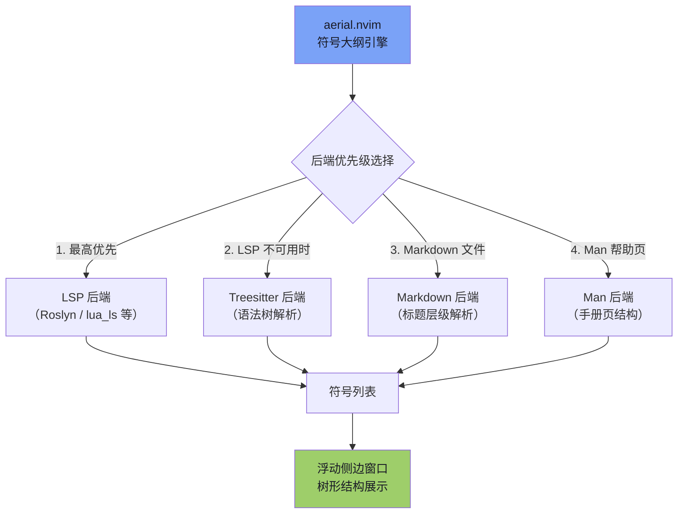
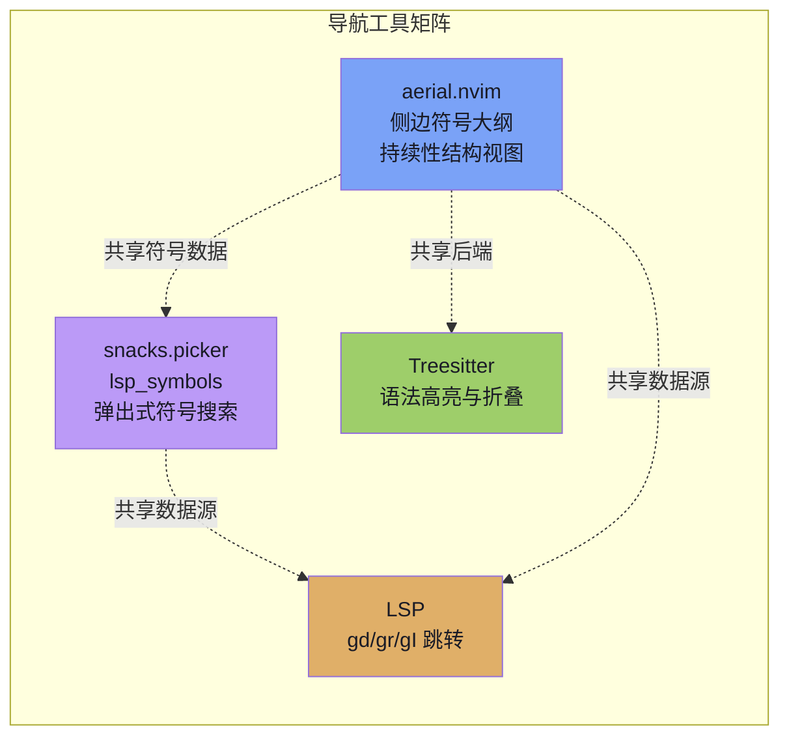

**aerial.nvim** 是一个代码符号大纲浏览器，它会在侧边浮动窗口中以树形结构展示当前文件的所有代码符号——类、方法、函数、变量、接口等，帮助你在复杂文件中快速定位和跳转。本项目的 aerial 配置启用了多后端支持（LSP、Treesitter、Markdown、Man），配合精心设计的图标体系和按文件类型过滤的策略，为 C# 和 Lua 开发者提供清晰的代码结构概览。

Sources: [aerial.lua](lua/plugins/aerial.lua#L78-L121)

## 整体架构：多后端符号解析

aerial.nvim 的核心能力在于它能从**多个数据源**提取代码符号，而非仅依赖单一后端。配置中声明了四个后端并按优先级排序，aerial 会自动选择当前文件可用的最高优先级后端进行解析。



**后端选择的实际含义**：当你打开一个 C# 文件且 Roslyn LSP 已连接时，aerial 使用 LSP 后端获取最精确的符号信息（包括完整的类型层级、方法签名等）。如果 LSP 尚未启动或不可用，aerial 会降级到 Treesitter 后端——它通过语法树解析出代码结构，精度略低但响应更快。对于 Markdown 文档，专用后端能解析标题层级结构；对于 Vim 的 Man 帮助页，也有对应的后端处理。

Sources: [aerial.lua](lua/plugins/aerial.lua#L96)

## 快捷键与触发方式

aerial 的触发方式非常简单，通过一个全局快捷键即可切换符号大纲窗口的显示：

| 快捷键 | 功能 | 注册方式 |
|--------|------|----------|
| `<leader>cs` | 切换 Aerial 符号大纲窗口 | 全局键映射 |

> ⚠️ **重要提示：`<leader>cs` 的键位重叠**。在 LspAttach 自动命令中，mason.lua 注册了一个 buffer-local 的 `<leader>cs` 映射指向 `Snacks.picker.lsp_symbols()`（弹出式符号列表）。由于 Neovim 中 buffer-local 映射优先于全局映射，**当 LSP 已连接时，按下 `<leader>cs` 实际触发的是 snacks.picker 的文档符号搜索**，而非 aerial 的侧边栏。如果你需要使用 aerial 的侧边大纲视图，可以通过命令模式执行 `:AerialToggle` 来打开。

Sources: [aerial.lua](lua/plugins/aerial.lua#L118-L120), [mason.lua](lua/plugins/mason.lua#L75)

## 图标系统与符号类型过滤

### 图标设计

配置中为每种代码符号类型都定义了 Nerd Font 图标，覆盖了从基础类型到 AI 工具的全部 40 余种符号类别。这些图标不仅是视觉装饰——它们在 aerial 的大纲窗口中帮助你在扫视时**瞬间区分**符号类型：类（``）、方法（`󰊕`）、接口（``）、枚举（``）等各有独特图标。

一个值得注意的细节是对 Lua 语言的特殊处理。Lua 语言服务器（lua_ls）会将 `if/else/for` 等控制流结构标记为 `Package` 类型，这在语义上并不合理。配置中通过一个 HACK 修正了这个问题：将 Lua 文件的 `Package` 图标替换为 `Control` 图标（``），使显示结果更符合直觉。

Sources: [aerial.lua](lua/plugins/aerial.lua#L1-L42), [aerial.lua](lua/plugins/aerial.lua#L83-L87)

### 符号类型过滤（filter_kind）

并非所有符号都需要在大纲中显示。配置通过 `filter_kind` 机制定义了哪些符号类型应该出现在 aerial 窗口中，并且**按文件类型**做了差异化配置：

| 符号类型 | default（默认） | lua（Lua 文件） | 说明 |
|----------|:-:|:-:|------|
| Class | ✅ | ✅ | 类定义 |
| Constructor | ✅ | ✅ | 构造函数 |
| Enum | ✅ | ✅ | 枚举类型 |
| Field | ✅ | ✅ | 字段/属性 |
| Function | ✅ | ✅ | 函数 |
| Interface | ✅ | ✅ | 接口定义 |
| Method | ✅ | ✅ | 方法 |
| Module | ✅ | ✅ | 模块 |
| Namespace | ✅ | ✅ | 命名空间 |
| Package | ✅ | ❌ | 包（Lua 中排除，因为 lua_ls 误用此类型） |
| Property | ✅ | ✅ | 属性 |
| Struct | ✅ | ✅ | 结构体 |
| Trait | ✅ | ✅ | 特质/特征 |
| markdown | — | — | 完全禁用（`false`） |
| help | — | — | 完全禁用（`false`） |

对于 Markdown 和 Vim 帮助文件，`filter_kind` 被设为 `false`，意味着**不进行任何过滤**——所有可解析的符号都会展示，因为这些文件类型的结构化信息本身就比较稀疏。

Sources: [aerial.lua](lua/plugins/aerial.lua#L43-L77), [aerial.lua](lua/plugins/aerial.lua#L89-L107)

## 窗口布局与树形引导线

aerial 的浮动窗口采用了精心定制的视觉风格：

- **attach_mode = "global"**：aerial 面板追踪全局焦点所在的 buffer，而非固定在首次打开时的 buffer 上。这意味着当你在不同窗口间切换时，aerial 的内容会自动更新为当前 buffer 的符号列表。
- **resize_to_content = false**：禁止窗口自动调整大小以适应内容，避免频繁的窗口尺寸变化造成视觉干扰。
- **树形引导线**：使用 Unicode 绘图字符构建层级关系的视觉引导：
  ```
  ├╴ 同级中间项
  └╴ 同级最后一项
  │ 嵌套层级连接线
    缩进空白
  ```

Sources: [aerial.lua](lua/plugins/aerial.lua#L95-L114)

## 插件加载策略

aerial 采用 **VeryLazy** 加载策略，这意味着它不会在 Neovim 启动时立即加载，而是在首次触发相关事件（如打开文件、执行键映射等）时才进行懒加载。这种策略对启动性能友好，同时确保了在需要代码导航时插件已经就绪。

Sources: [aerial.lua](lua/plugins/aerial.lua#L81)

## 与其他导航工具的协作关系

本项目的代码导航并非由 aerial 独自承担，它与其他工具形成了一个互补的导航生态：



| 使用场景 | 推荐工具 | 说明 |
|----------|----------|------|
| 浏览文件整体结构 | aerial (`:AerialToggle`) | 侧边持续性大纲，一目了然 |
| 快速跳转到某个符号 | snacks.picker (`<leader>cs`) | 模糊搜索符号名称 |
| 跨文件符号搜索 | snacks.picker (`<leader>sS`) | 工作区级别的符号搜索 |
| 跳转到定义/引用 | LSP 快捷键 (`gd`, `gr`) | 精确的代码间导航 |

配置注释中提到，telescope aerial 扩展已被移除，项目统一使用 snacks.picker 作为模糊搜索前端。这是一个有意的架构简化决策——减少 picker 框架的碎片化，统一使用 snacks 作为搜索交互层。

Sources: [aerial.lua](lua/plugins/aerial.lua#L123), [mason.lua](lua/plugins/mason.lua#L70-L75), [snacks.lua](lua/plugins/snacks.lua#L127-L128)

## 延伸阅读

- 了解 aerial 所依赖的 LSP 基础设施：[Mason LSP 管理：服务器自动安装与 capabilities 注册](28-mason-lsp-guan-li-fu-wu-qi-zi-dong-an-zhuang-yu-capabilities-zhu-ce)
- 了解 aerial 的 Treesitter 后端配置：[Treesitter 配置：语法高亮、代码折叠与 Razor 文件支持](14-treesitter-pei-zhi-yu-fa-gao-liang-dai-ma-zhe-die-yu-razor-wen-jian-zhi-chi)
- 了解快捷键体系的完整设计：[快捷键体系：Leader 键分组与 buffer-local 绑定策略](12-kuai-jie-jian-ti-xi-leader-jian-fen-zu-yu-buffer-local-bang-ding-ce-lue)
- 了解 snacks.picker 的符号搜索功能：[文件浏览与项目管理：neo-tree、yazi 与 snacks picker](13-wen-jian-liu-lan-yu-xiang-mu-guan-li-neo-tree-yazi-yu-snacks-picker)