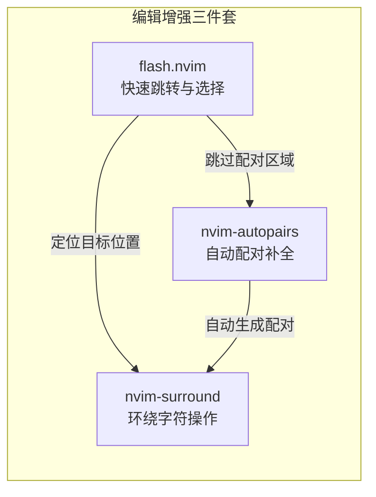

高效的文本编辑是 Neovim 的核心优势之一。本配置集成了三个互补的编辑增强插件：**flash.nvim** 负责光标的快速跳转与结构化选择，**nvim-surround** 负责括号、引号等环绕字符的批量操作，**nvim-autopairs** 负责输入时自动补全配对符号。三者分别覆盖了"移动""修改""输入"三个高频编辑场景，协同构成一套完整的编辑增强体系。

Sources: [flash.lua](lua/plugins/flash.lua#L1-L25), [nvim-surround.lua](lua/plugins/nvim-surround.lua#L1-L5), [nvim-autopairs.lua](lua/plugins/nvim-autopairs.lua#L1-L5)

## flash.nvim：基于标签的快速跳转

**flash.nvim** 是由 folke 开发的高性能跳转插件。与传统的逐字符搜索（`f`/`t`）或逐行移动（`j`/`k`）不同，flash 会在屏幕上所有匹配位置显示一个**单字符标签**，你只需输入标签字母即可瞬间跳转到目标位置。这种"一次按键、直达目标"的交互模式大幅减少了重复按键次数。

该插件配置了六组快捷键，覆盖了从简单跳转到结构化选择的完整场景。以下是全部按键绑定的详细说明：

| 按键 | 模式 | 功能 | 说明 |
|------|------|------|------|
| `s` | Normal / Visual / Operator-pending | **Flash 跳转** | 输入字符后，屏幕上所有匹配位置显示标签，按标签字母跳转 |
| `S` | Normal / Visual / Operator-pending | **Flash Treesitter** | 基于 Treesitter 语法树选择节点，而非字符匹配 |
| `r` | Operator-pending | **远程 Flash** | 在不移动光标的情况下，将操作应用到远程目标位置 |
| `R` | Operator-pending / Visual | **Treesitter 搜索** | 结合 Treesitter 节点与搜索模式的混合跳转 |
| `<C-s>` | Command | **切换 Flash 搜索** | 在 `/` 搜索过程中动态开关 Flash 标签提示 |
| `<C-space>` | Normal / Visual / Operator-pending | **Treesitter 增量选择** | 模拟 Treesitter 增量选择，`<C-space>` 扩大选择，`<BS>` 缩小选择 |

Sources: [flash.lua](lua/plugins/flash.lua#L8-L23)

### 核心功能详解

**Flash 跳转**（`s`）是最基础也最常用的功能。按下 `s` 后输入一个或多个字符，flash 会在屏幕上所有匹配位置生成标签。这些标签通常是 1-2 个字母，直接输入对应字母即可跳转。例如在一个较长的函数中，你想跳转到某个变量名 `result` 的位置，只需按 `s` → 输入 `result` → 看到目标位置旁的标签字母 → 按下该字母即可到达。

**Flash Treesitter**（`S`）则完全绕开了字符匹配的思路。按下 `S` 后，flash 会利用 Treesitter 语法分析的结果，将当前文件按语法节点（如函数名、参数列表、代码块）逐层高亮。你可以通过反复按 `S` 在不同层级的语法节点间切换选择，最终选中目标节点。这对于快速选中整个函数体、if 块或参数列表非常高效。

**Treesitter 增量选择**（`<C-space>`）是对 `S` 的增强变体。它的工作方式类似于 IDE 中的"扩大选择"功能：第一次按下选中光标所在的最小语法节点（如一个标识符），再次按下 `<C-space>` 向外扩大一层（如扩大到整个函数调用），按 `<BS>`（退格键）则向内缩小一层。这在需要精确选择嵌套结构中的某一段代码时特别有用。

**远程 Flash**（`r`）是一种特殊的 operator-pending 模式跳转。它允许你在不移动光标的前提下，将编辑操作（如 `d` 删除、`c` 修改）应用到跳转标签指定的远程位置。例如 `dr` 会进入远程删除模式，你选择目标标签后，该位置的内容被删除，但光标仍留在原位。

**切换 Flash 搜索**（`<C-s>`）作用于命令行模式。当你使用 `/` 进行搜索时，按下 `<C-s>` 可以动态切换是否在搜索结果上显示 Flash 标签，让你在普通搜索和标签跳转之间无缝切换。

Sources: [flash.lua](lua/plugins/flash.lua#L9-L23)

### 加载策略与 VSCode 兼容

flash 插件采用 `VeryLazy` 加载事件，意味着它不会在 Neovim 启动时立即加载，而是在首次需要时才初始化。配置中设置了 `vscode = true`，表示该插件在 VSCode Neovim 扩展环境中同样可用，确保了跨编辑器的一致体验。

Sources: [flash.lua](lua/plugins/flash.lua#L3-L4)

## nvim-surround：环绕字符的批量操作

**nvim-surround** 是一个专注于"环绕字符"操作的插件。所谓环绕字符，指的是成对出现的包围结构：括号 `()`、方括号 `[]`、花括号 `{}`、引号 `""`/`''`、反引号 `` `` ``、HTML 标签 `
...
` 等。nvim-surround 让你可以用一条命令完成对这些环绕字符的添加、删除和替换。

该插件采用默认配置（`opts = {}`），使用的是作者推荐的标准键位。以下是三组核心操作：

| 操作 | 按键序列 | 示例 | 效果 |
|------|----------|------|------|
| **添加环绕** | `ys{motion}{char}` | `ysiw)` | 将光标所在单词用 `()` 包裹：`word` → `(word)` |
| **删除环绕** | `ds{char}` | `ds"` | 删除光标周围的 `""`：`"hello"` → `hello` |
| **替换环绕** | `cs{target}{replacement}` | `cs"'` | 将 `""` 替换为 `''`：`"hello"` → `'hello'` |
| **整行环绕** | `yss{char}` | `yss)` | 将整行用 `()` 包裹 |
| **可视化环绕** | 选中文本后按 `S{char}` | `vipS)` | 将选中的段落用 `()` 包裹 |

**按键记忆法**：`ys` = "you surround"（你环绕），`ds` = "delete surround"（删除环绕），`cs` = "change surround"（更改环绕）。其中 `{char}` 指定环绕字符类型：`)`/`(` 表示括号，`"` 表示双引号，`` ` `` 表示反引号，`t` 表示 HTML 标签等。

在 [快捷键发现：which-key 按键提示系统](23-kuai-jie-jian-fa-xian-which-key-an-jian-ti-shi-xi-tong) 中，`gs` 被注册为 "surround" 分组标签，用于提示 `gS`（可视化行环绕）等扩展操作。

Sources: [nvim-surround.lua](lua/plugins/nvim-surround.lua#L1-L5), [whichkey.lua](lua/plugins/whichkey.lua#L29)

## nvim-autopairs：自动配对补全

**nvim-autopairs** 是一个轻量级的自动配对插件。当你在插入模式下输入左括号 `(` 时，它会自动补全右括号 `)` 并将光标置于两者之间；输入左引号 `"` 时，自动补全右引号 `""`。这消除了手动输入配对符号的繁琐操作，特别适合频繁编写函数调用、条件表达式和字符串的 C# 开发场景。

该插件使用默认配置（`opts = {}`），开箱即用地支持以下配对：

| 输入 | 自动补全 | 光标位置 |
|------|----------|----------|
| `(` | `()` | 光标在中间 `(\|)` |
| `[` | `[]` | 光标在中间 `[\|]` |
| `{` | `{}` | 光标在中间 `{\|}` |
| `"` | `""` | 光标在中间 `"\|"` |
| `'` | `''` | 光标在中间 `'\|'` |
| `` ` `` | `` `` `` | 光标在中间 `` `\` `` |

### 加载时机

与 flash 和 nvim-surround 使用 `VeryLazy` 不同，nvim-autopairs 使用 `InsertEnter` 作为加载事件。这意味着插件仅在首次进入插入模式时才加载，进一步优化了启动性能。由于自动配对只在插入模式下有意义，这种加载策略既保证了功能可用性，又避免了在启动阶段加载不必要的代码。

Sources: [nvim-autopairs.lua](lua/plugins/nvim-autopairs.lua#L3-L4)

## 实战工作流：三者协同

三个插件在实际编辑中经常联动使用。以下是两个典型的协同场景：

**场景一：快速添加函数调用**

在 C# 代码中，你有一个变量 `result` 需要包裹进 `ToString()` 调用。使用 `s` 跳转到 `result` 所在位置，然后用 nvim-surround 的 `ysiwt` 添加环绕，或者直接用 flash 的 Treesitter 选择快速定位后配合 `ysiw(` 添加括号。之后 nvim-autopairs 会在你输入 `ToString(` 时自动补全右括号。

**场景二：重构字符串引号类型**

当你需要将代码中的双引号字符串统一改为逐字字符串（`@"..."` 格式）时，先用 `s` 跳转到目标字符串位置，再用 `cs"`` ` 将双引号替换为反引号，或用 `ds"` 删除引号后手动添加新格式。配合 `<C-space>` 增量选择可以精确选中字符串内容进行批量操作。

## 插件加载策略对比

三个插件采用了不同的加载策略，体现了精细化的性能优化思路：

| 插件 | 加载事件 | 加载时机 | 理由 |
|------|----------|----------|------|
| flash.nvim | `VeryLazy` | UI 初始化完成后 | 跳转功能在多种模式下使用，但不需要启动即加载 |
| nvim-surround | `VeryLazy` | UI 初始化完成后 | 环绕操作需要配合其他按键组合，延迟加载无感知 |
| nvim-autopairs | `InsertEnter` | 首次进入插入模式 | 仅在插入模式有意义，最晚加载 |

Sources: [flash.lua](lua/plugins/flash.lua#L3), [nvim-surround.lua](lua/plugins/nvim-surround.lua#L3), [nvim-autopairs.lua](lua/plugins/nvim-autopairs.lua#L4)

## 延伸阅读

- [快捷键体系：Leader 键分组与 buffer-local 绑定策略](12-kuai-jie-jian-ti-xi-leader-jian-fen-zu-yu-buffer-local-bang-ding-ce-lue) — 了解全局快捷键的组织方式，以及 flash 和 nvim-surround 的按键如何融入整体键位体系
- [快捷键发现：which-key 按键提示系统](23-kuai-jie-jian-fa-xian-which-key-an-jian-ti-shi-xi-tong) — 当你忘记某个编辑增强快捷键时，which-key 会实时提示所有可用绑定
- [Treesitter 配置：语法高亮、代码折叠与 Razor 文件支持](14-treesitter-pei-zhi-yu-fa-gao-liang-dai-ma-zhe-die-yu-razor-wen-jian-zhi-chi) — Flash Treesitter 功能依赖 Treesitter 语法分析，了解底层语法树的工作原理