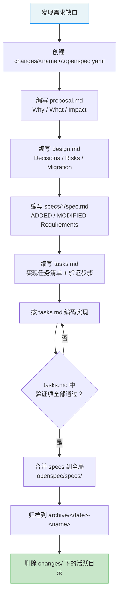

本配置框架采用自建的 **openspec** 规范体系来驱动功能开发。openspec 是一套轻量级的、基于文件系统的需求规格与变更管理约定，其核心思想是：**先写规格再写代码，每个变更都有完整的动机、设计和任务跟踪**。这套体系不依赖任何外部工具，仅通过目录结构与 Markdown 文件的约定来组织，使 Neovim 配置的演进过程像软件项目一样可追溯、可审查、可回滚。本文将从目录结构、规格写作规范、变更生命周期三个维度，系统阐述 openspec 的运作机制，并以本项目中实际的 C# DAP 调试系统和 LSP 配置变更作为贯穿全文的示例。

Sources: [openspec](openspec)

## 目录结构与核心概念

openspec 的根目录位于配置仓库的 `openspec/` 下，分为两个顶层命名空间——`specs/` 存放当前生效的**需求规格**（source of truth），`changes/` 存放所有**变更提案**的生命周期文件。

```
openspec/
├── specs/                          # 全局需求规格（当前生效状态）
│   ├── csharp-dap-core/spec.md     # DAP 框架与适配器注册规格
│   ├── csharp-dap-launch/spec.md   # 调试启动配置规格
│   ├── csharp-dap-ui/spec.md       # 调试面板 UI 规格
│   └── csharp-lsp-config/spec.md   # Roslyn LSP 配置规格
├── changes/                        # 变更提案（生命周期管理）
│   ├── add-csharp-debug-plugin/    # 活跃变更：新增 C# 调试插件
│   ├── dap-keybindings-and-features/ # 活跃变更：DAP 快捷键增强
│   ├── fix-roslyn-sln-reload/      # 活跃变更（仅元数据）
│   └── archive/                    # 已完成归档
│       └── 2026-02-21-configure-csharp-lsp/
```

`specs/` 目录下的每个子目录代表一个独立的**能力单元**（capability），其内部的 `spec.md` 定义了该能力的所有需求条目。这些规格是系统的"合约"——实现代码必须满足其中所有 `SHALL` 声明的约束。`changes/` 目录下的每个子目录代表一次**变更提案**，通过固定的文件集合（`.openspec.yaml`、`proposal.md`、`design.md`、`tasks.md`、`specs/`）记录从动机到实现的全过程。

Sources: [openspec](openspec)

## 需求规格写作规范

### SHALL / WHEN / THEN 三段式

openspec 的规格文件采用一种严格的 BDD（Behavior-Driven Development）风格编写，每条需求以 **SHALL** 声明约束，以 **WHEN/THEN** 场景描述验证条件。这种格式来源于 [csharp-dap-core/spec.md](openspec/specs/csharp-dap-core/spec.md#L1-L36) 中的实际范例：

```markdown
### Requirement: netcoredbg 适配器注册到 nvim-dap

系统 SHALL 在 `dap.adapters.coreclr` 中注册 `netcoredbg` 可执行文件路径，
以便 nvim-dap 能够启动调试会话。

#### Scenario: 适配器路径指向 Mason 安装目录
- **WHEN** nvim-dap 初始化时
- **THEN** `dap.adapters.coreclr.executable.command` 解析为
         Mason 包路径下的 `netcoredbg` 可执行文件
```

每条需求的结构遵循以下模板：

| 组成部分 | 作用 | 关键字 |
|---------|------|--------|
| **Requirement 标题** | 用一句话概括能力的语义目标 | `### Requirement:` |
| **SHALL 声明** | 描述系统必须满足的行为约束，不可省略 | `SHALL` |
| **Scenario** | 为每个关键行为定义可验证的测试场景 | `#### Scenario:` |
| **WHEN** | 描述触发条件（前置状态） | `WHEN` |
| **THEN** | 描述期望结果（后置状态） | `THEN` |

这种格式的设计意图是：每条 Requirement 可以直接映射到一组手工验证步骤，甚至可以转换为自动化测试用例。在 [csharp-dap-launch/spec.md](openspec/specs/csharp-dap-launch/spec.md#L1-L58) 中可以看到更复杂的多场景需求——同一条"从 launch.json 加载调试配置"需求下包含了自动加载、防重复加载、类型过滤三个场景，覆盖了正常路径和边界情况。

Sources: [csharp-dap-core/spec.md](openspec/specs/csharp-dap-core/spec.md#L1-L36), [csharp-dap-launch/spec.md](openspec/specs/csharp-dap-launch/spec.md#L1-L58)

### 全局规格与变更内规格的关系

openspec 中存在两类 spec.md 文件，它们通过 `## ADDED Requirements` / `## MODIFIED Requirements` 标记来区分增量与全量：

- **全局规格**（`openspec/specs/*/spec.md`）：代表当前生效的完整合约状态，所有需求条目不带增量标记
- **变更内规格**（`openspec/changes/<name>/specs/*/spec.md`）：代表该变更要新增或修改的需求，使用 `## ADDED Requirements` 前缀标记

例如，[add-csharp-debug-plugin 变更内的 csharp-dap-core spec](openspec/changes/add-csharp-debug-plugin/specs/csharp-dap-core/spec.md#L1-L31) 使用了 `## ADDED Requirements` 前缀，表明这些需求是此次变更新引入的。当变更完成后，这些增量需求会被合并到全局 `openspec/specs/` 对应的 spec.md 中，去掉 `ADDED` 前缀，形成新的完整合约。这种机制确保了全局规格始终反映系统的真实状态，而变更内规格则记录了每次演进的具体差异。

Sources: [changes/add-csharp-debug-plugin/specs/csharp-dap-core/spec.md](openspec/changes/add-csharp-debug-plugin/specs/csharp-dap-core/spec.md#L1-L31)

### 已废弃需求的处理

当某条需求经技术验证后确认不可行，openspec 采用**保留但注释**的方式记录决策依据，而非直接删除。最典型的例子是 [dap-set-next-statement/spec.md](openspec/changes/dap-keybindings-and-features/specs/dap-set-next-statement/spec.md#L1-L2)：

```markdown
<!-- 已移除：netcoredbg 3.1.3-1062 不支持 DAP supportsGotoTargetsRequest capability，
     dap.goto_() 无效。 -->
```

这种做法保留了"尝试过但放弃"的历史轨迹，避免未来有人重复提出相同需求时需要重新调研。在 [dap-keybindings-and-features 的 proposal.md](openspec/changes/dap-keybindings-and-features/proposal.md#L12-L13) 中，`dap-set-next-statement` 也被标记为 ~~删除线~~ 以明确其状态变更。

Sources: [dap-set-next-statement/spec.md](openspec/changes/dap-keybindings-and-features/specs/dap-set-next-statement/spec.md#L1-L2), [proposal.md](openspec/changes/dap-keybindings-and-features/proposal.md#L12-L13)

## 变更管理生命周期

每个变更提案都是一个自包含的目录，包含固定的文件集合。变更从创建到归档经历以下阶段：



### 第一阶段：元数据与提案

每个变更以一个极简的 YAML 元数据文件 [.openspec.yaml](openspec/changes/add-csharp-debug-plugin/.openspec.yaml#L1-L3) 开端，仅声明 schema 版本和创建日期。随后 [proposal.md](openspec/changes/add-csharp-debug-plugin/proposal.md#L1-L35) 回答三个核心问题：

| 小节 | 回答的问题 | 典型内容 |
|------|-----------|---------|
| **Why** | 为什么需要这个变更？ | 当前配置的痛点与能力缺口 |
| **What Changes** | 具体要做什么？ | 新增/修改的插件、文件、功能列表 |
| **Capabilities** | 影响哪些能力单元？ | New Capabilities + Modified Capabilities |
| **Impact** | 影响范围有多大？ | 新文件、修改文件、依赖变化、不受影响的部分 |

proposal 的价值在于**范围界定**——它迫使开发者在动手之前思考清楚边界。[add-csharp-debug-plugin 的 proposal](openspec/changes/add-csharp-debug-plugin/proposal.md#L29-L35) 中明确列出了"不涉及 `cs_solution.lua` 逻辑本身不修改"和"新文件仅 `dap-cs.lua`"，这为后续的 design 和 tasks 划定了不可逾越的边界。

Sources: [.openspec.yaml](openspec/changes/add-csharp-debug-plugin/.openspec.yaml#L1-L3), [proposal.md](openspec/changes/add-csharp-debug-plugin/proposal.md#L1-L35)

### 第二阶段：设计决策

[design.md](openspec/changes/add-csharp-debug-plugin/design.md#L1-L151) 是变更的核心思考文档，它记录了所有重要的技术决策及其背后的权衡。每个决策以 `D1`、`D2` 编号，遵循统一格式：

- **选择**：做了什么决定
- **理由**：为什么这样决定
- **放弃的方案**：考虑过但拒绝的替代方案及其缺点

以 D2 决策为例——[调试快捷键通过 LspAttach autocmd 挂载而非修改 roslyn.lua](openspec/changes/add-csharp-debug-plugin/design.md#L42-L62)。这个决策的关键理由是"避免修改 roslyn.lua 以最小化变更范围"和"DAP 配置完全自包含，卸载 dap-cs.lua 时自动失效"。同时记录了放弃的方案："修改 roslyn.lua 添加 on_attach → 耦合两个不同关注点"。

这种决策记录的价值在于**可审计性**。当未来有人质疑"为什么不在 roslyn.lua 里直接加调试配置"时，design.md 中 D2 给出了明确的回答。design.md 末尾的 **Risks / Trade-offs** 表格和 **Migration Plan** 则确保风险被前置识别、回滚路径被预先规划。

Sources: [design.md](openspec/changes/add-csharp-debug-plugin/design.md#L1-L151)

### 第三阶段：任务执行与验证

[tasks.md](openspec/changes/add-csharp-debug-plugin/tasks.md#L1-L59) 将 design.md 中的决策转化为可执行的 checklist，每项任务以 `- [x]` 或 `- [ ]` 标记完成状态。任务被按逻辑分组编号，例如"1. 插件声明"、"2. Mason 自动安装"、"6. 调试快捷键"等。

一个值得关注的模式是 tasks.md 中区分了**实现任务**和**验证任务**。在 [add-csharp-debug-plugin/tasks.md](openspec/changes/add-csharp-debug-plugin/tasks.md#L45-L59) 中，第 7 节和第 8 节的 7.1-7.5、8.6 都是验证项——它们不涉及代码编写，而是要求开发者在实际环境中确认功能正常。这些验证项直接对应 spec.md 中的 WHEN/THEN 场景，形成了从规格到验证的完整闭环。

Sources: [tasks.md](openspec/changes/add-csharp-debug-plugin/tasks.md#L1-L59)

### 第四阶段：归档与合并

当变更的所有 tasks（包括验证项）完成后，变更进入归档阶段：

1. 将 specs 目录中的增量需求合并到 `openspec/specs/` 全局规格中
2. 将整个变更目录移动到 `openspec/changes/archive/` 并加上完成日期前缀
3. 保留变更的所有历史文件（proposal、design、tasks、specs）供未来追溯

项目中已完成的归档案例是 [2026-02-21-configure-csharp-lsp](openspec/changes/archive/2026-02-21-configure-csharp-lsp)，它记录了从混乱的多文件 OmniSharp 配置迁移到统一的 Roslyn LSP 配置的完整过程。其 [tasks.md](openspec/changes/archive/2026-02-21-configure-csharp-lsp/tasks.md#L1-L22) 中所有条目均已标记为 `[x]`，证明变更已全部交付。

Sources: [archive/2026-02-21-configure-csharp-lsp](openspec/changes/archive/2026-02-21-configure-csharp-lsp), [tasks.md](openspec/changes/archive/2026-02-21-configure-csharp-lsp/tasks.md#L1-L22)

## 变更提案的完整结构一览

下表汇总了每个活跃变更目录中必须包含的文件及其职责：

| 文件 | 必需 | 职责 | 内容格式 |
|------|:----:|------|---------|
| `.openspec.yaml` | ✅ | 元数据：schema 版本、创建日期 | YAML（2 行） |
| `proposal.md` | ✅ | 动机与范围：Why、What、Capabilities、Impact | Markdown（固定小节） |
| `design.md` | ✅ | 技术决策：Context、Goals、Decisions（D1-Dn）、Risks、Migration | Markdown（固定小节） |
| `specs/*/spec.md` | 可选 | 本变更新增/修改的需求规格 | Markdown（ADDED/MODIFIED + SHALL/WHEN/THEN） |
| `tasks.md` | ✅ | 实现清单与验证步骤 | Markdown（GFM checkbox） |

当变更仅有初步想法但尚未展开设计时，可以只保留 `.openspec.yaml` 作为占位。例如 [fix-roslyn-sln-reload](openspec/changes/fix-roslyn-sln-reload/.openspec.yaml#L1-L3) 目前仅包含元数据文件，其详细设计记录在 [docs/fix-roslyn-sln-reload.md](docs/fix-roslyn-sln-reload.md#L1-L53) 中采用了一种更紧凑的单文件格式。这表明 openspec 并不强制要求所有变更都走完整的四阶段流程——小型修复可以灵活处理，但大型功能变更（如整个 DAP 调试系统的引入）则受益于完整的规范驱动流程。

Sources: [fix-roslyn-sln-reload/.openspec.yaml](openspec/changes/fix-roslyn-sln-reload/.openspec.yaml#L1-L3), [docs/fix-roslyn-sln-reload.md](docs/fix-roslyn-sln-reload.md#L1-L53)

## 实战案例：DAP 调试系统的两次迭代

本项目的 C# DAP 调试系统经历了两个 openspec 变更，清晰展示了**能力累积**的演进模式。

**第一次迭代**——[add-csharp-debug-plugin](openspec/changes/add-csharp-debug-plugin/proposal.md#L1-L35) 建立了调试能力的基础：引入 nvim-dap 框架、通过 Mason 安装 netcoredbg 适配器、配置 Console App 和 ASP.NET 的 launch configuration、集成 dap-ui 调试面板。这次变更创建了三个全新的 capability spec（csharp-dap-core、csharp-dap-launch、csharp-dap-ui），定义了从"零调试能力"到"基本可调试"的全部需求。

**第二次迭代**——[dap-keybindings-and-features](openspec/changes/dap-keybindings-and-features/proposal.md#L1-L30) 在已有基础上增强体验：补充 VS Code 风格的 F 键快捷键、添加交互式变量修改（Set Variable）、实现 .NET 热重载（dotnet watch + attach）。这次变更的 design.md 中特别记录了一个**已验证不可行**的决策——Set Next Statement（[dap-set-next-statement](openspec/changes/dap-keybindings-and-features/specs/dap-set-next-statement/spec.md#L1-L2)），因为 netcoredbg 不支持 DAP `gotoTargets` capability。两次迭代之间，proposal 的 Impact 小节明确声明"仅影响 roslyn LSP attach 后的 buffer 局部键位，不影响其他文件类型"，确保变更不会产生意料之外的副作用。

Sources: [add-csharp-debug-plugin/proposal.md](openspec/changes/add-csharp-debug-plugin/proposal.md#L1-L35), [dap-keybindings-and-features/proposal.md](openspec/changes/dap-keybindings-and-features/proposal.md#L1-L30), [dap-keybindings-and-features/design.md](openspec/changes/dap-keybindings-and-features/design.md#L1-L15)

## 从 openspec 到代码的映射

openspec 的最终价值体现在规格与实现代码之间的**可追溯性**。下表展示了全局 specs 目录中每个能力单元与其对应的实现文件之间的关系：

| 全局 Spec | 核心实现文件 | 关键需求映射 |
|-----------|------------|-------------|
| `csharp-dap-core` | [lua/plugins/dap-cs.lua](lua/plugins/dap-cs.lua) | nvim-dap 声明、netcoredbg 适配器注册、Mason ensure_installed |
| `csharp-dap-launch` | [lua/core/dap.lua](lua/core/dap.lua) | launch.json 加载、Console/ASP.NET 配置、DLL 路径推断 |
| `csharp-dap-ui` | [lua/plugins/dap-cs.lua](lua/plugins/dap-cs.lua) | dap-ui 自动开关、virtual-text 内联显示、buffer-local 快捷键 |
| `csharp-lsp-config` | [lua/plugins/roslyn.lua](lua/plugins/roslyn.lua) | Mason 自动安装、单一配置入口、blink.cmp capabilities |

当需要修改某个功能时，开发者可以先查阅对应的 spec.md 了解行为合约，再定位到实现文件进行修改，最后在 tasks.md 的验证项中确认行为符合 WHEN/THEN 场景的描述。这种从规格到代码再到验证的闭环，是 openspec 规范驱动开发的核心工作流。

Sources: [openspec/specs](openspec/specs)

## 延伸阅读

- 了解 DAP 调试系统的完整技术架构，参见 [DAP 调试系统架构：多调试器后端切换与适配器注册](8-dap-diao-shi-xi-tong-jia-gou-duo-diao-shi-qi-hou-duan-qie-huan-yu-gua-pei-qi-zhu-ce)
- 了解 Roslyn LSP 的配置细节，参见 [Roslyn LSP 配置：语言服务器管理与解决方案定位](7-roslyn-lsp-pei-zhi-yu-yan-fu-wu-qi-guan-li-yu-jie-jue-fang-an-ding-wei)
- 了解 lazy.nvim 插件声明模式，参见 [lazy.nvim 插件管理：懒加载策略与 spec 规范](5-lazy-nvim-cha-jian-guan-li-lan-jia-zai-ce-lue-yu-spec-gui-fan)
- 了解代码格式化约定，参见 [代码风格约定：stylua 格式化配置](27-dai-ma-feng-ge-yue-ding-stylua-ge-shi-hua-pei-zhi)