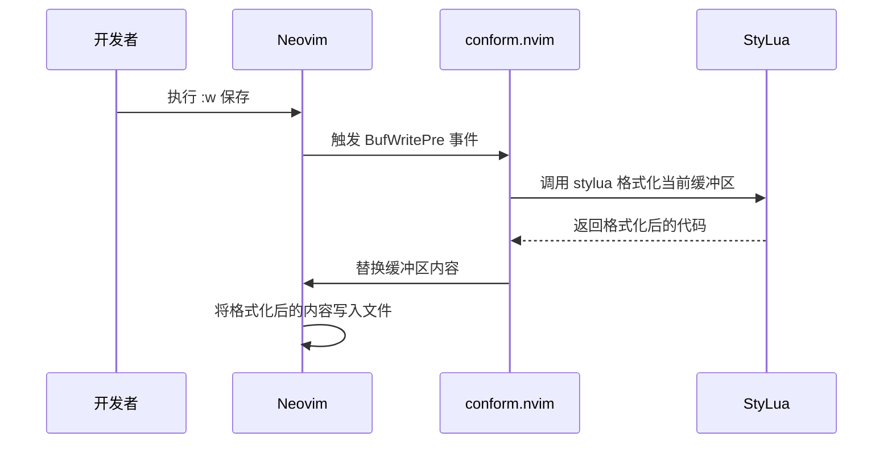
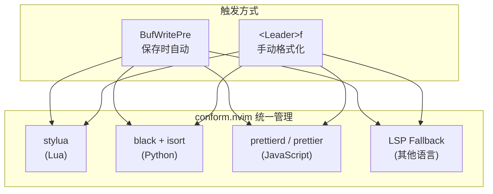

本页解析项目中 Lua 代码的格式化规范——由根目录的 `stylua.toml` 定义规则，通过 [conform.nvim](lua/plugins/conform.lua) 实现保存时自动格式化，并结合编辑器层面的 `colorcolumn` 标尺形成完整的风格保障体系。理解这套配置能帮助你写出与项目整体风格完全一致的代码，无需手动对齐缩进或操心行长限制。

Sources: [stylua.toml](stylua.toml#L1-L3), [conform.lua](lua/plugins/conform.lua#L1-L30)

## 格式化规则总览：三行配置的核心含义

项目的 Lua 代码格式化由根目录下的 `stylua.toml` 统一控制。StyLua 是一款专为 Lua 语言设计的高性能格式化器，类似于 JavaScript 生态中的 Prettier——它不只做"美化"，而是以确定性的规则将任何合法 Lua 代码重写为统一风格，消除团队成员之间的格式分歧。

配置文件仅有三个选项，每个都直接影响你编写 Lua 代码时的行为：

| 配置项 | 值 | 含义 | 对编辑器的影响 |
|---|---|---|---|
| `indent_type` | `"Spaces"` | 使用空格而非 Tab 进行缩进 | Lua 文件中按 Tab 键插入空格 |
| `indent_width` | `2` | 每级缩进占用 2 个空格 | 控制嵌套层级的视觉深度 |
| `column_width` | `120` | 单行最大长度为 120 字符 | 超过此长度时 StyLua 自动折行 |

```toml
indent_type = "Spaces"
indent_width = 2
column_width = 120
```

**为什么选择 2 空格缩进？** Lua 插件配置天然具有多层嵌套结构（`return` → 插件表 → `opts` → 具体选项），2 空格缩进能在保持视觉层级清晰的同时，避免深层嵌套导致代码被挤到屏幕右侧。你可以在 [neo-tree 配置](lua/plugins/neo-tree.lua) 中看到这种效果——即使 `renderers` 嵌套了 4 层表格，代码仍然保持可读。

**为什么选择 120 列宽？** 这个值与 `basic.lua` 中设置的颜色标尺 `colorcolumn = "120"` 完全匹配，形成双重保障：编辑时你能在第 120 列看到一条视觉参考线，格式化时 StyLua 也会以此为标准自动折行。

Sources: [stylua.toml](stylua.toml#L1-L3), [basic.lua](lua/core/basic.lua#L5), [neo-tree.lua](lua/plugins/neo-tree.lua#L39-L56)

## 编辑器缩进与 StyLua 的协作关系

一个容易混淆的点：`basic.lua` 中设置了 `tabstop = 4` 和 `expandtab = true`，而 `stylua.toml` 却规定 `indent_width = 2`——两者并不矛盾。`tabstop` 和 `shiftwidth` 控制的是 Neovim 对**所有文件类型**的默认缩进行为，而 StyLua 作为专门的 Lua 格式化器，会在格式化时覆盖这些设置。

实际的协作流程如下：


这意味着在编辑过程中你看到的缩进宽度可能不精确，但保存后 StyLua 会将其统一校正为 2 空格。如果你希望在编辑时就获得与格式化结果一致的体验，可以为 Lua 文件单独设置 `shiftwidth`，例如在 `autocmds.lua` 中添加一个 `FileType lua` 的自动命令。不过即使不这么做，保存时自动格式化机制已经能确保最终结果的一致性。

Sources: [basic.lua](lua/core/basic.lua#L7-L9), [conform.lua](lua/plugins/conform.lua#L23-L27)

## conform.nvim：格式化的触发机制

StyLua 本身是一个独立的命令行工具，它不会自动运行。项目中通过 [conform.nvim](lua/plugins/conform.lua) 将 StyLua 接入 Neovim 的编辑流程，实现了两条格式化触发路径：

### 保存时自动格式化

这是最核心的机制。`conform.nvim` 监听 `BufWritePre` 事件——即每次保存文件**之前**触发格式化。格式化完成后文件再写入磁盘，确保磁盘上的文件始终是格式化后的版本：



`format_on_save` 配置中有一个关键参数 `lsp_fallback = true`，表示当 StyLua 不可用时退回到 LSP 提供的格式化能力。超时设置为 `timeout_ms = 500`——如果 StyLua 在 500 毫秒内未完成格式化，操作会被跳过，避免保存时出现明显卡顿。

### 手动格式化

除了保存自动触发外，项目还绑定了 `<Leader>f` 快捷键用于手动格式化当前缓冲区。这在你想在不保存文件的情况下预览格式化效果时非常有用。该快捷键同样启用了 `lsp_fallback = true`，并使用异步模式 `async = true` 避免阻塞 UI。

Sources: [conform.lua](lua/plugins/conform.lua#L1-L29)

## `-- stylua: ignore`：精确控制格式化豁免

有时候某些代码的结构是刻意为之的，不希望被格式化器修改。StyLua 提供了行级豁免指令 `-- stylua: ignore`，放在目标行**上一行**即可跳过对该行的格式化。项目中有两处典型用法：

**用法一：保护单行表达式结构。** 在 [lualine 配置](lua/plugins/lualine.lua#L73-L78) 中，DAP 状态组件的函数定义与条件判断写在一行，用 `-- stylua: ignore` 阻止 StyLua 将其拆成多行：

```lua
-- stylua: ignore
{
    function() return "  " .. require("dap").status() end,
    cond = function() return package.loaded["dap"] and require("dap").status() ~= "" end,
    color = { fg = "#bb9af7" },
},
```

**用法二：阻止文件加载。** 在 [example.lua](lua/plugins/example.lua#L2-L3) 中，使用 `-- stylua: ignore` 保护一个始终返回空表的条件判断，防止 StyLua 重排代码导致逻辑改变：

```lua
-- stylua: ignore
if true then return {} end
```

> **使用建议**：`-- stylua: ignore` 应谨慎使用。每次添加时思考一下——是因为格式化器的规则确实不适用于这段代码，还是代码本身的结构需要优化？大多数情况下，StyLua 的格式化结果是更易读的版本。

Sources: [lualine.lua](lua/plugins/lualine.lua#L73-L78), [example.lua](lua/plugins/example.lua#L2-L3)

## 项目代码风格模式速查

结合 StyLua 的格式化规则和项目现有代码，以下是编写 Lua 配置时应遵循的核心风格模式：

| 风格维度 | 约定 | 示例来源 |
|---|---|---|
| **插件 Spec 结构** | `return { ... }` 包裹，顶层 2 空格缩进 | [gitsigns.lua](lua/plugins/gitsigns.lua#L1-L30) |
| **字符串引号** | 双引号 `"` 用于配置值，单引号 `'` 仅在字符串内含双引号时使用 | [conform.lua](lua/plugins/conform.lua#L3) |
| **表格尾部逗号** | 始终使用尾部逗号（trailing comma） | [neo-tree.lua](lua/plugins/neo-tree.lua#L7-L9) |
| **注释风格** | 中文注释用于解释意图，英文注释用于标注功能分区 | [basic.lua](lua/core/basic.lua#L19-L27) |
| **快捷键绑定** | 单行紧凑格式，`desc` 描述放在最后 | [keymap.lua](lua/core/keymap.lua#L9-L12) |
| **函数体** | 简单单表达式写在一行；多行逻辑使用标准缩进 | [gitsigns.lua](lua/plugins/gitsigns.lua#L22-L28) |
| **空行分隔** | 逻辑分组之间插入一个空行 | [snacks.lua](lua/plugins/snacks.lua#L55-L68) |

### 插件 Spec 的标准模板

```lua
return {
  "author/plugin-name",     -- 插件全名
  event = "VeryLazy",       -- 加载时机（可选）
  dependencies = { ... },   -- 依赖（可选）
  keys = {                  -- 快捷键绑定（可选）
    { "<leader>x", function() ... end, desc = "Description" },
  },
  opts = {                  -- 或 config = function() ... end
    -- 配置选项
  },
}
```

这个模板贯穿项目所有插件文件，你可以在 [tokyonight.lua](lua/plugins/tokyolight.lua)、[gitsigns.lua](lua/plugins/gitsigns.lua) 等文件中看到它的具体应用。StyLua 的 2 空格缩进确保了即使嵌套层级较深，代码仍然保持可读性。

Sources: [gitsigns.lua](lua/plugins/gitsigns.lua#L1-L30), [basic.lua](lua/core/basic.lua#L1-L27), [snacks.lua](lua/plugins/snacks.lua#L55-L68), [keymap.lua](lua/core/keymap.lua#L9-L12)

## 格式化工具链全景

将 StyLua 放在项目的整体格式化工具链中观察，它只是 `conform.nvim` 管理的多个格式化器之一：



StyLua 专注于 Lua 文件的格式化，而 Python 使用 `isort`（导入排序）+ `black`（代码格式化）的组合，JavaScript 优先使用 `prettierd`（守护进程模式，更快）并回退到 `prettier`。这种按语言分配专用格式化器的策略，确保每种语言都能获得最专业的格式化效果。

Sources: [conform.lua](lua/plugins/conform.lua#L18-L22)

## 延伸阅读

- **格式化的完整触发机制**和更多格式化工具配置详见 [代码格式化：conform.nvim 保存时自动格式化](15-dai-ma-ge-shi-hua-conform-nvim-bao-cun-shi-zi-dong-ge-shi-hua)
- **StyLua 的安装**（作为 Mason 管理的工具之一）参见 [Mason LSP 管理：服务器自动安装与 capabilities 注册](28-mason-lsp-guan-li-fu-wu-qi-zi-dong-an-zhuang-yu-capabilities-zhu-ce)
- **编辑器基础设置**（包括缩进、编码、标尺等）参见 [配置文件加载流程与启动顺序](3-pei-zhi-wen-jian-jia-zai-liu-cheng-yu-qi-dong-shun-xu)