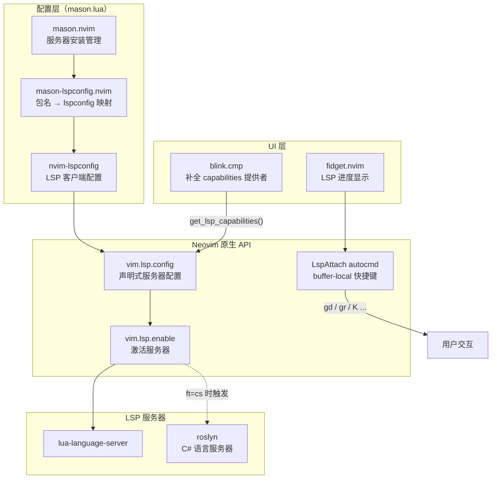
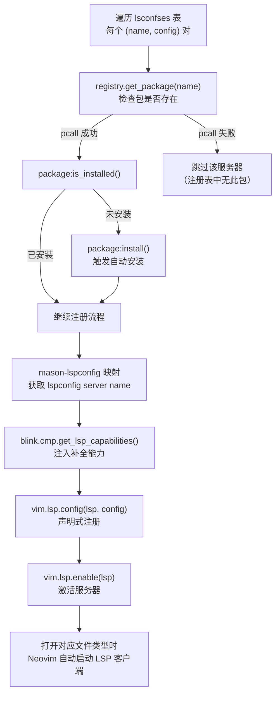
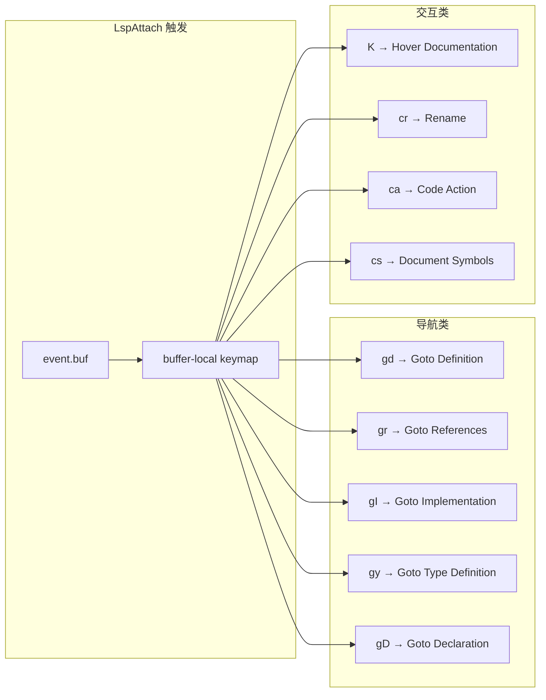

本配置采用 **mason.nvim + mason-lspconfig.nvim + nvim-lspconfig** 三层协作架构，结合 Neovim 0.11+ 原生 LSP API（`vim.lsp.config` / `vim.lsp.enable`），实现语言服务器的声明式注册、按需安装与补全能力的自动对接。本文将深入解析 Mason 插件的依赖拓扑、服务器自动安装机制、capabilities 注册流程，以及 LspAttach 事件驱动的快捷键绑定策略。

Sources: [mason.lua](lua/plugins/mason.lua#L1-L86)

## 架构概览：三层协作的 LSP 管理体系

Mason 相关插件在本配置中形成一个清晰的分层依赖结构。**mason.nvim** 负责底层的服务器二进制管理与安装，**mason-lspconfig.nvim** 作为桥梁层提供 Mason 包名到 lspconfig server name 的映射，而 **nvim-lspconfig** 提供统一的 LSP 客户端配置接口。UI 层面，**fidget.nvim** 以 LspAttach 事件触发加载，在编辑器右下角渲染 LSP 进度动画。整个体系通过 `VeryLazy` 事件延迟加载，避免启动阶段的性能开销。



关键设计决策在于：**Roslyn 作为 C# 语言服务器拥有独立的插件文件**（[roslyn.lua](lua/plugins/roslyn.lua)），通过 `ft = "cs"` 实现文件类型级别的懒加载，不参与 Mason 的统一安装流程。Mason 仅管理通用语言服务器（当前为 `lua-language-server`），而 C# 开发链的 LSP 部分由 roslyn.nvim 自行管理。

Sources: [mason.lua](lua/plugins/mason.lua#L22-L29), [roslyn.lua](lua/plugins/roslyn.lua#L1-L6), [fidget.lua](lua/plugins/fidget.lua#L1-L21)

## 依赖声明与加载策略

Mason 插件在 [mason.lua](lua/plugins/mason.lua) 中以 lazy.nvim 的 spec 格式声明，采用 `VeryLazy` 事件加载，确保 Neovim 核心 UI 初始化完成后再加载 LSP 管理模块，缩短启动时间。其依赖关系形成如下拓扑：

| 组件 | 角色 | 加载时机 |
|------|------|----------|
| `mason.nvim` | 服务器二进制安装、注册表管理 | `VeryLazy` |
| `mason-lspconfig.nvim` | Mason 包名 ↔ lspconfig 名称映射 | 随 mason.nvim 加载 |
| `nvim-lspconfig` | LSP 客户端配置、`:LspInfo` 等命令 | 随 mason.nvim 加载 |
| `fidget.nvim` | LSP 进度通知 UI | `LspAttach` 事件触发 |
| `blink.cmp` | 补全引擎，提供 LSP capabilities | `InsertEnter` / `CmdlineEnter` |

在 `config` 函数中，配置通过 `require("lspconfig")` 显式预加载 lspconfig 模块，目的是**注册 `:LspInfo`、`:LspStart` 等用户命令**，使这些命令在 Mason 初始化完成后立即可用。这是一个微妙但重要的顺序依赖——若不先加载 lspconfig，用户在 Mason 初始化后立即执行 `:LspInfo` 将提示未知命令。

Sources: [mason.lua](lua/plugins/mason.lua#L36-L39)

## 双注册表机制：标准 Registry 与自定义扩展

Mason 默认从 `github:mason-org/mason-registry` 获取服务器定义。本配置通过 `registries` 选项额外添加了 **Crashdummyy/mason-registry** 自定义注册表：

```lua
opts = {
    registries = {
        "github:mason-org/mason-registry",
        "github:Crashdummyy/mason-registry", -- 包含 roslyn 的自定义 registry
    },
},
```

这意味着 Mason 在查找包时，会先搜索标准注册表，再搜索自定义注册表。虽然当前 Roslyn 的实际管理已由 [roslyn.nvim](lua/plugins/roslyn.lua) 独立接管，但自定义注册表的保留为未来可能需要从 Mason 安装的其他非标准 LSP 服务器（如注释中的 `vtsls`、`html`、`cssls`）预留了扩展路径。配置文件中可以看到被注释掉的这些服务器条目，暗示配置者曾考虑或未来计划支持多语言开发场景。

Sources: [mason.lua](lua/plugins/mason.lua#L30-L20)

## 服务器声明与自动安装流程

Mason 管理的服务器以 **声明式配置表** `lsconfses` 定义在文件顶部。该表的键是 Mason 包名，值是传递给 `vim.lsp.config` 的配置参数，包括 `settings` 等服务器特定选项。以 `lua-language-server` 为例：

```lua
local lsconfses = {
  ["lua-language-server"] = {
    settings = {
      Lua = {
        completion = { callSnippet = "Replace" },
        diagnostics = { globals = { "vim" } },
      },
    },
  },
}
```

核心的 `setup` 函数实现了**检查-安装-注册-启用**的四步流水线：



值得注意的实现细节：

- **`pcall` 安全调用**：`registry.get_package(name)` 使用 `pcall` 包裹，即使包名在注册表中不存在也不会抛出异常，而是静默跳过，体现了防御性编程的思想。
- **异步安装**：`package:install()` 是异步操作，不会阻塞 Neovim 主线程。安装过程中用户可以正常编辑，fidget.nvim 会显示安装进度。
- **Neovim 0.11+ 原生 API**：本配置使用 `vim.lsp.config()` 和 `vim.lsp.enable()` 替代传统的 `lspconfig[name].setup()` 调用，这是 Neovim 0.11 引入的声明式 LSP 配置 API，支持延迟激活——服务器只在打开匹配文件类型时才实际启动。

Sources: [mason.lua](lua/plugins/mason.lua#L1-L55)

## Capabilities 注册：blink.cmp 补全能力注入

LSP 协议中的 **capabilities** 是客户端向服务器声明自身支持能力的机制。本配置使用 `blink.cmp` 作为补全引擎（已禁用 nvim-cmp），其提供的 `get_lsp_capabilities()` 函数返回一个包含补全、代码片段等能力声明的表：

```lua
config.capabilities = require("blink.cmp").get_lsp_capabilities()
vim.lsp.config(lsp, config)
```

这一行代码是补全系统与 LSP 系统的关键衔接点。`blink.cmp.get_lsp_capabilities()` 返回的能力表基于 Neovim 默认的 `vim.lsp.protocol.make_client_capabilities()`，并在此基础上扩展了补全相关的能力声明（如 snippet 支持、additional text edits 等）。通过将其注入到 `config.capabilities` 中，LSP 服务器能够正确识别客户端的补全能力，从而提供精确的补全建议。

同样的模式也出现在 [roslyn.lua](lua/plugins/roslyn.lua) 中：

```lua
config = {
    capabilities = require("blink.cmp").get_lsp_capabilities(),
},
```

两处使用相同的 capabilities 获取方式，确保所有 LSP 服务器（Mason 管理的通用服务器和 Roslyn）都获得一致的补全能力声明。

Sources: [mason.lua](lua/plugins/mason.lua#L48-L51), [roslyn.lua](lua/plugins/roslyn.lua#L10-L12), [blink.lua](lua/plugins/blink.lua#L55-L69)

## Diagnostic 配置：虚拟文本与更新策略

在服务器注册完成后，配置通过 `vim.diagnostic.config` 设置全局诊断行为：

```lua
vim.diagnostic.config({
    virtual_text = true,
    update_in_insert = false
})
```

| 参数 | 值 | 说明 |
|------|----|------|
| `virtual_text` | `true` | 在代码行末以虚拟文本形式显示诊断信息（错误、警告等） |
| `update_in_insert` | `false` | 插入模式下不更新诊断，避免输入时的视觉干扰 |

注释掉的 `virtual_lines = true` 选项是一个更丰富的诊断展示方式，它会在代码下方以多行虚拟文本展示完整的诊断信息。当前选择 `virtual_text = true` 是更轻量的方案，适合日常编码。两者的区别在于：`virtual_text` 仅显示诊断消息的第一行，而 `virtual_lines` 会展开完整的多行诊断详情。

Sources: [mason.lua](lua/plugins/mason.lua#L57-L61)

## LspAttach 事件：Buffer-Local 快捷键绑定

`LspAttach` 自动命令是 LSP 快捷键绑定的标准范式。它在 LSP 客户端成功附加到 buffer 时触发，确保快捷键只在 LSP 功能可用时才被注册。本配置创建了一个名为 `user-lsp-attach` 的 augroup，每次绑定都以 `buffer = event.buf` 限定作用域，避免快捷键污染非 LSP buffer。



**关键设计选择**是导航类操作（`gd`、`gr`、`gI`、`gy`、`cs`）使用 **Snacks.picker** 而非内置的 `vim.lsp.buf` 函数。Snacks.picker 提供了更丰富的交互式列表界面（带有预览窗口、过滤功能），相比原生 `vim.lsp.buf.definition()` 的简单跳转体验更佳。而操作类命令（`rename`、`code_action`、`hover`、`declaration`）则直接使用 Neovim 内置的 LSP API，因为这些操作的交互模式不需要列表选择器。

需要注意的是，此 `LspAttach` 回调作用于**所有 LSP 客户端**（包括 Mason 管理的服务器和 Roslyn）。Roslyn 额外在 [roslyn.lua](lua/plugins/roslyn.lua) 中注册了自己的 `LspAttach` 回调（augroup 为 `roslyn-keymaps`），通过 `client.name ~= "roslyn"` 条件过滤，仅当 Roslyn 客户端附加时才绑定 `<leader>ct`（选择解决方案目标）和 `<leader>cl`（重启分析）这两个专属快捷键。

Sources: [mason.lua](lua/plugins/mason.lua#L63-L83), [roslyn.lua](lua/plugins/roslyn.lua#L32-L63)

## fidget.nvim：LSP 进度可视化

[fidget.lua](lua/plugins/fidget.lua) 作为 Mason 的依赖声明，但实际加载时机为 `LspAttach` 事件——这意味着它在首个 LSP 客户端附加到 buffer 时才激活，是最精确的懒加载粒度。fidget.nvim 拦截 LSP 的 `$/progress` 通知，在编辑器右下角以浮窗形式展示服务器的工作状态：

| 配置项 | 值 | 作用 |
|--------|----|------|
| `winblend` | `0` | 窗口透明度，0 为完全不透明 |
| `relative` | `"editor"` | 浮窗相对于整个编辑器定位 |
| `done_icon` | `"✓"` | 任务完成时的图标 |
| `progress_icon` | `{ pattern = "dots", period = 1 }` | 进度动画样式，使用点状动画，周期 1 秒 |

fidget 的存在使得 Mason 安装服务器、LSP 服务器初始化索引等长时间操作都有可见的进度反馈，极大改善了用户对后台任务的感知。特别是在首次启动时 Mason 自动安装 `lua-language-server` 的场景下，用户可以实时看到下载和解压进度。

Sources: [fidget.lua](lua/plugins/fidget.lua#L1-L21)

## 服务器配置参考：lua-language-server

当前 Mason 管理的唯一活跃服务器是 `lua-language-server`，其配置专注于 Neovim Lua 开发场景：

| 配置路径 | 值 | 说明 |
|----------|----|------|
| `Lua.completion.callSnippet` | `"Replace"` | 函数调用补全时，将整个调用替换为 snippet（而非仅在括号内插入） |
| `Lua.diagnostics.globals` | `{ "vim" }` | 将 `vim` 标记为已知全局变量，消除 `Undefined global `vim`` 警告 |

`callSnippet = "Replace"` 是 Neovim 配置开发中的重要设置。默认情况下，lua-language-server 对函数调用提供两种补全方式：`"Insert"` 仅插入参数占位符，而 `"Replace"` 将整个函数调用（包括函数名和括号）作为 snippet 提供，支持在参数间 Tab 跳转。在 Neovim 配置场景中，大量使用 `vim.keymap.set()`、`vim.api.nvim_create_autocmd()` 等多参数函数，`"Replace"` 模式能显著提升参数填写效率。

Sources: [mason.lua](lua/plugins/mason.lua#L1-L20)

## 扩展新服务器的操作指南

若需要添加新的 LSP 服务器到 Mason 管理体系，只需在 `lsconfses` 表中添加新条目。以下是操作流程：

1. **确认包名**：通过 `:Mason` 界面搜索目标服务器，记录 Mason 包名（如 `pyright`、`tslint`）
2. **添加配置**：在 `lsconfses` 表中添加条目，键为 Mason 包名，值为服务器配置
3. **重启 Neovim**：`setup` 函数会在下次加载时自动检测并安装

示例——添加 TypeScript 支持：

```lua
local lsconfses = {
  ["lua-language-server"] = { -- 现有配置
    settings = { Lua = { ... } },
  },
  ["typescript-language-server"] = { -- 新增
    settings = {},
  },
}
```

对于**不在标准注册表中的服务器**，需先确认自定义注册表（`Crashdummyy/mason-registry`）是否包含该包，或考虑添加更多自定义注册表到 `registries` 配置中。对于像 Roslyn 这样拥有独立 Neovim 插件封装的服务器，建议保持独立文件管理模式（参照 [roslyn.lua](lua/plugins/roslyn.lua) 的模式），以获得更精细的文件类型级懒加载控制。

Sources: [mason.lua](lua/plugins/mason.lua#L1-L55)

## 架构总结与相关阅读

本配置的 Mason LSP 管理系统体现了**声明式配置 + 自动安装 + 原生 API**的现代化 Neovim LSP 管理理念。通过 `lsconfses` 配置表集中管理服务器声明，`setup` 函数统一处理安装与注册，`vim.lsp.config/enable` 原生 API 实现延迟激活，`LspAttach` 事件驱动快捷键绑定——每一层都有清晰的职责边界。

| 关注点 | 相关页面 |
|--------|----------|
| Roslyn C# LSP 的独立配置与解决方案管理 | [Roslyn LSP 配置：语言服务器管理与解决方案定位](7-roslyn-lsp-pei-zhi-yu-yan-fu-wu-qi-guan-li-yu-jie-jue-fang-an-ding-wei) |
| 补全框架如何消费 LSP capabilities | [blink.cmp 补全框架：easy-dotnet 源集成与 cmdline 补全](11-blink-cmp-bu-quan-kuang-jia-easy-dotnet-yuan-ji-cheng-yu-cmdline-bu-quan) |
| 快捷键体系中的 LSP 相关绑定 | [快捷键体系：Leader 键分组与 buffer-local 绑定策略](12-kuai-jie-jian-ti-xi-leader-jian-fen-zu-yu-buffer-local-bang-ding-ce-lue) |
| 插件懒加载策略的整体设计 | [lazy.nvim 插件管理：懒加载策略与 spec 规范](5-lazy-nvim-cha-jian-guan-li-lan-jia-zai-ce-lue-yu-spec-gui-fan) |
| LSP 驱动的代码折叠方案 | [代码折叠方案：nvim-ufo 与 Treesitter 折叠表达式](20-dai-ma-zhe-die-fang-an-nvim-ufo-yu-treesitter-zhe-die-biao-da-shi) |