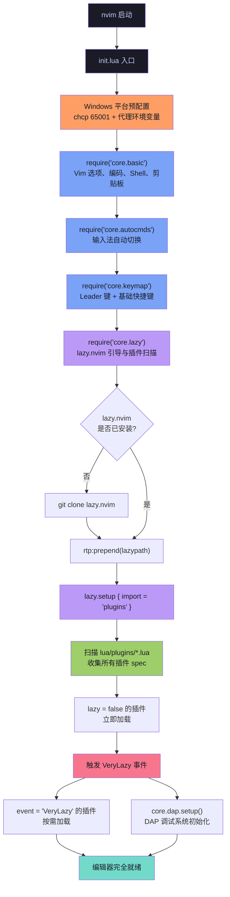
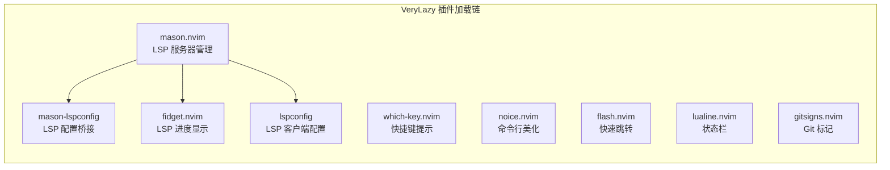

本页详细解析 Neovim 启动时配置文件的加载流程——从入口文件 `init.lua` 开始，经过 core 基础模块的同步初始化，到 lazy.nvim 接管后的插件懒加载全过程。理解这条加载链路，是阅读后续所有深度解析页面的基础，也是排查配置问题时定位根因的关键能力。

## 整体架构概览

Neovim 的配置加载遵循一个清晰的两阶段模型：**同步初始化阶段**由入口文件手动控制，按固定顺序依次执行基础设置；**懒加载阶段**由插件管理器 lazy.nvim 接管，根据每个插件声明的触发条件按需加载。这种设计确保了编辑器的核心功能在毫秒级内就绪，而重量级插件（如 LSP 服务器、调试适配器）只在真正需要时才消耗资源。

下面的流程图展示了从执行 `nvim` 命令到编辑器完全就绪的全过程：



Sources: [init.lua](init.lua#L1-L23)

## 第一阶段：同步初始化（core 模块）

当 Neovim 启动时，它首先查找配置目录下的 `init.lua` 文件并逐行执行。本项目的 `init.lua` 在加载任何插件之前，先通过四个 `require()` 调用按固定顺序完成基础环境的搭建。这四个模块位于 `lua/core/` 目录下，它们的执行是完全同步的——前一个模块执行完毕后，下一个才会开始。这种顺序保证了一种**依赖确定性**：后续模块可以安全地使用前面模块已经设置好的全局状态。

Sources: [init.lua](init.lua#L12-L15)

### 1. 平台预配置（init.lua 头部）

在加载任何 core 模块之前，`init.lua` 先执行两项平台适配操作。对于 Windows 系统，它通过 `chcp 65001` 将子进程的代码页切换为 UTF-8，避免 lazygit 等子进程输出乱码。随后设置 HTTP/HTTPS 代理环境变量，确保后续 lazy.nvim 克隆插件、Mason 安装 LSP 服务器等网络操作能通过代理正常完成。

```lua
-- init.lua 第 1-10 行的平台预配置
if vim.fn.has("win32") == 1 then
  vim.fn.system("chcp 65001")
end
vim.env.HTTP_PROXY = "http://127.0.0.1:7897"
vim.env.HTTPS_PROXY = "http://127.0.0.1:7897"
vim.env.NO_PROXY = "localhost,127.0.0.1"
```

**注意**：代理地址 `127.0.0.1:7897` 是硬编码的，如果你的代理软件使用不同端口，需要手动修改此处的值。

Sources: [init.lua](init.lua#L1-L10)

### 2. core/basic.lua — 编辑器基础选项

这是加载链中的第一个 core 模块，负责设置 Neovim 的全局编辑行为。它涵盖以下配置域：

| 配置域 | 关键设置 | 用途 |
|--------|---------|------|
| **行号显示** | `number = true`, `relativenumber = true` | 当前行显示绝对行号，其余行显示相对行号 |
| **光标辅助** | `cursorline = true`, `colorcolumn = "120"` | 高亮当前行，在第 120 列显示参考线 |
| **缩进策略** | `expandtab = true`, `tabstop = 4`, `shiftwidth = 0` | 将 Tab 转换为 4 个空格 |
| **搜索行为** | `ignorecase = true`, `smartcase = true` | 默认忽略大小写，但当搜索包含大写字母时切换为区分大小写 |
| **窗口分割** | `splitbelow = true`, `splitright = true` | 新窗口默认出现在下方和右侧 |
| **编码设置** | `encoding = 'utf-8'`, `fileencodings = 'utf-8,gbk,gb18030,...'` | 默认 UTF-8，兼容中文编码自动检测 |
| **Shell 配置** | `shell = 'pwsh'` + 完整的 shellcmdflag | 使用 PowerShell 7 作为默认 Shell，并设置 UTF-8 编码传递 |
| **剪贴板** | `clipboard:append("unnamedplus")` | 使用系统剪贴板作为默认寄存器 |
| **SSH 剪贴板** | OSC 52 协议自动检测 | SSH 环境下通过 OSC 52 转发剪贴板到本地终端 |

其中 Shell 配置部分比较精细——不仅设置了 `shell = 'pwsh'`，还配套设置了 `shellcmdflag`、`shellredir`、`shellpipe`、`shellquote`、`shellxquote` 五个选项，确保 Neovim 的 `:!` 命令、`system()` 调用等场景下 PowerShell 7 能正确处理 UTF-8 编码的输入输出。

SSH 剪贴板部分则通过检测 `SSH_CLIENT`/`SSH_TTY`/`SSH_CONNECTION` 环境变量，在远程环境下自动切换为 OSC 52 协议，让 Windows Terminal、iTerm2 等支持的终端可以直接复制远端内容到本地剪贴板。

Sources: [basic.lua](lua/core/basic.lua#L1-L62)

### 3. core/autocmds.lua — 自动命令

第二个加载的 core 模块非常精简，仅处理一个 Windows 特定的功能：**输入法自动切换**。当你在 Windows 上安装了 `im_select.exe` 工具时，该模块会注册两个自动命令——离开插入模式时切换到英文输入法（代码 `1033`），进入插入模式时切换到中文输入法（代码 `2052`）。这样在普通模式下操作时不会因为中文输入法而干扰快捷键，回到插入模式后又自动恢复中文输入。

这个模块包含一个前置检查 `vim.fn.executable(im_select_path) == 1`，如果工具不存在则完全跳过注册，不会产生任何副作用。

Sources: [autocmds.lua](lua/core/autocmds.lua#L1-L25)

### 4. core/keymap.lua — 基础快捷键

第三个 core 模块定义了**不依赖任何插件**的全局快捷键。它首先设置了两个关键的全局变量：

- `vim.g.mapleader = " "` — Leader 键设为**空格**，这是几乎所有 Leader 快捷键组合的起点
- `vim.g.maplocalleader = "\\"` — Local Leader 设为反斜杠，用于 buffer-local 的特殊操作

随后定义的快捷键覆盖了窗口导航（`<C-h/j/k/l>`）、行移动（`<A-j/k>`）、搜索行为优化（`n/N` 方向感知）、文件保存（`<C-s>`）、标签页管理（`<leader><tab>` 前缀）等常见操作。这些快捷键之所以放在 core 模块而非插件中，是因为它们不依赖任何第三方插件，在编辑器启动的最早阶段就需要可用。

**重要**：Leader 键的设置**必须**在 lazy.nvim 加载之前完成，因为插件 spec 中使用 `<leader>` 前缀的快捷键（如 neo-tree 的 `<leader>e`）在注册时需要知道 Leader 键的实际映射。

Sources: [keymap.lua](lua/core/keymap.lua#L1-L68)

### 5. core/lazy.lua — 插件管理器引导

这是同步初始化阶段的最后一个模块，也是最关键的转折点——它将控制权从手动 `require()` 调用转移到 lazy.nvim 的自动化插件管理系统。


lazy.nvim 的引导逻辑分为三步：首先检查 `stdpath("data")/lazy/lazy.nvim` 目录是否存在；若不存在，则通过 `git clone` 从 GitHub 克隆稳定版本到该目录，克隆失败时会显示错误信息并退出；最后将 lazy.nvim 的路径添加到 Neovim 的 `runtimepath` 前面，确保后续的 `require("lazy")` 调用能正确解析。

`require("lazy").setup()` 的核心参数是 `spec = { { import = "plugins" } }`，这告诉 lazy.nvim 去 `lua/plugins/` 目录下扫描所有 `.lua` 文件，将每个文件的返回值作为插件 spec 收集起来。注意此处 LazyVim 的导入被注释掉了（`-- { "LazyVim/LazyVim", import = "lazyvim.plugins" }`），说明本项目**不依赖 LazyVim 框架**，而是直接使用 lazy.nvim 作为独立的插件管理器。

Sources: [lazy.lua](lua/core/lazy.lua#L1-L35)

## 第二阶段：懒加载（plugins 模块）

当 `require("lazy").setup()` 执行完毕后，所有 `lua/plugins/` 目录下的插件 spec 都已被收集。lazy.nvim 会根据每个 spec 中声明的触发条件决定加载时机——**未到加载时机的插件只会注册快捷键占位符和命令占位符，不会执行任何实质性的初始化代码**。这是 Neovim 启动速度优化的核心机制。

### 懒加载触发策略分类

本项目的 30+ 个插件使用了六种不同的加载策略，下表按**加载时机从早到晚**排列：

| 策略 | 触发条件 | 典型插件 | 加载时机 |
|------|---------|---------|---------|
| **`lazy = false`** | 无条件立即加载 | treesitter, snacks, nvim-ufo, toggleterm | `lazy.setup()` 执行时 |
| **`priority = 1000`** | 高优先级立即加载 | snacks（Dashboard） | `lazy.setup()` 执行时，排在其他插件前面 |
| **`event = "VeryLazy"`** | UI 初始化后触发 | mason, which-key, noice, flash, lualine, gitsigns | Neovim UI 完全就绪后 |
| **`event = "InsertEnter"`** | 进入插入模式 | blink.cmp | 首次进入插入模式时 |
| **`ft = "cs"`** | 打开特定文件类型 | roslyn | 首次打开 `.cs` 文件时 |
| **`keys = { ... }`** | 按下指定快捷键 | neo-tree, lazygit, diffview, conform | 用户按下对应按键时 |
| **`cmd = { ... }`** | 执行指定命令 | lazygit (`:LazyGit`), diffview (`:DiffviewOpen`), conform (`:ConformInfo`) | 用户输入对应命令时 |

Sources: [treesitter.lua](lua/plugins/treesitter.lua#L1-L4), [snacks.lua](lua/plugins/snacks.lua#L1-L4), [mason.lua](lua/plugins/mason.lua#L23-L25), [blink.lua](lua/plugins/blink.lua#L24), [roslyn.lua](lua/plugins/roslyn.lua#L1-L3), [neo-tree.lua](lua/plugins/neo-tree.lua#L10-L13), [lazygit.lua](lua/plugins/lazygit.lua#L2-L9)

### 立即加载的插件

设为 `lazy = false` 的插件在 `lazy.setup()` 执行时**同步加载**，它们通常是编辑器的"基础设施"——缺少它们会导致后续功能异常。本项目中有四个插件被标记为立即加载：

- **snacks.nvim**（`priority = 1000`）：提供 Dashboard 启动页、通知系统、文件选择器等核心 UI 功能。`priority = 1000` 确保它在所有其他插件之前加载，这样 Dashboard 能在启动时立即显示。
- **nvim-treesitter**（`lazy = false`）：语法高亮引擎。因为 Treesitter 在文件打开时就需要工作，它必须在启动阶段就绑定到 `FileType` 自动命令上。
- **nvim-ufo**：代码折叠引擎。它需要在启动时设置 `foldlevel`、`foldcolumn` 等原生选项。
- **toggleterm**：终端集成。它在 `config` 函数中直接调用 `setup()` 而没有声明任何懒加载条件，因此被默认为 `lazy = false`。

Sources: [snacks.lua](lua/plugins/snacks.lua#L1-L4), [treesitter.lua](lua/plugins/treesitter.lua#L1-L4), [nvim-ufo.lua](lua/plugins/nvim-ufo.lua#L1-L5), [toggleterm.lua](lua/plugins/toggleterm.lua#L1-L5)

### VeryLazy 阶段加载的插件

`VeryLazy` 是 lazy.nvim 定义的一个特殊事件，它在 Neovim 的 UI 完全初始化后触发。这是大多数 UI 类和工具类插件的理想加载时机——它们需要在启动后可用，但不需要在毫秒级的启动路径上阻塞。

本项目在 VeryLazy 阶段加载的插件构成了一条功能链：



值得特别关注的是 **mason.nvim**：它在 VeryLazy 阶段加载后，会遍历 `lsconfses` 表中声明的 LSP 服务器（当前仅有 `lua-language-server`），检查它们是否已安装，未安装的会自动触发安装。安装完成后，通过 `vim.lsp.config()` 和 `vim.lsp.enable()` 注册 LSP 配置和启用服务器，并设置 `LspAttach` 自动命令来注册 LSP 相关的快捷键（如 `gd` 跳转到定义、`K` 悬停文档等）。

Sources: [mason.lua](lua/plugins/mason.lua#L23-L84), [whichkey.lua](lua/plugins/whichkey.lua#L1-L5), [noice.lua](lua/plugins/noice.lua#L1-L5), [flash.lua](lua/plugins/flash.lua#L1-L4), [lualine.lua](lua/plugins/lualine.lua#L1-L4), [gitsigns.lua](lua/plugins/gitsigns.lua#L1-L4)

### 事件触发加载的插件

这类插件只在特定编辑器事件发生时才加载，实现了最精细的按需加载：

- **blink.cmp**（`event = { "InsertEnter", "CmdlineEnter" }`）：补全引擎。只有当你首次进入插入模式（开始输入代码）或命令行模式（输入 `:` 命令）时才加载。这意味着如果你只是打开文件浏览而不编辑任何内容，补全引擎永远不会被加载。
- **conform.nvim**（`event = { "BufWritePre" }`）：格式化工具。只在保存文件前触发，确保格式化操作在写入磁盘前执行。

Sources: [blink.lua](lua/plugins/blink.lua#L24), [conform.lua](lua/plugins/conform.lua#L1-L5)

### 文件类型触发加载的插件

这是最"懒"的加载策略——只有当你打开特定类型的文件时才加载对应插件：

- **roslyn.nvim**（`ft = "cs"`）：C# 语言服务器。只有打开 `.cs` 文件时才加载并启动 Roslyn LSP，为编辑器提供代码补全、诊断、导航等 C# 语言特性。

对于不使用 C# 的编辑场景（如纯 Lua 配置编辑），Roslyn 完全不会被加载，节省了显著的内存和 CPU 开销。

Sources: [roslyn.lua](lua/plugins/roslyn.lua#L1-L3)

### 快捷键/命令触发加载的插件

这是懒加载的终极形态——插件只在用户显式调用时才加载。lazy.nvim 会预先注册一个快捷键或命令的"占位符"，当用户触发时才执行实际的插件加载和初始化：

| 插件 | 触发方式 | 说明 |
|------|---------|------|
| neo-tree | `<leader>e` / `<leader>o` | 文件浏览器，按空格+e 打开 |
| lazygit | `<leader>gg` 或 `:LazyGit` | Git 图形界面 |
| diffview | `<leader>gd` / `<leader>gD` 或 `:DiffviewOpen` | Git diff 查看 |
| conform | `<leader>f`（手动格式化）或 `:ConformInfo` | 代码格式化 |

以 neo-tree 为例：当你启动 Neovim 后按下 `<leader>e`（即空格+e），lazy.nvim 会先加载 neo-tree 插件及其所有依赖（plenary.nvim、nvim-web-devicons、nui.nvim、nvim-window-picker），执行 `config` 函数完成初始化，然后执行 `<cmd>Neotree toggle<cr>` 命令。**第二次**按下 `<leader>e` 时，插件已经加载完成，命令会立即执行。

Sources: [neo-tree.lua](lua/plugins/neo-tree.lua#L10-L13), [lazygit.lua](lua/plugins/lazygit.lua#L2-L9), [diffview.lua](lua/plugins/diffview.lua#L2-L8), [conform.lua](lua/plugins/conform.lua#L1-L15)

## 第三阶段：VeryLazy 后的延迟初始化

在 `init.lua` 的最后一部分，注册了一个 `User` 事件监听器，当 `VeryLazy` 事件触发时，执行 `core.dap` 模块的 `setup()` 函数。这是整个加载链的最后一环：

```lua
vim.api.nvim_create_autocmd("User", {
  pattern = "VeryLazy",
  once = true,
  callback = function() require("core.dap").setup() end,
})
```

DAP（Debug Adapter Protocol）调试系统的初始化被放在 VeryLazy 之后，是因为它需要依赖多个已经加载完成的插件：dap-ui 需要 `dapui` 插件就绪，调试适配器路径需要从 Mason 的安装目录或 sharpdbg 插件目录中获取，而 `blink.cmp` 的 `get_lsp_capabilities()` 也需要先注册完成。`once = true` 确保这个初始化只执行一次，不会因为后续的 VeryLazy 事件而重复触发。

Sources: [init.lua](init.lua#L17-L22), [dap.lua](lua/core/dap.lua#L1-L5)

## 完整加载时序表

下面的表格按执行顺序汇总了所有模块和插件的加载时机，可以作为排查问题时的快速参考：

| 顺序 | 模块/插件 | 加载方式 | 主要功能 |
|:----:|----------|---------|---------|
| 1 | `init.lua` 头部 | 同步执行 | Windows 代码页 + 代理设置 |
| 2 | `core/basic.lua` | `require()` 同步 | 编辑器选项、编码、Shell、剪贴板 |
| 3 | `core/autocmds.lua` | `require()` 同步 | 输入法自动切换 |
| 4 | `core/keymap.lua` | `require()` 同步 | Leader 键 + 基础快捷键 |
| 5 | `core/lazy.lua` | `require()` 同步 | lazy.nvim 引导 + 插件 spec 扫描 |
| 6 | snacks.nvim | `priority = 1000` + `lazy = false` | Dashboard、通知、Picker |
| 7 | nvim-treesitter | `lazy = false` | 语法高亮、代码折叠 |
| 8 | nvim-ufo | `lazy = false`（默认） | 折叠增强 |
| 9 | toggleterm | `lazy = false`（默认） | 浮动终端 |
| 10 | mason.nvim | `event = "VeryLazy"` | LSP 服务器管理 |
| 11 | which-key.nvim | `event = "VeryLazy"` | 快捷键提示 |
| 12 | noice.nvim | `event = "VeryLazy"` | 命令行美化 |
| 13 | flash.nvim | `event = "VeryLazy"` | 快速跳转 |
| 14 | lualine.nvim | `event = "VeryLazy"` | 状态栏 |
| 15 | gitsigns.nvim | `event = "VeryLazy"` | Git 标记 |
| 16 | core/dap.lua | VeryLazy 回调 | DAP 调试系统初始化 |
| 17 | blink.cmp | `event = "InsertEnter"` | 补全引擎 |
| 18 | conform.nvim | `event = "BufWritePre"` | 保存时格式化 |
| 19 | roslyn.nvim | `ft = "cs"` | C# 语言服务器 |
| 20+ | neo-tree, lazygit, diffview 等 | `keys` / `cmd` 触发 | 按需加载的各功能插件 |

## 目录结构与模块对应关系

理解加载流程的另一种方式是直接看目录结构——每个文件在加载链中扮演的角色可以从它的位置直接推断：

```
nvim/
├── init.lua                          ← 入口文件，定义加载顺序
├── .neoconf.json                     ← neoconf 插件配置（LSP 开发辅助）
├── lua/
│   ├── core/                         ← 同步初始化模块（启动时全部加载）
│   │   ├── basic.lua                 ← 编辑器基础选项
│   │   ├── autocmds.lua              ← 自动命令
│   │   ├── keymap.lua                ← 基础快捷键
│   │   ├── lazy.lua                  ← 插件管理器引导
│   │   ├── dap.lua                   ← DAP 调试核心（VeryLazy 后加载）
│   │   └── dap_config.lua            ← DAP 调试器切换配置
│   └── plugins/                      ← 插件 spec 目录（由 lazy.nvim 扫描）
│       ├── snacks.lua                ← lazy=false, priority=1000
│       ├── treesitter.lua            ← lazy=false
│       ├── tokyonight.lua            ← 无懒加载条件（默认 lazy=false）
│       ├── blink.lua                 ← event=InsertEnter
│       ├── mason.lua                 ← event=VeryLazy
│       ├── roslyn.lua                ← ft=cs
│       ├── neo-tree.lua              ← keys 触发
│       ├── lazygit.lua               ← cmd+keys 触发
│       └── ... （其他插件 spec）
└── stylua.toml                       ← Lua 代码格式化规则
```

注意 `lua/plugins/` 目录下的**每个 `.lua` 文件都会被 lazy.nvim 扫描**，但被扫描不等于被加载——lazy.nvim 只是收集它们的 spec 定义，实际的插件加载要等到触发条件满足时才发生。唯一的例外是 [example.lua](lua/plugins/example.lua#L1-L3)，它通过 `if true then return {} end` 在文件级别短路，返回空 spec，相当于被禁用。

Sources: [example.lua](lua/plugins/example.lua#L1-L3)

## 常见加载问题排查

理解了加载链路后，以下典型问题的定位会变得直观：

| 问题现象 | 可能原因 | 排查方向 |
|---------|---------|---------|
| 插件快捷键不生效 | Leader 键未设置或插件未加载 | 检查 `core/keymap.lua` 是否在 `core/lazy.lua` 之前加载 |
| 保存时不自动格式化 | conform.nvim 未加载 | 检查 `event = { "BufWritePre" }` 是否被正确声明 |
| 打开 .cs 文件无代码补全 | roslyn.nvim 未触发 | 确认 `ft = "cs"` 生效，文件类型是否被正确识别 |
| DAP 调试快捷键缺失 | DAP 初始化依赖 Roslyn LSP Attach | 确认 Roslyn 已连接到当前 buffer |
| Dashboard 不显示 | snacks.nvim 的 priority 不足 | 确认 `priority = 1000` 存在且 `lazy = false` |
| 命令行显示异常 | noice.nvim 未加载 | 检查 VeryLazy 事件是否正常触发 |

Sources: [init.lua](init.lua#L12-L22)

## 建议阅读顺序

掌握本页的加载流程后，建议按以下顺序继续深入：

1. [双模块分层设计：core 基础层与 plugins 扩展层](4-shuang-mo-kuai-fen-ceng-she-ji-core-ji-chu-ceng-yu-plugins-kuo-zhan-ceng) — 深入理解 core 与 plugins 两层架构的设计哲学
2. [lazy.nvim 插件管理：懒加载策略与 spec 规范](5-lazy-nvim-cha-jian-guan-li-lan-jia-zai-ce-lue-yu-spec-gui-fan) — 掌握插件 spec 的完整语法和高级用法
3. [快捷键体系：Leader 键分组与 buffer-local 绑定策略](12-kuai-jie-jian-ti-xi-leader-jian-fen-zu-yu-buffer-local-bang-ding-ce-lue) — 理解快捷键在 core 和 plugins 中的分配逻辑