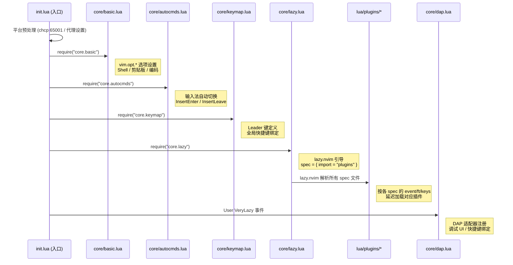
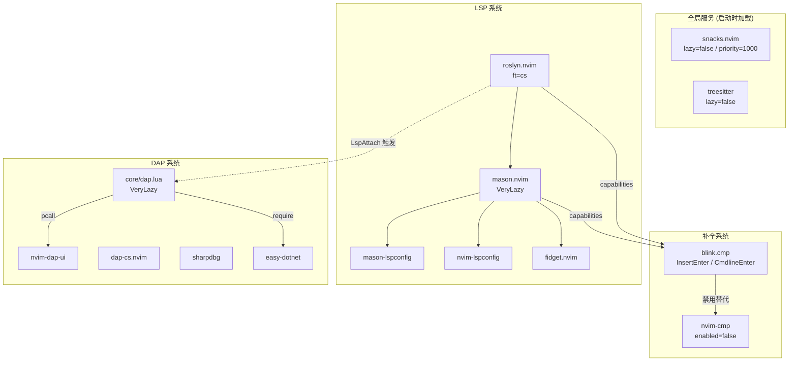

本框架采用 **core / plugins 双模块分层架构**，将编辑器的基础行为配置与功能扩展插件清晰地隔离到两个独立目录中。**core 层**负责 Neovim 原生选项、全局快捷键、自动命令以及调试系统核心初始化——这些是不依赖任何第三方插件的"编辑器骨架"；**plugins 层**则由 lazy.nvim 按需加载，每个 `.lua` 文件对应一个独立的插件 spec，涵盖主题、LSP、补全、文件浏览等全部扩展功能。这种分层设计使得配置的维护边界明确：修改编辑器基础行为只动 `lua/core/`，增删插件功能只动 `lua/plugins/`，二者互不干扰。

Sources: [init.lua](init.lua#L1-L23)

## 架构总览与加载时序

整个配置的启动过程遵循一个严格的时序链：**平台预处理 → core 模块同步加载 → lazy.nvim 接管插件加载 → VeryLazy 事件触发 DAP 初始化**。下图展示了从 `init.lua` 入口到各模块的完整加载路径：



`init.lua` 中的 12–15 行按固定顺序同步加载四个 core 模块。这个顺序不可随意调换——`basic.lua` 必须先于 `keymap.lua` 执行，因为 Leader 键的赋值（`vim.g.mapleader`）需要在任何快捷键绑定之前完成；而 `lazy.lua` 必须放在最后，因为它会触发 lazy.nvim 的插件解析流程，此时所有基础配置应该已经就绪。第 18–22 行的 DAP 初始化被有意推迟到 `VeryLazy` 事件，确保在 DAP 注册适配器之前，所有插件（如 mason、dapui）已经完成加载。

Sources: [init.lua](init.lua#L1-L23), [lua/core/lazy.lua](lua/core/lazy.lua#L24-L34)

## core 层：编辑器骨架

core 层包含 6 个文件，每个文件承担一个明确的职责领域。它们在 Neovim 启动的同步阶段被加载，构成了编辑器的**最简可用状态**——即使禁用全部插件，core 层的配置依然能让 Neovim 以合理的方式工作。

| 文件 | 职责 | 加载时机 | 是否依赖插件 |
|------|------|----------|-------------|
| `basic.lua` | vim 选项（行号、缩进、编码、Shell） | 启动时同步 | ❌ |
| `keymap.lua` | Leader 键 + 全局快捷键 | 启动时同步 | ❌ |
| `autocmds.lua` | 输入法自动切换（Windows） | 启动时同步 | ❌ |
| `lazy.lua` | lazy.nvim 引导 + 插件 spec 导入 | 启动时同步 | ❌（自身引导 lazy） |
| `dap.lua` | DAP 适配器注册 + 调试快捷键 + UI | VeryLazy 事件 | ✅ 依赖 dap / dapui |
| `dap_config.lua` | 调试器后端选择（纯配置） | 被 dap.lua require | ❌ |

### basic.lua —— Neovim 选项的声明式配置

`basic.lua` 采用纯粹的 `vim.opt.*` 声明式风格，将所有编辑器行为选项集中在一个文件中。配置涵盖四个维度：**编辑行为**（行号、相对行号、光标行高亮、120 列标尺、Tab 转空格）、**窗口布局**（水平/垂直分割方向）、**搜索策略**（忽略大小写 + 智能大小写）、**平台适配**（Shell 设为 pwsh、UTF-8 编码、中文编码兼容链、SSH 环境的 OSC 52 剪贴板转发）。

这种"单文件集中所有选项"的模式使得查找任何编辑器行为配置都只需打开一个文件，而不像分散在各插件 spec 中那样难以追踪。值得注意的是，第 37–61 行处理 SSH 环境下的剪贴板策略——当检测到 `SSH_CLIENT` 等环境变量时，切换到 OSC 52 协议实现远程剪贴板同步，粘贴操作则通过自定义的 `my_paste` 函数读取默认寄存器内容，绕过 OSC 52 paste 的兼容性问题。

Sources: [lua/core/basic.lua](lua/core/basic.lua#L1-L62)

### keymap.lua —— Leader 键与全局快捷键

`keymap.lua` 的第一行定义了整个快捷键体系的根节点：`vim.g.mapleader = " "`（Space 作为 Leader 键）和 `vim.g.maplocalleader = "\\"`。**这一行必须在 `basic.lua` 之后、`lazy.lua` 之前执行**，因为 lazy.nvim 在解析插件 spec 中的 `keys` 字段时，会展开 Leader 键占位符——如果 Leader 尚未定义，所有 `<leader>` 快捷键将无法正确映射。

全局快捷键按照功能分组，涵盖：**编辑操作**（Ctrl+Z/Ctrl+Shift+Z 撤销/重做、Alt+J/K 行移动、逗号/句号/分号的 undo 断点）、**窗口导航**（Ctrl+H/J/K/L 跨窗口移动、Ctrl+方向键调整窗口大小）、**文件操作**（Ctrl+S 保存）、**标签页管理**（`<leader><tab>` 前缀组）、**终端**（`<leader><TAB>` 从终端模式退出到 Normal 模式）。这些快捷键不依赖任何插件，构成了"在任何 Neovim 实例中都能使用"的基础操作集。

Sources: [lua/core/keymap.lua](lua/core/keymap.lua#L1-L68)

### autocmds.lua —— 平台感知的自动命令

`autocmds.lua` 当前只处理一个特定场景：Windows 平台下输入法的自动切换。通过检测 `~/Tools/im_select.exe` 是否存在，在 `InsertLeave` 时切换到英文输入法（代码 1033），在 `InsertEnter` 时切换回中文输入法（代码 2052）。这种"条件注册"模式（先检测环境，再决定是否创建 autocmd）是该文件的设计核心——它不会在不满足条件的环境中产生任何副作用。

Sources: [lua/core/autocmds.lua](lua/core/autocmds.lua#L1-L25)

### lazy.lua —— 插件管理器的引导

`lazy.lua` 分为两个阶段：**引导阶段**（第 1–22 行）检查 lazy.nvim 是否已安装在 `stdpath("data")/lazy/lazy.nvim`，若不存在则自动从 GitHub 克隆稳定分支，克隆失败则退出并提示；**配置阶段**（第 24–34 行）调用 `require("lazy").setup()`，其中 `spec = { { import = "plugins" } }` 是整个 plugins 层的入口——lazy.nvim 会自动扫描 `lua/plugins/` 目录下的所有 `.lua` 文件，将每个文件 return 的表解析为插件 spec。注意 `rocks.enabled = false` 禁用了 LuaRocks 支持，避免在 Windows 上的 C 编译依赖问题。

Sources: [lua/core/lazy.lua](lua/core/lazy.lua#L1-L35)

### dap.lua 与 dap_config.lua —— 跨层的调试系统

DAP（Debug Adapter Protocol）系统是 core 层中最复杂的部分，也是**唯一与 plugins 层存在运行时依赖关系的 core 模块**。它的初始化被推迟到 `VeryLazy` 事件之后，原因在于：适配器注册依赖 mason 安装的调试器路径、dap-ui 需要 `nvim-dap-ui` 插件已加载、`blink.cmp` 的 capabilities 需要已注册。

`dap_config.lua` 是一个纯配置文件，仅返回一个包含 `debugger` 字段的表（可选值为 `"netcoredbg"`、`"sharpdbg"`、`"easydotnet"`）。这种将"选择哪个后端"与"如何注册后端"分离到两个文件的模式，使得切换调试器只需修改 `dap_config.lua` 中的一行注释，而无需理解 `dap.lua` 中复杂的条件分支逻辑。

`dap.lua` 的 `M.setup()` 函数内部按照清晰的编号段组织：**§0 适配器注册**（根据 `dap_config.debugger` 的值选择 netcoredbg/sharpdbg/easydotnet 模式）、**§1 dap-ui 集成**（pcall 安全加载，自动打开/关闭）、**§1.5 调试停止时自动跳转到当前帧**、**§2 virtual text**、**§4 C# 调试快捷键**（buffer-local，仅在 Roslyn LSP 连接时注册）。其中 `LspAttach` 回调（第 226–343 行）是整个 DAP 系统的运行时入口，它通过检测 `client.name == "roslyn"` 来确保快捷键只在 C# buffer 中生效，并在内部完成 launch.json 加载、DLL 路径检测、兜底配置生成等完整流程。

Sources: [lua/core/dap.lua](lua/core/dap.lua#L1-L347), [lua/core/dap_config.lua](lua/core/dap_config.lua#L1-L10), [init.lua](init.lua#L17-L22)

## plugins 层：lazy.nvim spec 规范驱动的功能扩展

plugins 层由 `lua/plugins/` 目录下约 30 个独立的 Lua 文件组成。每个文件遵循 lazy.nvim 的 **spec 规范**——返回一个表（或表数组），包含插件名称、加载条件、配置选项、快捷键绑定等字段。lazy.nvim 在启动时扫描所有文件，合并同名插件的 spec，然后根据各 spec 声明的 `event`、`ft`、`keys`、`cmd` 等条件进行**懒加载**。

### 插件 spec 的四种典型模式

通过分析 `lua/plugins/` 中的文件，可以归纳出四种典型的 spec 编写模式：

| 模式 | 特征 | 代表文件 | 适用场景 |
|------|------|----------|----------|
| **极简配置** | 仅 `plugin name + opts + config` | `tokyonight.lua`、`fidget.lua` | 主题、轻量 UI 增强 |
| **延迟加载 + 快捷键触发** | `event`/`ft`/`keys` + `config` | `neo-tree.lua`、`conform.lua`、`flash.lua` | 按需加载的功能插件 |
| **复杂集成** | 多 `dependencies` + 自定义 `config` 函数 + autocmd | `mason.lua`、`roslyn.lua`、`blink.lua` | LSP/补全/调试等系统级集成 |
| **全局服务** | `lazy = false` 或 `priority = 1000` | `snacks.lua`、`treesitter.lua` | 框架级基础设施 |

以 `tokyonight.lua` 为例，它是极简配置模式的典型代表——仅 10 行代码就完成了一个主题的全部配置：

```lua
return {
    "folke/tokyonight.nvim",
    opts = { style = "moon" },
    config = function(_, opts)
        require("tokyonight").setup(opts)
        vim.cmd("colorscheme tokyonight")
    end
}
```

而 `mason.lua` 则展示了复杂集成模式的完整特征：声明 `dependencies` 依赖链（nvim-lspconfig、fidget、mason-lspconfig）、在 `config` 函数中完成 LSP 服务器自动安装、capabilities 注册（通过 `blink.cmp`）、`LspAttach` autocmd 注册 buffer-local 快捷键。

Sources: [lua/plugins/tokyonight.lua](lua/plugins/tokyonight.lua#L1-L11), [lua/plugins/mason.lua](lua/plugins/mason.lua#L1-L86), [lua/plugins/neo-tree.lua](lua/plugins/neo-tree.lua#L1-L60)

### 插件间的依赖与协作关系

plugins 层的文件虽然在物理上各自独立，但在运行时通过 lazy.nvim 的 `dependencies` 机制和 Neovim 的 `LspAttach` autocmd 形成了明确的协作关系。下图展示了核心插件之间的依赖拓扑：



这个依赖拓扑揭示了几个关键的设计决策：

1. **blink.cmp 禁用 nvim-cmp**：`blink.lua` 的第一个 spec `{ "hrsh7th/nvim-cmp", enabled = false }` 明确声明了补全框架的替换关系。这是 lazy.nvim 的标准做法——通过在 spec 中声明对另一个插件的禁用，避免两个补全引擎冲突。

2. **capabilities 的统一注册**：`mason.lua` 和 `roslyn.lua` 都调用 `require("blink.cmp").get_lsp_capabilities()` 来获取补全引擎的能力声明，确保 LSP 服务器知道客户端支持哪些补全特性。

3. **LspAttach 作为跨模块协调点**：`mason.lua`（第 63–83 行）和 `roslyn.lua`（第 32–64 行）以及 `core/dap.lua`（第 226–343 行）都注册了 `LspAttach` autocmd。lazy.nvim 不提供插件间的直接通信机制，`LspAttach` 事件实际上承担了"LSP 就绪后分发任务"的协调角色——各模块通过检查 `client.name` 来决定是否响应，实现了松耦合的协作。

4. **DAP 的跨层调用链**：`core/dap.lua` 通过 `pcall` 安全加载 `dapui` 插件（因为 dapui 可能尚未安装），体现了 core 层对 plugins 层的"可选依赖"态度——core 层可以引用插件，但必须在插件不存在时优雅降级。

Sources: [lua/plugins/blink.lua](lua/plugins/blink.lua#L1-L7), [lua/plugins/roslyn.lua](lua/plugins/roslyn.lua#L10-L13), [lua/plugins/mason.lua](lua/plugins/mason.lua#L48-L51), [lua/core/dap.lua](lua/core/dap.lua#L185-L191)

### 延迟加载策略分析

plugins 层的核心价值之一是利用 lazy.nvim 的多种延迟加载触发器，将 Neovim 的启动时间压缩到最小。通过分析各 spec 文件中的加载条件，可以归纳出以下策略矩阵：

| 触发器类型 | 使用场景 | 示例 |
|-----------|---------|------|
| `event = "VeryLazy"` | 需要在 UI 就绪后加载但不急于首帧 | `mason.lua`、`lualine.lua`、`noice.lua`、`whichkey.lua` |
| `event = "InsertEnter"` | 仅在进入插入模式时需要 | `blink.lua`（补全引擎） |
| `event = "BufWritePre"` | 保存文件前触发 | `conform.lua`（格式化） |
| `ft = "cs"` | 仅打开特定文件类型时加载 | `roslyn.lua`（C# 文件） |
| `keys = { ... }` | 按下特定快捷键时加载 | `neo-tree.lua`、`flash.lua`、`lazygit.lua` |
| `cmd = { "ConformInfo" }` | 执行特定命令时加载 | `conform.lua` |
| `lazy = false` | 启动时立即加载 | `snacks.lua`、`treesitter.lua` |

其中 `keys` 触发器特别值得注意——它既是延迟加载的触发条件，又是快捷键绑定的声明。以 `neo-tree.lua` 为例，`keys = { { "<leader>e", "<cmd>Neotree toggle<cr>" } }` 意味着：用户首次按下 `<leader>e` 时，lazy.nvim 才会加载 neo-tree 插件并执行其 `config` 函数，之后该快捷键才真正可用。但在首次按下之前，lazy.nvim 已经注册了一个"占位"映射，所以 `which-key` 等工具能正常显示该快捷键的描述。

Sources: [lua/plugins/conform.lua](lua/plugins/conform.lua#L1-L5), [lua/plugins/roslyn.lua](lua/plugins/roslyn.lua#L1-L4), [lua/plugins/neo-tree.lua](lua/plugins/neo-tree.lua#L10-L13), [lua/plugins/snacks.lua](lua/plugins/snacks.lua#L1-L5)

## 双模块的设计原则与维护约定

### 职责边界：什么放 core，什么放 plugins

判断一个配置项应该放在 core 层还是 plugins 层，核心原则是：**该配置在没有任何第三方插件的情况下是否仍然有效且有意义？**

- ✅ **放入 core 的条件**：修改 Neovim 内置选项（`vim.opt.*`）、使用 `vim.keymap.set` 绑定不依赖插件功能的快捷键、使用 `vim.api.nvim_create_autocmd` 注册不依赖插件事件的全局自动命令。`basic.lua` 中的编码设置和 `keymap.lua` 中的窗口导航快捷键都是典型例子。

- ✅ **放入 plugins 的条件**：配置需要 `require("某个插件")` 才能工作、快捷键调用的是插件提供的函数（如 `Snacks.picker.files()`）、autocmd 回调中使用了插件 API。`conform.lua` 的格式化快捷键和 `mason.lua` 的 LSP 服务器安装都是典型例子。

- ⚠️ **灰色地带：DAP 系统**：`core/dap.lua` 是一个特例——它被放在 core 层，因为它承载了"C# 调试"这个框架核心功能的基础初始化逻辑，但它确实依赖多个插件（dapui、mason 等）。通过将"选择哪个后端"抽取到 `dap_config.lua`、将后端特定配置留给 plugins 层（`dap-cs.lua`、`sharpdbg.lua`），这个跨层模块被控制在可接受的复杂度范围内。

Sources: [lua/core/dap.lua](lua/core/dap.lua#L1-L5), [lua/core/dap_config.lua](lua/core/dap_config.lua#L1-L10)

### 文件命名约定

| 层级 | 命名规则 | 示例 |
|------|---------|------|
| core 层 | 功能域小写英文，不含插件名 | `basic.lua`、`keymap.lua`、`autocmds.lua` |
| plugins 层 | 与插件主名称一致（去掉 `.nvim` 后缀） | `blink.lua`、`roslyn.lua`、`treesitter.lua` |
| plugins 层（功能组） | 功能描述而非插件名 | `dap-cs.lua`（而非 `nvim-dap.lua`） |

plugins 层的命名遵循"一看文件名就知道是什么功能"的原则。`tokyonight.lua` 打开就能看到主题配置，`conform.lua` 打开就能看到格式化配置——这种一一对应关系降低了"配置散落在哪"的认知成本。`example.lua` 是一个例外，它在第 3 行通过 `if true then return {} end` 实际上禁用了自身，仅作为 spec 编写的参考模板保留。

Sources: [lua/plugins/example.lua](lua/plugins/example.lua#L1-L3)

## 延伸阅读

本页介绍了 core/plugins 双模块分层的整体架构。要深入了解各模块的细节，建议按以下顺序阅读：

1. **[lazy.nvim 插件管理：懒加载策略与 spec 规范](5-lazy-nvim-cha-jian-guan-li-lan-jia-zai-ce-lue-yu-spec-gui-fan)** —— 理解 plugins 层的 spec 规范和懒加载触发器的完整语义
2. **[配置文件加载流程与启动顺序](3-pei-zhi-wen-jian-jia-zai-liu-cheng-yu-qi-dong-shun-xu)** —— 追踪从 `init.lua` 到各模块的完整加载链路
3. **[DAP 调试系统架构：多调试器后端切换与适配器注册](8-dap-diao-shi-xi-tong-jia-gou-duo-diao-shi-qi-hou-duan-qie-huan-yu-gua-pei-qi-zhu-ce)** —— 深入 core/dap.lua 与 plugins 层 DAP 插件的协作机制
4. **[快捷键体系：Leader 键分组与 buffer-local 绑定策略](12-kuai-jie-jian-ti-xi-leader-jian-fen-zu-yu-buffer-local-bang-ding-ce-lue)** —— core/keymap.lua 的全局键与 plugins 层的 buffer-local 键如何分层协作