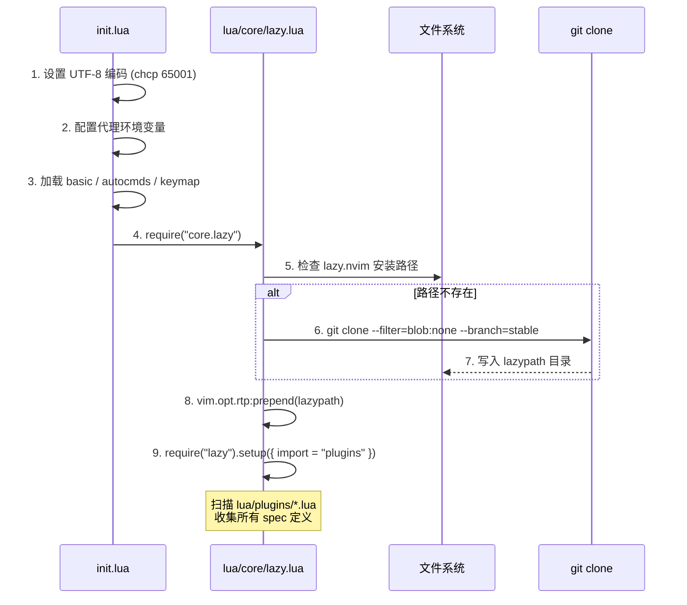
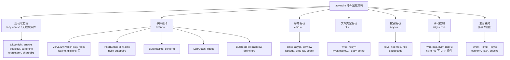
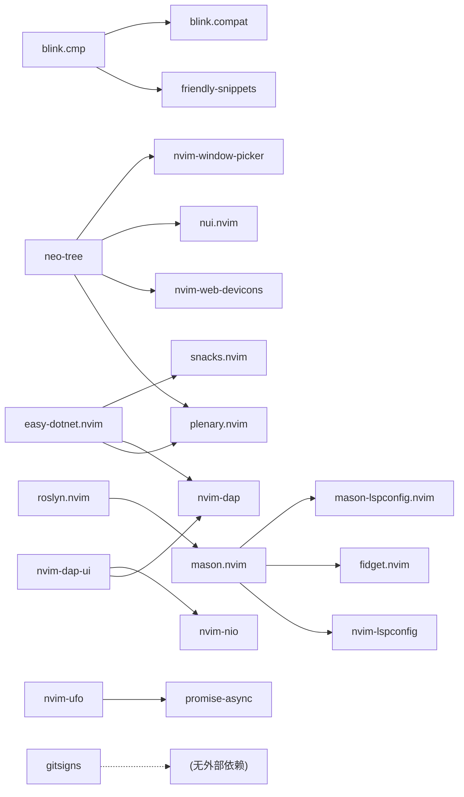

本配置以 **lazy.nvim** 作为唯一的插件管理器，通过 `lua/core/lazy.lua` 完成引导安装与全局配置，再借助 `{ import = "plugins" }` 自动扫描 `lua/plugins/` 目录下的所有 spec 文件，构建出一套声明式的插件管理体系。本文将深入解析这套体系的启动引导机制、spec 规范DSL、以及本项目中实际采用的七种懒加载策略——从启动时必须加载的核心插件，到按文件类型、按键、命令等条件按需延迟加载的扩展插件。

Sources: [lazy.lua](lua/core/lazy.lua#L1-L36), [init.lua](init.lua#L1-L23)

## 引导安装：自动克隆与运行时路径注入

lazy.nvim 自身并非 Neovim 内置组件，因此需要在首次启动时自动完成克隆安装。这段引导逻辑位于 `lua/core/lazy.lua` 的前半段，采用了 Neovim 社区中广泛使用的「**自举模式**」：检测 `stdpath("data")/lazy/lazy.nvim` 路径是否存在，若不存在则调用 `git clone` 从 GitHub 拉取 stable 分支，失败时输出错误信息并退出。安装完成后，通过 `vim.opt.rtp:prepend(lazypath)` 将 lazy.nvim 的路径注入到 Neovim 的运行时路径（runtimepath）头部，确保后续的 `require("lazy")` 调用能够正确解析。

Sources: [lazy.lua](lua/core/lazy.lua#L1-L22)

引导流程的时序关系如下：



**关键设计要点**：引导脚本在 `init.lua` 中的加载顺序位于 `core.basic`、`core.autocmds`、`core.keymap` 之后，这意味着 Neovim 的基础选项和全局快捷键在插件管理器启动之前就已经就绪。代理环境变量（`HTTP_PROXY`/`HTTPS_PROXY`）的设置甚至先于所有模块加载，确保 `git clone` 操作在受限网络环境中也能正常工作。

Sources: [init.lua](init.lua#L1-L15), [lazy.lua](lua/core/lazy.lua#L1-L22)

## 全局配置：import 机制与 rocks 禁用

`require("lazy").setup()` 接受一个配置表，本项目的核心配置极为精简：

```lua
require("lazy").setup({
  spec = {
    { import = "plugins" },
  },
  rocks = {
    enabled = false,
  },
})
```

**`{ import = "plugins" }`** 是整个插件体系的骨架。lazy.nvim 会自动扫描 `lua/plugins/` 目录下的所有 `.lua` 文件，将每个文件 `return` 的表（或表的列表）作为独立的插件 spec 进行注册。这意味着添加一个新插件只需在 `lua/plugins/` 下新建一个 `.lua` 文件，无需修改任何入口配置。

**`rocks = { enabled = false }`** 禁用了 luarocks 的集成。本项目所有插件均为纯 Lua/Neovim 插件，不依赖 luarocks 提供的 C 扩展库，因此跳过 luarocks 的初始化可以减少启动时间并避免 Windows 平台上常见的编译兼容性问题。

Sources: [lazy.lua](lua/core/lazy.lua#L24-L34)

## Spec 文件结构规范

`lua/plugins/` 目录下的每个文件都是一个 **spec 源文件**，lazy.nvim 在启动时收集所有文件的返回值。存在两种合法的返回格式：

| 返回格式 | 示例文件 | 适用场景 |
|---------|---------|---------|
| **单表**: `return { "author/plugin", ... }` | 大多数插件文件 | 每个文件对应一个插件 |
| **多表列表**: `return { { "plugin-a", ... }, { "plugin-b", ... } }` | `blink.lua`, `dap-cs.lua`, `opencode.lua` | 多个插件需要合并声明，或需要禁用/覆盖已有插件 |

**单表格式**的典型结构如下，每个字段都是 lazy.nvim spec DSL 的一部分：

```lua
return {
  "插件全名（GitHub 仓库路径）",     -- 必填：唯一标识
  branch = "main",                    -- 可选：Git 分支/版本标签
  lazy = false,                       -- 可选：是否懒加载
  event = "VeryLazy",                 -- 可选：触发加载的事件
  cmd = { "CommandName" },            -- 可选：触发加载的命令
  ft = "cs",                          -- 可选：触发加载的文件类型
  keys = { { "<key>", ... } },        -- 可选：触发加载的按键
  dependencies = { "dep/plugin" },    -- 可选：前置依赖
  build = ":TSUpdate",                -- 可选：安装后执行命令
  init = function() end,              -- 可选：插件加载前执行（设置全局变量）
  opts = { ... },                     -- 可选：传递给 plugin.setup() 的配置表
  config = function(_, opts) end,     -- 可选：自定义配置函数
}
```

**多表格式的典型用途是「插件覆盖 + 新增声明」组合**。以 `blink.lua` 为例，它同时声明了禁用 `nvim-cmp` 和启用 `blink.cmp` 两个 spec，保持了补全框架切换的逻辑内聚性。

Sources: [blink.lua](lua/plugins/blink.lua#L1-L7), [dap-cs.lua](lua/plugins/dap-cs.lua#L1-L16), [opencode.lua](lua/plugins/opencode.lua#L1-L30)

## 懒加载策略全景图

本项目的 30+ 个插件采用了 **七种不同的懒加载策略**，每种策略对应特定的使用场景。下表展示了所有策略的分类概览：



Sources: [tokyonight.lua](lua/plugins/tokyonight.lua#L1-L10), [snacks.lua](lua/plugins/snacks.lua#L1-L5), [treesitter.lua](lua/plugins/treesitter.lua#L1-L6), [bufferline.lua](lua/plugins/bufferline.lua#L1-L39)

### 策略一：启动时加载（`lazy = false` 或无触发条件）

某些插件必须在 Neovim 启动的最早阶段就完成加载，否则会严重影响用户体验。本项目中有三类插件采用此策略：

| 插件 | 显式声明 | 必须启动加载的原因 |
|------|---------|-----------------|
| **tokyonight** | 无触发条件 | 主题必须在 UI 渲染前生效，否则会闪烁默认配色 |
| **snacks.nvim** | `lazy = false, priority = 1000` | 提供 Dashboard 启动画面和全局通知，`priority = 1000` 确保在其他插件之前加载 |
| **nvim-treesitter** | `lazy = false` | 语法高亮是编辑器核心功能，需要在文件打开时立即可用 |
| **bufferline** | `lazy = false` | 标签页是 UI 核心组件，延迟加载会导致启动时标签栏空白 |
| **toggleterm** | 无触发条件 | 终端集成需要预注册 `<C-\>` 全局快捷键 |
| **sharpdbg** | 无触发条件 | DAP 调试器后端需要提前注册以便后续按需调用 |
| **dooing** | 无触发条件 | 待办事项管理器，默认随启动加载 |
| **render-markdown** | 无触发条件 | Markdown 渲染依赖 treesitter 且需要尽早激活 |

**`priority` 字段**仅对启动时加载的插件有意义，数值越大越先加载。snacks 的 `priority = 1000` 确保其 Dashboard 在所有其他插件之前完成初始化。

Sources: [snacks.lua](lua/plugins/snacks.lua#L1-L5), [treesitter.lua](lua/plugins/treesitter.lua#L1-L6), [bufferline.lua](lua/plugins/bufferline.lua#L38-L39), [tokyonight.lua](lua/plugins/tokyonight.lua#L1-L10)

### 策略二：事件驱动加载（`event`）

**事件驱动**是最常用的懒加载策略。当指定的事件被触发时，lazy.nvim 才会加载对应的插件。本项目使用了五种不同的 event 值：

| event 值 | 触发时机 | 使用插件 |
|----------|---------|---------|
| `"VeryLazy"` | Neovim 完成初始化后、UI 完全就绪时 | which-key, noice, lualine, gitsigns, mason, aerial, nvim-surround, yazi, smear-cursor, flash |
| `"InsertEnter"` | 首次进入插入模式时 | blink.cmp, nvim-autopairs |
| `"BufWritePre"` | 保存文件之前 | conform |
| `"BufReadPre"` | 打开文件缓冲区之前 | rainbow-delimiters |
| `{ "LspAttach" }` | LSP 客户端附加到缓冲区时 | fidget |

**`VeryLazy`** 是 lazy.nvim 提供的特殊伪事件，它在 `User VeryLazy` 事件触发时执行，时序上等同于"Neovim 完全启动后"。这是 UI 类插件的最佳加载时机——它们不影响启动速度，但在用户开始交互时已经就绪。本项目中 **10 个插件**使用 `VeryLazy`，是数量最多的策略。

**`InsertEnter`** 的设计非常精准：补全引擎和自动配对只有在用户开始输入代码时才需要。blink.cmp 使用 `event = { "InsertEnter", "CmdlineEnter" }` 的双重条件，确保在命令行模式下也能提供补全功能。

**`LspAttach`** 事件的使用体现了精细的延迟粒度：fidget 只在 LSP 真正附加到某个缓冲区时才加载，对于不使用 LSP 的文件类型（如纯文本），fidget 永远不会被加载。

Sources: [whichkey.lua](lua/plugins/whichkey.lua#L1-L5), [blink.lua](lua/plugins/blink.lua#L24-L24), [conform.lua](lua/plugins/conform.lua#L1-L4), [fidget.lua](lua/plugins/fidget.lua#L1-L6), [rainebow.lua](lua/plugins/rainebow.lua#L1-L5)

### 策略三：命令驱动加载（`cmd`）

当插件提供了 Vim 命令入口时，`cmd` 字段可以在命令首次被调用时才触发插件加载。这是「**用到了才加载**」策略的典型实现：

| 插件 | 注册的命令 |
|------|----------|
| **lazygit** | `LazyGit` |
| **diffview** | `DiffviewOpen`, `DiffviewFileHistory`, `DiffviewClose` |
| **lspsaga** | `Lspsaga` |
| **grug-far** | `GrugFar`, `GrugFarWithin` |
| **codex** | `Codex`, `CodexToggle` |

lazy.nvim 在检测到 `cmd` 字段后，会预先注册这些命令的「桩（stub）」——命令本身只是一个触发器，真正执行时会先加载插件，再调用插件的实际实现。用户在使用 `:LazyGit` 等命令时，不会感知到任何延迟，因为 lazy.nvim 的加载速度通常在毫秒级。

Sources: [lazygit.lua](lua/plugins/lazygit.lua#L1-L10), [diffview.lua](lua/plugins/diffview.lua#L1-L10), [lspsaga.lua](lua/plugins/lspsaga.lua#L1-L4), [grug-far.lua](lua/plugins/grug-far.lua#L1-L5), [codex.lua](lua/plugins/codex.lua#L1-L4)

### 策略四：文件类型驱动加载（`ft`）

**文件类型加载**是最精确的按需加载策略。当 Neovim 打开特定类型的文件时，`ft` 字段指定的插件才会被加载。本项目中两个 C#/.NET 专用插件采用了此策略：

| 插件 | ft 值 | 含义 |
|------|------|------|
| **roslyn** | `"cs"` | 仅在打开 `.cs` 文件时加载 Roslyn LSP |
| **easy-dotnet** | `{ "cs", "csproj", "sln", "props", "fs", "fsproj" }` | 打开 C# 项目相关文件时加载 .NET 工具链 |

这一策略的效果是：如果你在 Neovim 中编辑 Python 或 Lua 文件，Roslyn 和 easy-dotnet **永远不会被加载**，不会占用任何内存或增加启动时间。这体现了 lazy.nvim 的核心理念——**只加载你需要的东西**。

Sources: [roslyn.lua](lua/plugins/roslyn.lua#L1-L4), [easy-dotnet.lua](lua/plugins/easy-dotnet.lua#L1-L4)

### 策略五：按键驱动加载（`keys`）

`keys` 字段实现「**按下快捷键时才加载**」的策略。当用户按下指定的按键组合时，lazy.nvim 会先加载插件，再执行绑定的回调函数。本项目中部分插件 **仅通过 keys 驱动**：

| 插件 | 触发按键 |
|------|---------|
| **neo-tree** | `<leader>e`（切换）, `<leader>o`（聚焦） |
| **hop** | `<leader>hp` |
| **claudecode** | `<leader>ac`（切换）, `<leader>af`（聚焦）, `<leader>ar`（恢复）等 |

这些插件的共同特点是：功能完全由快捷键触发，没有自动启动的需求，也没有事件驱动的场景。用户可能一整天都不会打开文件树或调用 AI 助手，因此按需加载是最优选择。

Sources: [neo-tree.lua](lua/plugins/neo-tree.lua#L10-L13), [hop.lua](lua/plugins/hop.lua#L6-L8), [claudecode.lua](lua/plugins/claudecode.lua#L15-L32)

### 策略六：手动控制延迟加载（`lazy = true`）

某些插件作为其他插件的 **底层依赖** 存在，不应该自行触发加载，而应由上层逻辑按需引用。本项目中的 DAP（调试适配协议）组件采用了此策略：

```lua
-- DAP 插件声明（仅注册插件，初始化逻辑在 lua/core/dap.lua）
return {
  { "mfussenegger/nvim-dap",           lazy = true },
  { "nvim-neotest/nvim-nio",           lazy = true },
  { "rcarriga/nvim-dap-ui",            lazy = true,
    dependencies = { "mfussenegger/nvim-dap", "nvim-neotest/nvim-nio" } },
  { "theHamsta/nvim-dap-virtual-text", lazy = true,
    dependencies = { "mfussenegger/nvim-dap", "nvim-treesitter/nvim-treesitter" } },
}
```

`lazy = true` 告诉 lazy.nvim「这个插件永远不要自动加载」。实际的加载时机由 [init.lua](init.lua#L17-L22) 中的 `VeryLazy` 自动命令触发：

```lua
vim.api.nvim_create_autocmd("User", {
  pattern = "VeryLazy",
  once = true,
  callback = function() require("core.dap").setup() end,
})
```

这种「声明在 plugins 中、控制在 core 中」的分离设计，使得 DAP 相关的复杂初始化逻辑可以集中在 `lua/core/dap.lua` 中管理，而 `lua/plugins/dap-cs.lua` 仅负责注册插件元数据。

Sources: [dap-cs.lua](lua/plugins/dap-cs.lua#L1-L16), [init.lua](init.lua#L17-L22)

### 策略七：混合策略（多触发条件组合）

许多插件同时使用了多种加载触发条件，形成 **组合策略**。lazy.nvim 的语义是：只要 **任意一个条件** 被满足，插件就会被加载。本项目中混合策略的典型代表：

| 插件 | event | cmd | keys | 设计意图 |
|------|-------|-----|------|---------|
| **conform** | `BufWritePre` | `ConformInfo` | `<leader>f` | 保存时自动格式化 + 手动格式化快捷键 + 查看格式化状态命令 |
| **flash** | `VeryLazy` | — | 5 组按键 | 按键跳转功能需在普通模式下就绪，同时依赖 VeryLazy 确保 UI 稳定 |
| **snacks** | — | — | 20+ 按键 | 启动加载 Dashboard + 快捷键触发 picker/notifier 功能 |
| **gitsigns** | `VeryLazy` | — | 6 组按键 | Git 标记需在编辑时自动显示 + 手动导航/操作快捷键 |
| **codex** | — | `Codex`, `CodexToggle` | `<leader>cc` | 命令入口和快捷键入口双通道 |
| **diffview** | — | 3 个命令 | 3 组按键 | 命令和快捷键均为 Git 工作流入口 |

混合策略的核心价值在于**降低首次触发的延迟感**：无论用户是通过保存文件、执行命令还是按下快捷键来使用功能，插件都能在需要的那一刻立即可用。

Sources: [conform.lua](lua/plugins/conform.lua#L1-L15), [flash.lua](lua/plugins/flash.lua#L1-L24), [snacks.lua](lua/plugins/snacks.lua#L1-L134), [gitsigns.lua](lua/plugins/gitsigns.lua#L1-L30), [codex.lua](lua/plugins/codex.lua#L1-L28)

## Spec DSL 关键字段详解

除了加载策略相关的字段外，lazy.nvim spec 还提供了丰富的配置 DSL。以下梳理本项目中高频使用的关键字段及其典型模式：

### opts vs config：两种配置方式的选择

lazy.nvim 提供了两种配置插件的机制，本项目中两种都有大量使用：

| 字段 | 行为 | 使用场景 |
|------|------|---------|
| **`opts`**（表或函数） | lazy.nvim 自动调用 `require("plugin").setup(opts)` | 配置为简单的键值表，或需要动态计算时用函数返回 |
| **`config`**（函数） | 完全自定义配置逻辑，参数为 `(_, opts)` | 需要多步初始化、注册命令、创建自动命令等复杂逻辑 |

**`opts` 的三种形态**在本项目中都有体现：

```lua
-- 形态1：静态表
opts = { headerMaxWidth = 80 }

-- 形态2：函数返回表（需要动态计算）
opts = function()
  local logo = [[ ... ]]
  return { dashboard = { preset = { header = logo } } }
end

-- 形态3：opts_extend（列表合并）
opts_extend = { "sources.completion.enabled_providers", "sources.compat" }
```

**`opts_extend`** 是 lazy.nvim 的列表合并机制。当多个 spec 文件对同一插件定义 `opts` 时，普通 `opts` 会覆盖而非合并列表。`opts_extend` 指定哪些路径的列表字段应该追加合并，而不是覆盖。which-key 使用它来合并多个文件中定义的快捷键分组。

Sources: [whichkey.lua](lua/plugins/whichkey.lua#L6-L7), [blink.lua](lua/plugins/blink.lua#L10-L13), [snacks.lua](lua/plugins/snacks.lua#L5-L53), [grug-far.lua](lua/plugins/grug-far.lua#L4-L4)

### init：加载前的预处理

`init` 函数在插件 **加载之前** 执行，通常用于设置全局变量或 Neovim 选项，为插件的正式加载做准备。本项目中有三个插件使用了 `init`：

| 插件 | init 操作 | 目的 |
|------|----------|------|
| **noice** | `vim.opt.cmdheight = 0` | 隐藏原生命令行区域，避免浮动命令行出现时底部产生空行 |
| **lualine** | 保存/恢复 `laststatus` | 在 Dashboard 页面隐藏状态栏，在文件页面恢复显示 |
| **yazi** | `vim.g.loaded_netrwPlugin = 1` | 禁用 netrw 避免与 yazi 的目录管理冲突 |

`init` 和 `config` 的执行时序区别至关重要：`init` 在插件代码被加载之前运行，可以在不触发插件副作用的前提下设置前置条件；`config` 在插件加载完成后运行，可以安全地调用插件 API。

Sources: [noice.lua](lua/plugins/noice.lua#L9-L12), [lualine.lua](lua/plugins/lualine.lua#L7-L16), [yazi.lua](lua/plugins/yazi.lua#L40-L45)

### dependencies：依赖声明与加载顺序

`dependencies` 字段声明插件的前置依赖，lazy.nvim 会确保依赖项在当前插件之前加载。本项目中的依赖关系网络如下：



值得注意的是，`dependencies` 中也可以内联完整的 spec 定义。例如 `blink.lua` 中 `blink.compat` 被声明为内联依赖，带有 `optional = true` 和 `version = "*"` 等字段：

```lua
dependencies = {
  "rafamadriz/friendly-snippets",
  {
    "saghen/blink.compat",
    optional = true,  -- 仅在其他 spec 也启用时才加载
    opts = {},
    version = "*",
  },
},
```

Sources: [blink.lua](lua/plugins/blink.lua#L15-L23), [neo-tree.lua](lua/plugins/neo-tree.lua#L4-L9), [mason.lua](lua/plugins/mason.lua#L25-L29), [roslyn.lua](lua/plugins/roslyn.lua#L4-L6)

### version、branch 与 build：版本控制与构建

本项目中使用了三种版本控制字段：

| 字段 | 语义 | 示例 |
|------|------|------|
| **`branch`** | 指定 Git 分支 | `neo-tree` 使用 `"v3.x"` |
| **`version`** | 指定语义化版本标签 | `blink.cmp` 使用 `"*"`（最新稳定版），`nvim-ufo` 使用 `false`（跟踪最新提交） |
| **`build`** | 安装/更新后执行的命令 | `treesitter` 使用 `":TSUpdate"` 自动编译解析器 |

`version = "*"` 表示使用最新的 Git tag 版本；`version = false` 表示始终跟踪默认分支的最新提交。对于需要频繁获取上游修复的插件（如 `nvim-ufo`），`version = false` 是合理的选择。

Sources: [treesitter.lua](lua/plugins/treesitter.lua#L5-L5), [blink.lua](lua/plugins/blink.lua#L9-L9), [nvim-ufo.lua](lua/plugins/nvim-ufo.lua#L4-L4), [neo-tree.lua](lua/plugins/neo-tree.lua#L3-L3)

### enabled 与 optional：插件的条件启用

`enabled = false` 完全禁用一个插件，lazy.nvim 不会加载它。本项目利用此机制在 `blink.lua` 中禁用了 `nvim-cmp`：

```lua
return {
  { "hrsh7th/nvim-cmp", optional = true, enabled = false },
  { "saghen/blink.cmp", ... },
}
```

`optional = true` 表示该 spec 仅作为占位声明存在——如果其他 spec 文件也声明了同一插件，则合并配置；如果没有其他地方声明，则不会强制加载。这在从 `nvim-cmp` 迁移到 `blink.cmp` 时非常有用：即使某些依赖项（如 `mason.lua`）通过 `require("blink.cmp").get_lsp_capabilities()` 引用了 blink 的 API，`nvim-cmp` 也不会被意外加载。

Sources: [blink.lua](lua/plugins/blink.lua#L3-L6)

## lazy-lock.json：版本锁定与可复现构建

`lazy-lock.json` 文件记录了所有插件的精确 Git commit 哈希值。每当运行 `:Lazy restore` 或安装新插件时，此文件会自动更新。它在版本控制中的作用类似于 `package-lock.json` 或 `yarn.lock`：

```json
{
  "roslyn.nvim": { "branch": "main", "commit": "6a5e60a7c25d..." },
  "blink.cmp":   { "branch": "main", "commit": "78336bc89ee5..." }
}
```

通过将 `lazy-lock.json` 纳入 Git 版本控制，团队成员或不同机器之间可以获得**完全一致的插件版本**，避免因上游更新引入的不兼容问题。当需要更新时，使用 `:Lazy sync` 即可拉取最新版本并更新锁文件。

Sources: [lazy-lock.json](lazy-lock.json#L1-L50)

## 插件加载策略速查表

下表汇总了本项目中所有插件的加载策略，可作为快速参考：

| 插件 | 加载策略 | 触发条件 |
|------|---------|---------|
| tokyonight | 启动加载 | 无（主题） |
| snacks | 启动加载 | `lazy = false, priority = 1000` |
| nvim-treesitter | 启动加载 | `lazy = false` |
| bufferline | 启动加载 | `lazy = false` |
| toggleterm | 启动加载 | 无触发条件 |
| sharpdbg | 启动加载 | 无触发条件 |
| dooing | 启动加载 | 无触发条件 |
| render-markdown | 启动加载 | 无触发条件 |
| which-key | 事件 | `event = "VeryLazy"` |
| noice | 事件 | `event = "VeryLazy"` |
| lualine | 事件 | `event = "VeryLazy"` |
| gitsigns | 事件 + 按键 | `event = "VeryLazy"` + 6 组 keys |
| mason | 事件 + 依赖 | `event = "VeryLazy"` + dependencies |
| aerial | 事件 + 按键 | `event = "VeryLazy"` + keys |
| nvim-surround | 事件 | `event = "VeryLazy"` |
| yazi | 事件 + 按键 | `event = "VeryLazy"` + keys |
| smear-cursor | 事件 | `event = "VeryLazy"` |
| flash | 事件 + 按键 | `event = "VeryLazy"` + 6 组 keys |
| blink.cmp | 事件 | `event = { "InsertEnter", "CmdlineEnter" }` |
| nvim-autopairs | 事件 | `event = "InsertEnter"` |
| conform | 事件 + 命令 + 按键 | `event = "BufWritePre"` + cmd + keys |
| rainbow-delimiters | 事件 + 依赖 | `event = "BufReadPre"` |
| fidget | 事件 | `event = { "LspAttach" }` |
| lazygit | 命令 + 按键 | `cmd = "LazyGit"` + keys |
| diffview | 命令 + 按键 | 3 个 cmd + 3 组 keys |
| lspsaga | 命令 + 按键 | `cmd = "Lspsaga"` + keys |
| grug-far | 命令 + 按键 | 2 个 cmd + keys |
| codex | 命令 + 按键 | 2 个 cmd + keys |
| roslyn | 文件类型 | `ft = "cs"` |
| easy-dotnet | 文件类型 | `ft = { "cs", "csproj", ... }` |
| neo-tree | 按键 | 2 组 keys |
| hop | 按键 | 1 组 keys |
| claudecode | 按键 | 8 组 keys |
| nvim-dap | 手动 | `lazy = true`（由 core/dap.lua 控制） |
| nvim-dap-ui | 手动 | `lazy = true` |
| nvim-nio | 手动 | `lazy = true` |
| nvim-dap-virtual-text | 手动 | `lazy = true` |
| opencode | 依赖 | 无触发条件（作为内嵌 spec） |

## 设计原则总结

本项目的插件管理架构体现了以下几个核心设计原则：

**按需加载优先**。30+ 个插件中只有 7 个在启动时加载，其余全部通过事件、命令、文件类型或按键按需触发。`VeryLazy` 事件承担了 UI 类插件的统一延迟入口，而 `InsertEnter`、`BufWritePre`、`LspAttach` 等细粒度事件进一步将加载时机推迟到功能真正需要的时刻。

**声明与逻辑分离**。`lua/plugins/` 下的文件只负责声明「加载什么、何时加载、配置什么」，具体的业务逻辑（如 DAP 初始化）集中在 `lua/core/` 中通过自动命令触发。这使得插件 spec 文件保持简洁可读，复杂逻辑有独立的归属。

**多策略组合覆盖所有入口**。混合策略确保了无论用户通过快捷键、命令还是自动事件使用功能，插件都能在首次交互时立即可用，消除了「按了没反应」的体验瑕疵。

在理解了 lazy.nvim 的插件管理机制后，可以继续阅读 [双模块分层设计：core 基础层与 plugins 扩展层](4-shuang-mo-kuai-fen-ceng-she-ji-core-ji-chu-ceng-yu-plugins-kuo-zhan-ceng) 了解模块分层的全局架构，或直接进入 [快捷键体系：Leader 键分组与 buffer-local 绑定策略](12-kuai-jie-jian-ti-xi-leader-jian-fen-zu-yu-buffer-local-bang-ding-ce-lue) 了解 `keys` 字段背后的快捷键体系设计。