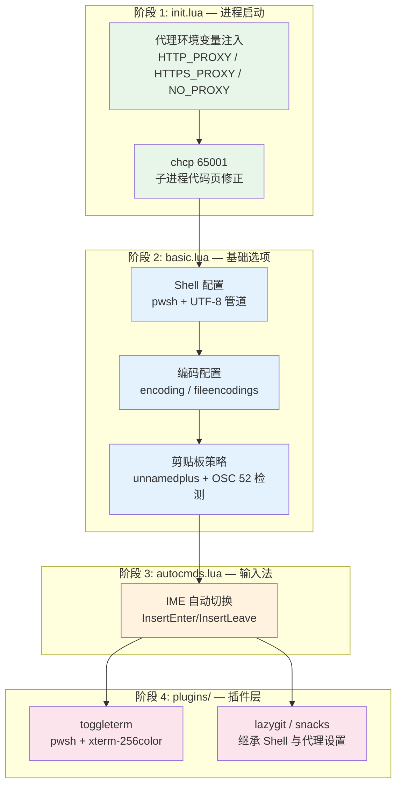
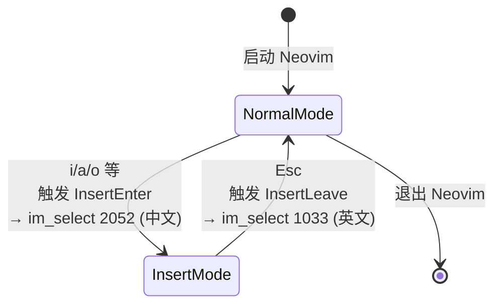

本配置以 Windows 为主要运行平台，在 Neovim 的跨平台架构上叠加了四个关键适配层：**Shell 集成**（PowerShell 7 作为默认 shell）、**字符编码**（UTF-8 优先 + 中文编码兼容）、**网络代理**（环境变量注入）和**剪贴板**（系统剪贴板 + SSH 场景下的 OSC 52 回退）。这些适配分散在 `init.lua` 和 `lua/core/basic.lua` 两个文件中，构成了一条从进程启动到运行时行为的完整适配链路。

## 适配层架构总览

Windows 平台适配并非零散的补丁，而是按照**执行时序**组织为四个阶段：进程启动时代理注入 → 代码页修正 → 基础选项设置（Shell/编码/剪贴板）→ 插件层终端配置。每个阶段解决一个特定的问题域，相互之间通过 Neovim 的加载顺序隐式依赖。



Sources: [init.lua](init.lua#L1-L23), [basic.lua](lua/core/basic.lua#L1-L62), [autocmds.lua](lua/core/autocmds.lua#L1-L25)

## 进程启动阶段：代理注入与代码页修正

`init.lua` 作为 Neovim 的入口文件，在加载任何模块之前先行处理两个全局性问题：**网络代理**和**Windows 代码页**。

### 代理环境变量注入

```lua
vim.env.HTTP_PROXY = "http://127.0.0.1:7897"
vim.env.HTTPS_PROXY = "http://127.0.0.1:7897"
vim.env.NO_PROXY = "localhost,127.0.0.1"
```

这三行代码在 Neovim 进程的**最早期**将代理地址写入环境变量，确保后续所有子进程——包括 lazy.nvim 的 git clone、Mason 的 LSP 服务器下载、以及 lazygit 的远程操作——都能通过本地代理（端口 7897）访问外部网络。`NO_PROXY` 变量排除了本地回环地址，避免本地服务请求被错误代理。这一配置放在 `require("core.basic")` 之前，意味着即使在基础选项加载阶段需要网络访问（如 lazy.nvim 的自动安装），代理也已经就绪。

Sources: [init.lua](init.lua#L8-L10)

### Windows 代码页修正

```lua
if vim.fn.has("win32") == 1 then
  vim.fn.system("chcp 65001")
end
```

Windows 默认使用代码页 936（GBK），这会导致 Neovim 的子进程（如 lazygit、git 命令等）输出中文或特殊字符时出现乱码。`chcp 65001` 将控制台代码页切换为 UTF-8，但此命令仅在 Windows 平台执行（`has("win32")` 条件守卫），保证配置在 Linux/macOS 上的兼容性。注意：这个 `system()` 调用发生在 `init.lua` 顶层，早于所有模块加载，因此其效果覆盖整个 Neovim 会话生命周期。

> **架构决策说明**：代理地址 `127.0.0.1:7897` 是硬编码值。如果需要在多台机器间共享此配置，建议将代理地址提取到环境变量或 `.neoconf.json` 中，通过 `vim.env.PROXY_URL` 动态读取。

Sources: [init.lua](init.lua#L3-L6)

## Shell 集成：PowerShell 7 作为默认 Shell

Neovim 内部通过 `vim.o.shell` 系列选项控制 `:!` 命令、`system()` 调用以及终端插件使用的 Shell 程序。本配置将默认 Shell 设置为 **PowerShell 7**（`pwsh`），并对其管道行为进行了精细调整。

```lua
vim.o.shell = 'pwsh'
vim.o.shellcmdflag = '-NoLogo -NoProfile -ExecutionPolicy RemoteSigned -Command [Console]::InputEncoding=[Console]::OutputEncoding=[System.Text.Encoding]::UTF8;'
vim.o.shellredir = '2>&1 | Out-File -Encoding UTF8 %s; exit $LastExitCode'
vim.o.shellpipe = '2>&1 | Out-File -Encoding UTF8 %s; exit $LastExitCode'
vim.o.shellquote = ''
vim.o.shellxquote = ''
```

每个选项的设计意图如下表所示：

| 选项 | 值 | 解决的问题 |
|---|---|---|
| `shell` | `pwsh` | 使用 PowerShell 7 替代默认的 cmd.exe，获得更好的 UTF-8 支持和脚本能力 |
| `shellcmdflag` | `-NoLogo -NoProfile ...` | `-NoLogo` 禁止启动横幅输出；`-NoProfile` 跳过用户配置文件加速启动；`-ExecutionPolicy RemoteSigned` 允许运行本地脚本；内联的 `[Console]::InputEncoding/OutputEncoding` 强制控制台使用 UTF-8 编码 |
| `shellredir` | `2>&1 \| Out-File -Encoding UTF8 %s; exit $LastExitCode` | 将 stdout 和 stderr 合并重定向到文件，同时用 UTF-8 编码写入；`$LastExitCode` 确保外部命令的退出码正确传播给 Neovim |
| `shellpipe` | 同 `shellredir` | 用于 `:make` 等命令的管道输出，逻辑与重定向一致 |
| `shellquote` / `shellxquote` | 空字符串 | PowerShell 的引号规则与 POSIX shell 不同，清空这两个选项避免 Neovim 错误地为命令参数添加引号 |

**关键细节**：`shellcmdflag` 中嵌入的 `[Console]::InputEncoding=[Console]::OutputEncoding=[System.Text.Encoding]::UTF8;` 是一条 PowerShell 赋值链——它同时将控制台的输入和输出编码设置为 UTF-8。这使得通过 `:!` 执行的任何外部命令的输出都能被 Neovim 正确解析，解决了 Windows 下常见的中文乱码问题。

Sources: [basic.lua](lua/core/basic.lua#L29-L35)

### 插件层终端的 Shell 配置

除了全局 Shell 选项外，[toggleterm](lua/plugins/toggleterm.lua) 插件也显式指定了 Shell 并设置了终端类型环境变量：

```lua
shell = 'pwsh',
on_create = function (term)
   term.env = vim.tbl_extend('force', term.env or {},{
        TERM = 'xterm-256color',
   })
end
```

`TERM=xterm-256color` 的注入确保了在浮动终端中运行的程序（如 git log、htop 等通过 SSH 的场景）能正确识别终端能力，获得完整的 256 色支持。这与全局 `shell` 选项形成互补——全局选项控制 Neovim 内部命令执行，toggleterm 的 `shell` 控制用户交互终端。

Sources: [toggleterm.lua](lua/plugins/toggleterm.lua#L10-L15)

## 字符编码：UTF-8 优先与中文兼容

编码配置处理两个维度：**Neovim 内部编码**和**文件读写编码**。

```lua
vim.o.encoding = 'utf-8'
vim.o.fileencoding = 'utf-8'
vim.o.fileencodings = 'utf-8,gbk,gb18030,gb2312,latin1'
```

| 选项 | 作用域 | 说明 |
|---|---|---|
| `encoding` | Neovim 内部 | Neovim 进程内部使用的字符编码，设为 `utf-8` 确保所有缓冲区、寄存器、变量都以 UTF-8 处理 |
| `fileencoding` | 当前缓冲区（本地） | 新建文件时使用的编码，`utf-8` 保证新文件默认以 UTF-8 保存 |
| `fileencodings` | 文件打开时的探测顺序 | 打开已有文件时，Neovim 按此列表从左到右尝试检测文件编码 |

**`fileencodings` 的探测策略**：当 Neovim 打开一个文件时，它会依次尝试 `utf-8` → `gbk` → `gb18030` → `gb2312` → `latin1`。将 `utf-8` 放在首位意味着所有 UTF-8 文件（现代项目的主流）会被即时识别，不会触发多余的编码转换。中文编码（`gbk`、`gb18030`、`gb2312`）紧跟其后，确保在 Windows 环境下打开遗留的中文文件时不会出现乱码。`latin1` 作为最后的兜底，保证任何二进制文件都能被打开而不会报错。

这三层编码配置与 Shell 配置中的 `chcp 65001` 和 `[Console]::InputEncoding/OutputEncoding` 形成完整的 UTF-8 覆盖：进程级 → 控制台级 → Neovim 内部级 → 文件 I/O 级。

Sources: [basic.lua](lua/core/basic.lua#L22-L27)

## 剪贴板策略：系统剪贴板与 SSH 场景

### 系统剪贴板映射

```lua
vim.opt.clipboard:append("unnamedplus")
```

`unnamedplus` 选项将 Neovim 的 `+` 寄存器（对应系统剪贴板）设置为默认的未命名寄存器。这意味着所有 `y`（复制）、`d`（删除）、`p`（粘贴）操作都直接与 Windows 系统剪贴板交互，无需额外的 `"+y` 前缀。在本地 Windows 环境下，Neovim 通过 Win32 API 直接访问系统剪贴板，这一行为是开箱即用的。

Sources: [basic.lua](lua/core/basic.lua#L19-L20)

### SSH 环境下的 OSC 52 回退方案

当 Neovim 运行在 SSH 会话中时，无法直接访问本地系统的剪贴板。此配置通过检测 SSH 环境变量，自动切换到 **OSC 52 协议**——一种通过终端转义序列将剪贴板内容转发到本地终端的机制。

```lua
if vim.env.SSH_CLIENT ~= nil or vim.env.SSH_TTY ~= nil or vim.env.SSH_CONNECTION ~= nil then
  vim.g.clipboard = {
    name = 'OSC 52',
    copy = {
      ['+'] = require('vim.ui.clipboard.osc52').copy('+'),
      ['*'] = require('vim.ui.clipboard.osc52').copy('*'),
    },
    paste = {
      ["+"] = my_paste("+"),
      ["*"] = my_paste("*"),
    },
  }
end
```

**检测逻辑**：三个 SSH 环境变量（`SSH_CLIENT`、`SSH_TTY`、`SSH_CONNECTION`）任一存在即判定为 SSH 会话。这三个变量由 SSH 服务端在不同场景下设置：`SSH_CLIENT` 在远程命令执行时存在，`SSH_TTY` 在交互式终端会话中存在，`SSH_CONNECTION` 在所有 SSH 连接中存在。多重检测确保覆盖各种 SSH 使用模式。

**复制与粘贴的不对称设计**：复制操作使用 Neovim 内置的 `vim.ui.clipboard.osc52` 模块，通过 OSC 52 转义序列将文本发送到本地终端的剪贴板。粘贴操作则使用了自定义的 `my_paste` 函数，从 Neovim 的 `"` 寄存器中读取内容：

```lua
function my_paste(reg)
    return function(lines)
        local content = vim.fn.getreg('"')
        return vim.split(content, '\n')
    end
end
```

这一设计的原因是：**OSC 52 协议仅支持写入剪贴板，不支持读取**。当用户在远程 Neovim 中按 `p` 粘贴时，实际上是从 Neovim 自身的 `"` 寄存器（记录最后一次复制/删除的内容）中读取，而非从本地系统剪贴板读取。这意味着在 SSH 环境下，粘贴操作只能粘贴"当前 Neovim 会话中最近复制的内容"，而非"本地系统中复制的任意内容"。

**终端兼容性要求**：OSC 52 协议需要本地终端模拟器支持。以下终端已确认兼容：

| 终端 | 最低版本 | 备注说明 |
|---|---|---|
| Windows Terminal | 1.18+ | 需在设置中启用"允许操作剪贴板" |
| iTerm2 | 3.x+ | 默认支持 |
| kitty | 所有版本 | 默认支持 |
| Alacritty | 0.13+ | 需配置 `terminal.osc52` |

Sources: [basic.lua](lua/core/basic.lua#L37-L61)

## 输入法自动切换：编辑模式与 IME 联动

在 Windows 中文输入环境下，一个常见的痛点是：退出插入模式后输入法仍处于中文状态，导致 Normal 模式下的命令（如 `j`、`k`、`dd`）被输入法拦截。此配置通过 `autocmds.lua` 中的自动命令组实现 IME 的模式联动。

```lua
local im_select_path = vim.fn.expand("~/Tools/im_select.exe")
im_select_path = im_select_path:gsub("\\", "/")

if vim.fn.has("win32") == 1 and vim.fn.executable(im_select_path) == 1 then
    local ime_autogroup = vim.api.nvim_create_augroup("ImeAutoGroup", { clear = true })

    vim.api.nvim_create_autocmd("InsertLeave", {
        callback = function()
            vim.cmd(":silent :!" .. im_select_path .. " 1033")
        end
    })

    vim.api.nvim_create_autocmd("InsertEnter", {
        callback = function()
            vim.cmd(":silent :!" .. im_select_path .. " 2052")
        end
    })
end
```

**工作原理**：

1. **依赖工具**：[im-select](https://github.com/daipeihust/im-select) 是一个跨平台的输入法管理命令行工具，此处通过 `~/Tools/im_select.exe` 引用
2. **路径预处理**：`gsub("\\", "/")` 将 Windows 反斜杠路径转换为正斜杠，这是 Neovim Lua 层对路径格式的要求
3. **条件守卫**：`has("win32") == 1 and executable(im_select_path) == 1` 双重条件确保仅在 Windows 且工具存在时激活，避免在非 Windows 平台报错或在没有安装工具的机器上产生无效命令
4. **IME 切换码**：`1033` 是英语（美国）的 Windows 键盘布局 LCID，`2052` 是中文（简体）的 LCID



**静默执行**（`:silent :!`）确保 IME 切换不会在命令行区域闪烁输出，保持编辑界面的干净。由于 `InsertLeave` 在每次退出插入模式时触发，这意味着无论用户如何进入和退出插入模式，Normal 模式下的键盘始终处于英文状态。

Sources: [autocmds.lua](lua/core/autocmds.lua#L1-L23)

## 配置全景：四层适配的协作关系

将本页讨论的所有 Windows 适配点汇总如下，它们在配置文件中的分布体现了"**尽早处理，逐层细化**"的设计原则：

| 适配层 | 配置文件 | 行号 | 触发时机 | 影响范围 |
|---|---|---|---|---|
| 代理注入 | `init.lua` | L8-L10 | 进程启动，最先执行 | 所有子进程的网络请求 |
| 代码页修正 | `init.lua` | L3-L6 | 进程启动，代理之后 | `:!` 命令、`system()` 调用的输出编码 |
| Shell 配置 | `basic.lua` | L29-L35 | 模块加载阶段 | 所有外部命令执行方式 |
| 编码设置 | `basic.lua` | L22-L27 | 模块加载阶段 | 缓冲区内部编码 + 文件 I/O |
| 系统剪贴板 | `basic.lua` | L19-L20 | 模块加载阶段 | y/d/p 操作 |
| OSC 52 回退 | `basic.lua` | L37-L61 | 模块加载阶段（条件执行） | SSH 环境下的剪贴板操作 |
| IME 联动 | `autocmds.lua` | L1-L23 | 模块加载阶段（条件注册） | 编辑模式切换时的输入法 |
| 终端 Shell | `toggleterm.lua` | L10-L15 | 插件初始化 | 浮动终端的 Shell 和终端类型 |

> **扩展建议**：如果需要将此配置移植到其他 Windows 开发环境，最需要关注的是 `init.lua` 中的代理地址和 `autocmds.lua` 中的 `im_select.exe` 路径——这两个是机器相关的硬编码值。考虑使用环境变量或 [配置页](3-pei-zhi-wen-jian-jia-zai-liu-cheng-yu-qi-dong-shun-xu) 中提到的加载顺序来提取这些值。

Sources: [init.lua](init.lua#L1-L23), [basic.lua](lua/core/basic.lua#L1-L62), [autocmds.lua](lua/core/autocmds.lua#L1-L23), [toggleterm.lua](lua/plugins/toggleterm.lua#L1-L19)

## 下一步阅读

本页覆盖了 Windows 平台的基础适配层。Shell 配置直接影响终端集成的行为，编码设置与 LSP 服务器的诊断输出相关，剪贴板策略则与编辑器基础操作紧密关联。建议按以下顺序继续深入：

- **[终端集成：toggleterm 浮动终端与 PowerShell 7](16-zhong-duan-ji-cheng-toggleterm-fu-dong-zhong-duan-yu-powershell-7)** — 了解 toggleterm 如何利用本章配置的 Shell 和环境变量，以及浮动终端的进阶用法
- **[快捷键体系：Leader 键分组与 buffer-local 绑定策略](12-kuai-jie-jian-ti-xi-leader-jian-fen-zu-yu-buffer-local-bang-ding-ce-lue)** — 剪贴板相关的快捷键在快捷键体系中有更完整的上下文
- **[Git 工作流：lazygit、gitsigns 与 diffview](17-git-gong-zuo-liu-lazygit-gitsigns-yu-diffview)** — lazygit 作为子进程会继承本章设置的代理和 Shell 环境