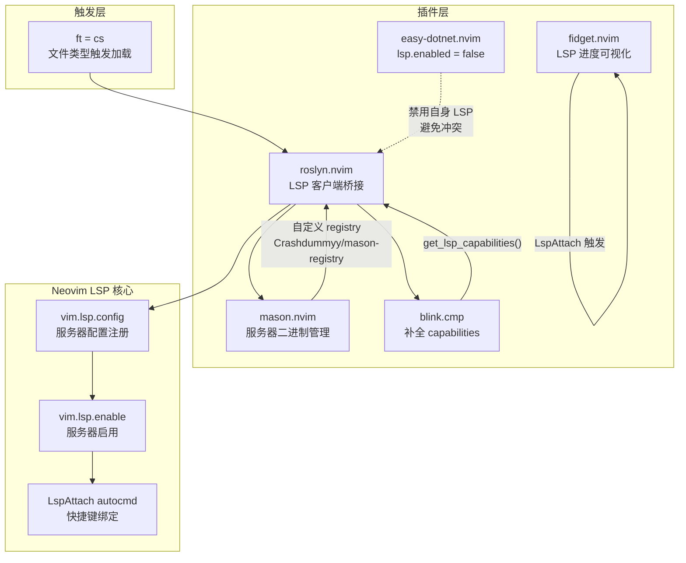
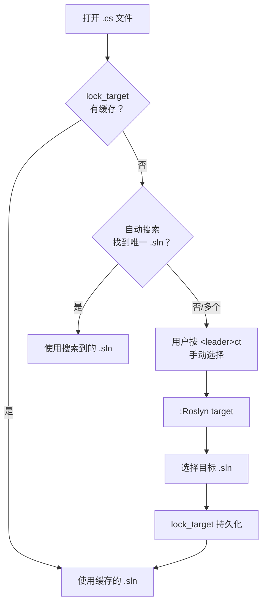
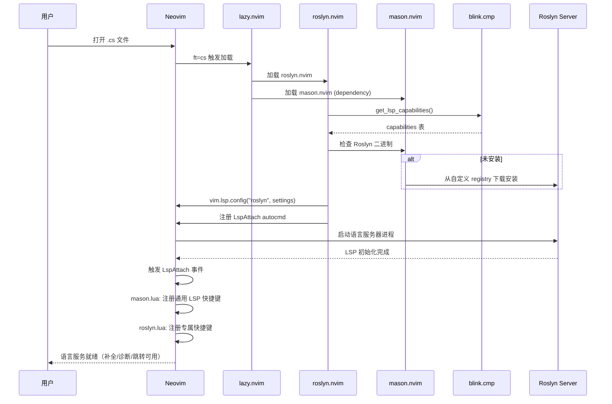

本文深入解析 Neovim 配置框架中 Roslyn 语言服务器的集成方案——从插件加载策略、Mason 自动安装机制、解决方案（.sln）定位逻辑，到专属快捷键体系，完整呈现 C# 语言服务在 Neovim 中的运行架构。Roslyn 是微软 .NET 编译平台的核心分析引擎，通过 `roslyn.nvim` 桥接为 Neovim 的 LSP 客户端，为 C# 开发者提供代码补全、诊断、跳转等完整智能编辑能力。

Sources: [roslyn.lua](lua/plugins/roslyn.lua#L1-L66)

## 架构总览：Roslyn 在配置框架中的位置

Roslyn LSP 的集成涉及多个插件的协作。理解这些组件之间的职责边界，是掌握整个 C# 开发体验的关键。

上图展示了 Roslyn LSP 集成的三层架构。**触发层**通过 `ft = "cs"` 实现懒加载，仅在用户打开 C# 文件时才激活整个语言服务链路。**插件层**中，`roslyn.nvim` 作为核心桥接器，从 Mason 获取服务器二进制，从 `blink.cmp` 获取补全能力声明，同时 `easy-dotnet` 主动禁用了自身的 LSP 功能以避免冲突。**Neovim LSP 核心**层通过 `vim.lsp.config` 和 `vim.lsp.enable` 注册配置，最终在 `LspAttach` 事件中绑定快捷键。

Sources: [roslyn.lua](lua/plugins/roslyn.lua#L1-L6), [mason.lua](lua/plugins/mason.lua#L30-L35), [easy-dotnet.lua](lua/plugins/easy-dotnet.lua#L19-L21)

## 插件加载策略与 Mason 自动安装

### 懒加载触发机制

Roslyn 插件采用 **文件类型懒加载** 策略，通过 `ft = "cs"` 限定仅在打开 `.cs` 文件时才加载插件。这意味着 Neovim 启动时不会加载任何 C# 语言服务相关代码，只有当用户实际编辑 C# 源文件时，整个 Roslyn 链路才会被激活。这种策略显著降低了非 C# 开发场景下的启动开销。

Sources: [roslyn.lua](lua/plugins/roslyn.lua#L3)

### Mason 自定义 Registry 与自动安装

Roslyn 的服务器二进制通过 Mason 管理，但并不在 `mason.lua` 的 `lsconfses` 表中配置——这是因为 `roslyn.nvim` 插件自身内部处理了服务器的查找与启动逻辑。Mason 配置中引入了一个**自定义 registry** `github:Crashdummyy/mason-registry`，该 registry 包含了 Roslyn 服务器的安装定义，使得 Mason 能够识别并安装 Roslyn。

整个安装流程遵循 openspec 规格中定义的契约：首次启动时 Mason 自动检测并下载 Roslyn 二进制文件，已安装时直接跳过，用户无需手动执行 `:MasonInstall`。

Sources: [mason.lua](lua/plugins/mason.lua#L30-L35), [spec.md](openspec/specs/csharp-lsp-config/spec.md#L1-L12)

### 单一配置入口原则

一个关键的设计约束是：**所有 C# LSP 配置仅存在于 `plugins/roslyn.lua` 一个文件中**。`mason.lua` 的 `lsconfses` 表中不含任何 C# 相关条目（无 OmniSharp、无 roslyn），`easy-dotnet.lua` 中 `lsp.enable` 被显式设为 `false`。这种隔离设计确保了配置的可追溯性——任何 C# 语言服务的行为变更只需检查一个文件。

Sources: [spec.md](openspec/specs/csharp-lsp-config/spec.md#L15-L30), [easy-dotnet.lua](lua/plugins/easy-dotnet.lua#L19-L21)

## Roslyn 服务器配置详解

### capabilities 注册与 blink.cmp 集成

Roslyn 通过 `require("blink.cmp").get_lsp_capabilities()` 获取补全框架的能力声明。这一调用将 blink.cmp 支持的 snippet、label details、additional text edits 等 LSP 补全扩展特性注册到 Roslyn 客户端，使 C# 补全候选能够完整展示参数签名、代码片段等高级信息。

Sources: [roslyn.lua](lua/plugins/roslyn.lua#L11)

### 分析器设置

Roslyn 的编译器设置通过 `vim.lsp.config` 注册，分为三个配置域：

| 配置域 | 设置项 | 值 | 作用 |
|--------|--------|-----|------|
| `csharp\|background_analysis` | `dotnet_analyzer_diagnostics_scope` | `"openFiles"` | 分析器诊断仅限于当前打开的文件，降低后台 CPU 占用 |
| `csharp\|background_analysis` | `dotnet_compiler_diagnostics_scope` | `"openFiles"` | 编译器诊断范围限定为打开的文件 |
| `csharp\|inlay_hints` | `csharp_enable_inlay_hints_for_implicit_object_creation` | `true` | 显示隐式对象创建的类型提示（如 `new()` 旁显示目标类型） |
| `csharp\|inlay_hints` | `csharp_enable_inlay_hints_for_implicit_variable_types` | `true` | 显示 `var` 关键字推断的实际类型 |
| `csharp\|code_lens` | `dotnet_enable_references_code_lens` | `true` | 在类型/方法上方显示引用计数 CodeLens |

**后台分析范围**设为 `openFiles` 是一个重要的性能决策。在大型 .NET 解决方案中，全量后台分析会导致 Roslyn 进程占用大量 CPU 和内存。将诊断范围限定为当前打开的文件，在保持即时反馈能力的同时显著降低了资源消耗。

**Inlay Hints** 的两项设置均为 `true`，使 Roslyn 在编辑器中以内联方式显示类型推断信息。这对 C# 12/13 中越来越常见的隐式类型声明（如 `var`、目标类型 `new()`）尤其有用——开发者无需悬停即可看到编译器推断的实际类型。

Sources: [roslyn.lua](lua/plugins/roslyn.lua#L15-L29)

## 解决方案定位与 Target 管理

### 自动搜索的局限性

Roslyn 在启动时会自动搜索项目根目录下的 `.sln` 或 `.csproj` 文件来确定工作空间。但在实际开发中，这种自动搜索面临两个典型问题：

1. **多解决方案冲突**：项目根目录可能包含多个 `.sln` 文件（如 `MyApp.sln` 和 `MyApp.Tests.sln`），Roslyn 的自动选择可能不符合预期。
2. **嵌套项目结构**：在 monorepo 或多层嵌套的目录结构中，向上遍历搜索可能定位到错误的解决方案。

### lock_target 策略

配置中启用了 `lock_target = true`，这意味着一旦用户通过 `:Roslyn target` 手动选择了解决方案文件，Roslyn 会**持久化记忆**该选择。后续在同一项目中打开 C# 文件时，Roslyn 将自动使用上次选择的 `.sln`，不再弹出选择窗口。

这一策略的核心思想是：**自动搜索作为默认行为，手动选择作为覆盖手段，持久化作为优化手段**。用户只需在首次遇到多解决方案场景时手动选择一次，之后 Roslyn 会自动复用。

Sources: [roslyn.lua](lua/plugins/roslyn.lua#L9), [fix-roslyn-sln-reload.md](docs/fix-roslyn-sln-reload.md#L10-L15)

## 快捷键体系：LSP 通用键与 Roslyn 专属键

### 两层快捷键架构

C# 文件中的快捷键分为两个层次：**LSP 通用快捷键**（由 `mason.lua` 的 `LspAttach` 注册，适用于所有语言服务器）和 **Roslyn 专属快捷键**（由 `roslyn.lua` 的 `LspAttach` 注册，仅在 Roslyn 客户端 attach 时生效）。

两个 `LspAttach` autocmd 并不冲突——`mason.lua` 中的注册使用 `user-lsp-attach` augroup，`roslyn.lua` 中使用 `roslyn-keymaps` augroup，它们各自独立触发。Neovim 的事件系统允许多个回调监听同一事件。

### LSP 通用快捷键

以下快捷键在所有 LSP 客户端 attach 时自动注册（不仅限于 Roslyn），由 `mason.lua` 的 `LspAttach` autocmd 统一管理：

| 快捷键 | 功能 | 实现方式 |
|--------|------|----------|
| `gd` | 跳转到定义 | `Snacks.picker.lsp_definitions()` |
| `gr` | 跳转到引用 | `Snacks.picker.lsp_references()` |
| `gI` | 跳转到实现 | `Snacks.picker.lsp_implementations()` |
| `gy` | 跳转到类型定义 | `Snacks.picker.lsp_type_definitions()` |
| `gD` | 跳转到声明 | `vim.lsp.buf.declaration` |
| `K` | 悬停文档 | `vim.lsp.buf.hover` |
| `<leader>cs` | 文档符号搜索 | `Snacks.picker.lsp_symbols()` |
| `<leader>cr` | 符号重命名 | `vim.lsp.buf.rename` |
| `<leader>ca` | 代码操作 | `vim.lsp.buf.code_action` |

Sources: [mason.lua](lua/plugins/mason.lua#L63-L83)

### Roslyn 专属快捷键

Roslyn 专属快捷键通过 `roslyn.lua` 中的 `LspAttach` autocmd 注册，带有 `client.name ~= "roslyn"` 的守卫条件——只有当 attach 的 LSP 客户端是 Roslyn 时才生效。这些快捷键使用 **buffer-local** 模式（`{ buffer = ev.buf }`），仅作用于当前 C# buffer，不会污染其他文件类型的快捷键空间。

| 快捷键 | 功能 | 实现逻辑 |
|--------|------|----------|
| `<leader>ct` | 选择解决方案目标 (.sln) | 执行 `:Roslyn target`，弹出 .sln 选择列表 |
| `<leader>cl` | 重启 Roslyn 分析 | 检测客户端 → 停止所有实例 → 延迟 500ms → 重新启动 |

**重启分析**（`<leader>cl`）的实现包含一个精巧的**边界处理**：当检测到没有活跃的 Roslyn 客户端时，不执行 stop-restart 流程，而是直接调用 `LspStart roslyn` 尝试启动新的实例。对于存在多个 Roslyn 客户端的场景（理论上不应出现，但作为防御性编程），会逐一停止后统一重启。`vim.defer_fn` 的 500ms 延迟确保 stop 操作完全完成后才发起 start，避免竞态条件。

Sources: [roslyn.lua](lua/plugins/roslyn.lua#L31-L64)

### which-key 集成

两个 Roslyn 专属快捷键被注册到 which-key 的 `<leader>c` code 分组中，用户按下 `<leader>` 后会看到以下分组提示：

- `<leader>c` → `code` 分组
  - `t` → "Select Solution Target"
  - `l` → "Reload Roslyn Analysis"
  - 以及其他通用 code 操作（`r` 重命名、`a` 代码操作、`s` 文档符号等）

Sources: [whichkey.lua](lua/plugins/whichkey.lua#L14-L16)

## 配置数据流：从文件打开到语言服务就绪

以下流程图展示了一个完整的 C# 文件编辑会话中，Roslyn LSP 从触发到就绪的完整数据流：

Sources: [roslyn.lua](lua/plugins/roslyn.lua#L7-L64), [mason.lua](lua/plugins/mason.lua#L36-L55)

## 边界情况与故障排除

| 场景 | 现象 | 处理方式 |
|------|------|----------|
| 无 Roslyn 客户端时按 `<leader>cl` | Roslyn 未启动或已崩溃 | 显示 "no active client" 通知，自动尝试 `LspStart roslyn` |
| 多个 .sln 文件导致自动选择错误 | 诊断不准确、补全缺失 | 使用 `<leader>ct` 手动选择正确的 .sln，`lock_target` 会记住选择 |
| 大量编辑后 Roslyn 不再更新诊断 | 代码修改后红色波浪线不消失 | 使用 `<leader>cl` 重启 Roslyn 分析引擎 |
| 保存时格式化失败 | conform.nvim 调用 dotnet format 报错 | 检查 Roslyn 是否正常运行（`:LspInfo`），必要时重启 |
| 补全候选缺少代码片段 | 只有文本补全没有 snippet | 确认 `blink.cmp` 已正确加载（`InsertEnter` 事件触发） |

`fidget.nvim` 作为 LSP 进度可视化组件，在 `LspAttach` 事件触发时加载。当 Roslyn 正在分析项目时，编辑器右下角会显示旋转的进度动画（`dots` 模式），分析完成后显示 ✓ 图标。这为判断 Roslyn 是否正在工作提供了直观的视觉反馈。

Sources: [roslyn.lua](lua/plugins/roslyn.lua#L43-L62), [fidget.lua](lua/plugins/fidget.lua#L1-L22), [fix-roslyn-sln-reload.md](docs/fix-roslyn-sln-reload.md#L40-L47)

## 延伸阅读

- [Mason LSP 管理：服务器自动安装与 capabilities 注册](28-mason-lsp-guan-li-fu-wu-qi-zi-dong-an-zhuang-yu-capabilities-zhu-ce) — 深入了解 Mason 的 registry 机制和通用 LSP 快捷键注册流程
- [blink.cmp 补全框架：easy-dotnet 源集成与 cmdline 补全](11-blink-cmp-bu-quan-kuang-jia-easy-dotnet-yuan-ji-cheng-yu-cmdline-bu-quan) — 理解 `get_lsp_capabilities()` 的完整能力声明与补全源配置
- [easy-dotnet 集成：项目管理、测试运行与 NuGet 操作](10-easy-dotnet-ji-cheng-xiang-mu-guan-li-ce-shi-yun-xing-yu-nuget-cao-zuo) — 了解为什么 easy-dotnet 禁用了自身 LSP 以及它与 Roslyn 的职责分工
- [DAP 调试系统架构：多调试器后端切换与适配器注册](8-dap-diao-shi-xi-tong-jia-gou-duo-diao-shi-qi-hou-duan-qie-huan-yu-gua-pei-qi-zhu-ce) — 从 LSP 智能编辑延伸到调试器的完整 C# 开发工具链