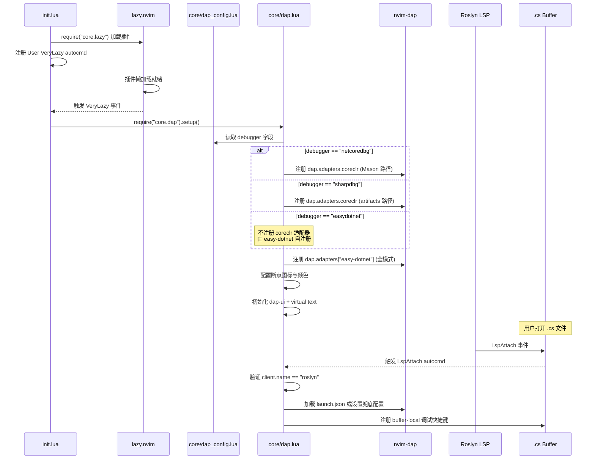

本篇深入解析 Neovim 配置中 DAP（Debug Adapter Protocol）调试系统的整体架构设计——如何通过一个策略切换点支持三种调试器后端（netcoredbg、sharpdbg、easy-dotnet），适配器如何在运行时注册到 `nvim-dap`，以及从启动时序到 buffer-local 快捷键挂载的完整链路。调试配置（launch.json 加载、DLL 检测、热重载）的细节将在 [调试配置详解：launch.json 加载、DLL 检测与热重载](9-diao-shi-pei-zhi-xiang-jie-launch-json-jia-zai-dll-jian-ce-yu-re-zhong-zai) 中展开。

## 架构总览：策略模式驱动的多后端系统

DAP 调试系统的核心设计采用**策略模式**：一个位于 `dap_config.lua` 的单字段配置作为策略选择器，`dap.lua` 在初始化时读取该字段，将对应的调试器适配器注册到 `nvim-dap` 的统一接口 `dap.adapters.coreclr` 上。这种设计使得调试器后端的切换无需修改任何业务逻辑代码，只需更改一个配置值。

整个系统由五个文件协作构成，各司其职：

| 文件 | 角色 | 职责范围 |
|------|------|---------|
| `lua/core/dap_config.lua` | **策略选择器** | 定义 `debugger` 字段，控制激活的调试器后端 |
| `lua/core/dap.lua` | **初始化引擎** | 适配器注册、UI 集成、快捷键挂载、launch 配置加载 |
| `lua/plugins/dap-cs.lua` | **插件声明** | 声明 nvim-dap、dap-ui、dap-virtual-text 为懒加载插件 |
| `lua/plugins/sharpdbg.lua` | **后端插件** | 声明 sharpdbg 源码仓库，供 lazy.nvim 管理 |
| `lua/plugins/easy-dotnet.lua` | **后端插件 + 自注册** | 声明 easy-dotnet，在 easydotnet 模式下自行注册 DAP 适配器 |

Sources: [dap_config.lua](lua/core/dap_config.lua#L1-L10), [dap.lua](lua/core/dap.lua#L1-L9), [dap-cs.lua](lua/plugins/dap-cs.lua#L1-L17), [sharpdbg.lua](lua/plugins/sharpdbg.lua#L1-L4), [easy-dotnet.lua](lua/plugins/easy-dotnet.lua#L1-L91)

### 三种调试器后端的定位差异

三种后端各有适用场景，并非简单的功能平替：

- **netcoredbg**：Mason 管理的成熟调试器，通过 `:MasonInstall netcoredbg` 安装。路径由 Mason 的 `install_root_dir` 动态解析，跨平台兼容性好。是系统最初的默认选择。
- **sharpdbg**：社区项目 `MattParkerDev/sharpdbg`，需要本地 `dotnet build` 编译后使用。路径解析尝试两种编译输出位置（`artifacts/bin/SharpDbg.Cli/Debug/` 及其 `net10.0` 子目录）。当前配置中它处于激活状态。
- **easy-dotnet**：将调试器适配器注册完全委托给 `easy-dotnet.nvim` 插件自身。此模式下 `dap.lua` 不向 `dap.adapters.coreclr` 注册任何适配器，而是由 easy-dotnet 的 `auto_register_dap = true` 配置触发自注册。launch 配置也由 easy-dotnet 的 `Dotnet debug` 命令驱动。

Sources: [dap.lua](lua/core/dap.lua#L118-L158), [easy-dotnet.lua](lua/plugins/easy-dotnet.lua#L23-L29), [dap_config.lua](lua/core/dap_config.lua#L5-L9)

## 启动时序与适配器注册流程

DAP 系统的初始化严格遵循 lazy.nvim 的生命周期管理。以下时序图展示了从 Neovim 启动到调试器可用的完整链路：



关键的时序约束在于：`dap.setup()` 通过 `User VeryLazy` 事件触发，这确保了所有 lazy.nvim 插件（包括 nvim-dap 本身、dap-ui、sharpdbg 等）已经加载完毕。适配器注册发生在 `setup()` 的 **第 0 步**，早于 UI 初始化和快捷键注册，保证了后续所有组件都能找到已注册的适配器。

Sources: [init.lua](init.lua#L17-L22), [dap.lua](lua/core/dap.lua#L114-L174)

### 适配器注册的三条分支路径

`dap.lua` 的 `setup()` 函数中，适配器注册逻辑（第 119–167 行）是整个系统的策略分叉点。三条分支的差异对比如下：

| 维度 | netcoredbg | sharpdbg | easydotnet |
|------|-----------|----------|------------|
| 注册目标 | `dap.adapters.coreclr` | `dap.adapters.coreclr` | 不注册（委托 easy-dotnet） |
| 适配器类型 | `executable` | `executable` | 由 easy-dotnet 决定 |
| 路径来源 | Mason `install_root_dir` | lazy.nvim plugin dir | easy-dotnet 内部解析 |
| 安装方式 | `:MasonInstall netcoredbg` | `dotnet build` 插件目录 | easy-dotnet 自动处理 |
| 可执行文件 | `netcoredbg[.exe]` | `SharpDbg.Cli.exe` | N/A |
| 未找到时的行为 | WARN 通知提示 Mason 安装 | WARN 通知提示 build | 插件自身处理 |

值得注意的是，**无论哪种模式**，`dap.adapters["easy-dotnet"]` 始终被注册（第 161–167 行）。这是一个函数式适配器，期望 `config.port` 字段存在，通过 TCP 连接到 `127.0.0.1:config.port`。它服务于 easy-dotnet 的 `Dotnet debug` 命令，在所有模式下都可调用。

Sources: [dap.lua](lua/core/dap.lua#L119-L167)

### sharpdbg 路径解析的双重回退

sharpdbg 后端的路径解析体现了对构建产物不确定性的防御性设计。由于 .NET SDK 版本差异，编译输出可能出现在两个位置，代码依次尝试：

1. **首选路径**：`{plugin_dir}/artifacts/bin/SharpDbg.Cli/Debug/SharpDbg.Cli.exe`
2. **回退路径**：`{plugin_dir}/artifacts/bin/SharpDbg.Cli/Debug/net10.0/SharpDbg.Cli.exe`

路径通过 `lazy.core.config.plugins` 表获取 sharpdbg 插件的安装目录，这是 lazy.nvim 提供的运行时 API，保证了路径的动态性——无论 lazy.nvim 将插件安装到哪个目录（标准路径、自定义路径或 stdpath），都能正确解析。

Sources: [dap.lua](lua/core/dap.lua#L134-L157)

## 插件声明与加载策略

DAP 相关的插件通过 `lua/plugins/dap-cs.lua` 统一声明，采用 **lazy = true** 策略——不在启动时加载，而是延迟到首次需要时按需加载。这避免了 DAP 基础设施在非调试场景下占用启动时间和内存。

| 插件 | 加载策略 | 触发条件 |
|------|---------|---------|
| `mfussenegger/nvim-dap` | `lazy = true` | 由 DAP API 调用触发 |
| `nvim-neotest/nvim-nio` | `lazy = true` | dap-ui 依赖 |
| `rcarriga/nvim-dap-ui` | `lazy = true` | 由 DAP 会话事件触发 |
| `theHamsta/nvim-dap-virtual-text` | `lazy = true` | 由 DAP 会话事件触发 |
| `MattParkerDev/sharpdbg` | 无 lazy 标记 | lazy.nvim 默认延迟加载 |

实际的加载触发链路是：`VeryLazy` 事件 → `require("core.dap")` → `require("dap")` 首次引用 → lazy.nvim 加载 nvim-dap 插件。这种隐式依赖链条使得无需显式配置 `cmd`、`ft` 或 `keys` 等懒加载触发器。

Sources: [dap-cs.lua](lua/plugins/dap-cs.lua#L1-L17), [init.lua](init.lua#L17-L22)

## UI 集成层：dap-ui 与 virtual text

调试 UI 由两个互补组件构成，均在 `dap.setup()` 中初始化：

**dap-ui** 通过事件监听器实现自动开关——`event_initialized` 后打开面板，`event_terminated` 和 `event_exited` 前关闭面板。这种声明式的生命周期管理确保了调试会话与 UI 状态的一致性，用户无需手动操作面板开关。面板布局使用 dap-ui 的默认配置（变量、调用栈、断点、控制台），未做自定义调整。

**nvim-dap-virtual-text** 提供内联变量值显示。在断点暂停时，当前作用域内的变量值以 virtual text 形式渲染在对应代码行右侧；会话结束后自动清除。初始化仅调用 `vt.setup()`，无额外配置。

**断点图标系统** 定义了五种自定义 sign：普通断点（●）、条件断点（◆）、拒绝断点（○）、日志点（▶）、停止位置（→），每种都配有独立的颜色高亮，提供即时的视觉区分。

Sources: [dap.lua](lua/core/dap.lua#L169-L223)

## 快捷键挂载：buffer-local 策略与 LspAttach 门控

调试快捷键的注册时机是 Roslyn LSP 附加到 `.cs` buffer 时。这一设计通过 `LspAttach` autocmd 配合 `client.name == "roslyn"` 过滤实现，确保：

- 仅在 C# buffer 上存在调试快捷键，不影响其他语言文件
- 快捷键注册与 LSP 就绪状态同步，不会在 LSP 未就绪时误触发调试操作
- 多个 `.cs` buffer 各自独立注册，互不干扰

快捷键采用 **F 键 + Leader 键双轨并行**策略。F 键（F5/F9/F10/F11 等）方便从其他 IDE 迁移的用户发挥肌肉记忆，而 `<leader>d` 前缀键在终端复用器可能截获 F 键的场景下提供可靠的后备方案。

Sources: [dap.lua](lua/core/dap.lua#L225-L343)

### 快捷键完整映射表

| F 键 | Leader 键 | DAP 操作 | 说明 |
|------|-----------|---------|------|
| `F5` | `<leader>dc` | `dap.continue()` | 启动/继续调试，首次运行弹出配置选择 |
| `F8` | `<leader>dp` | `dap.pause()` | 暂停执行 |
| `F10` | `<leader>do` | `dap.step_over()` | 单步跳过 |
| `F11` | `<leader>di` | `dap.step_into()` | 单步进入 |
| `S-F11` | `<leader>dO` | `dap.step_out()` | 单步跳出 |
| `F9` | `<leader>db` | `dap.toggle_breakpoint()` | 切换断点 |
| — | `<leader>dB` | `dap.set_breakpoint()` | 条件断点（弹出条件输入框） |
| `S-F5` | `<leader>dq` | `dap.terminate()` + `dapui.close()` | 终止调试并关闭 UI |
| — | `<leader>dE` | `set_variable()` | 交互式修改变量值 |
| — | `<leader>dh` | `hot_reload()` | dotnet watch 热重载 + 自动 attach |
| — | `<leader>dj` | `jump_to_frame()` | 跳转到当前调试帧位置 |
| — | `<leader>dg` | `dap.goto_()` | 设置下一条语句（需调试器支持） |
| — | `<leader>dr` | `dap.repl.open()` | 打开 REPL |
| — | `<leader>du` | `dapui.toggle()` | 手动切换调试 UI |
| — | `<leader>dl` | `dap.list_breakpoints()` | 列出所有断点 |

Sources: [dap.lua](lua/core/dap.lua#L275-L342)

## 配置切换实操

切换调试器后端只需编辑 `lua/core/dap_config.lua`，修改 `debugger` 字段值：

```lua
-- 当前激活：sharpdbg
return {
  debugger = "sharpdbg",
  -- debugger = "easydotnet",
  -- debugger = "netcoredbg",
}
```

切换后重启 Neovim 即可生效。需要确保对应后端已正确安装：

- **切到 netcoredbg**：执行 `:MasonInstall netcoredbg`
- **切到 sharpdbg**：在 sharpdbg 插件目录下执行 `dotnet build`
- **切到 easydotnet**：无额外步骤，easy-dotnet 插件已在 `ft` 匹配 `.cs` 文件时自动加载

Sources: [dap_config.lua](lua/core/dap_config.lua#L1-L10), [easy-dotnet.lua](lua/plugins/easy-dotnet.lua#L27-L29)

## 架构决策追溯

从 openspec 变更记录中可以追溯系统演进的关键设计决策：

**D1 — 核心逻辑与插件声明分离**：最初的实现将所有 DAP 配置集中在 `lua/plugins/dap-cs.lua` 中。后经过重构，将运行时初始化逻辑迁移至 `lua/core/dap.lua`，`dap-cs.lua` 仅保留插件声明。这使得 DAP 初始化可以通过 `init.lua` 的 `VeryLazy` autocmd 精确控制时序，避免了 lazy.nvim 加载 `dap-cs.lua` 时与 Mason 安装路径之间的竞争条件。

**D2 — LspAttach 替代 on_attach**：由于 `roslyn.nvim` 的 `setup()` 接口不直接暴露 `on_attach` 回调，系统改用 `LspAttach` autocmd 并按 `client.name == "roslyn"` 过滤。这一方案更符合 Neovim 的原生事件模型，且保证了 DAP 快捷键只在 Roslyn 服务就绪后才被注册。

**D3 — 双轨快捷键方案**：F 键绑定面临终端复用器（tmux、Windows Terminal）可能截获按键的风险。双轨方案（F 键 + Leader 键）确保在 F 键不可用的环境中，`<leader>d` 系列快捷键始终可用作为后备。

Sources: [add-csharp-debug-plugin/design.md](openspec/changes/add-csharp-debug-plugin/design.md#L29-L43), [dap-keybindings-and-features/design.md](openspec/changes/dap-keybindings-and-features/design.md#L29-L48)

## 延伸阅读

- **调试配置的加载细节**（launch.json 解析、DLL 自动检测、attach 配置）在 [调试配置详解：launch.json 加载、DLL 检测与热重载](9-diao-shi-pei-zhi-xiang-jie-launch-json-jia-zai-dll-jian-ce-yu-re-zhong-zai) 中深入分析
- **easy-dotnet 的项目管理和测试功能**参见 [easy-dotnet 集成：项目管理、测试运行与 NuGet 操作](10-easy-dotnet-ji-cheng-xiang-mu-guan-li-ce-shi-yun-xing-yu-nuget-cao-zuo)
- **快捷键系统的整体设计**参见 [快捷键体系：Leader 键分组与 buffer-local 绑定策略](12-kuai-jie-jian-ti-xi-leader-jian-fen-zu-yu-buffer-local-bang-ding-ce-lue)
- **Mason 工具链管理**参见 [Mason LSP 管理：服务器自动安装与 capabilities 注册](28-mason-lsp-guan-li-fu-wu-qi-zi-dong-an-zhuang-yu-capabilities-zhu-ce)