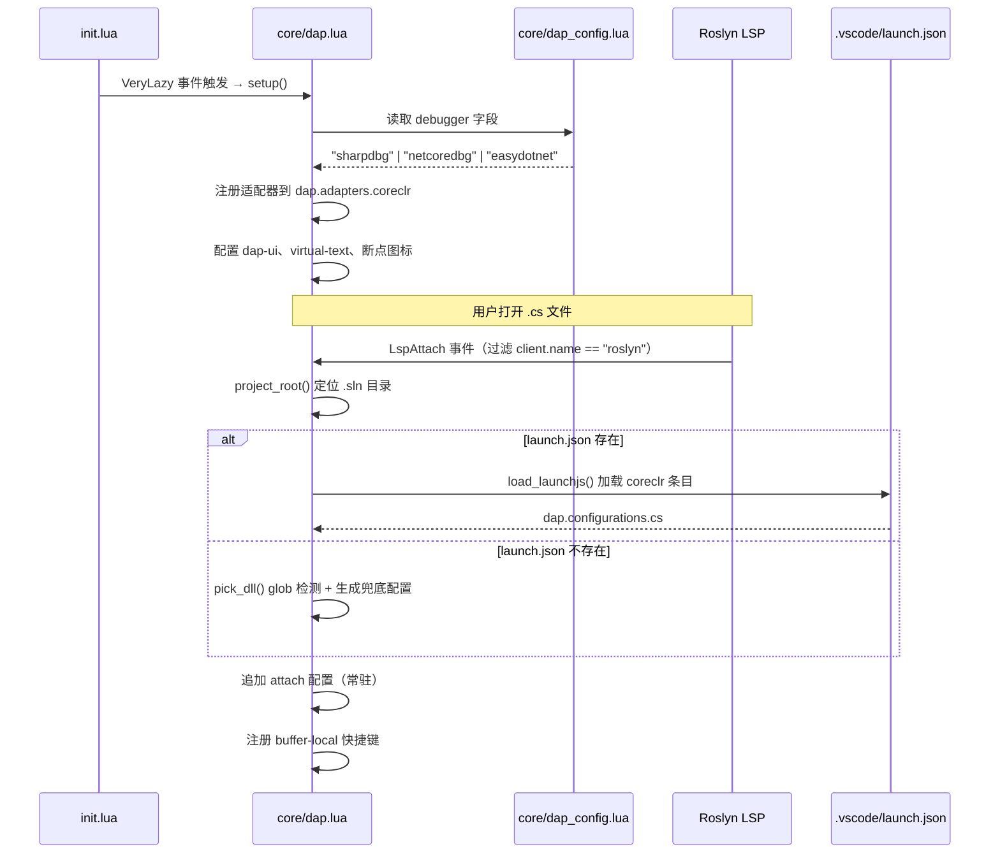
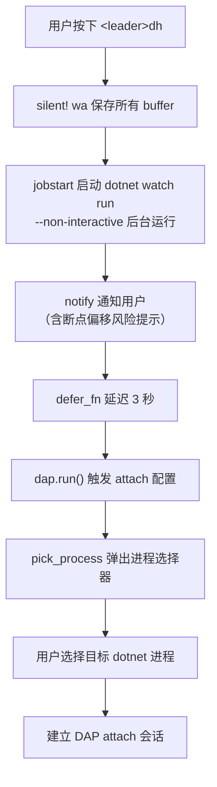

本文深入解析 Neovim 配置框架中 C# 调试配置的完整生命周期——从调试器后端选择到 `launch.json` 解析、DLL 自动检测兜底，再到 `dotnet watch` 热重载的工作原理。理解这些机制，有助于在不同项目结构下快速排查"调试器无法启动""找不到 DLL"等常见问题，也能根据团队需求灵活定制 launch configuration。

Sources: [dap_config.lua](lua/core/dap_config.lua#L1-L10), [dap.lua](lua/core/dap.lua#L1-L10)

## 架构总览：从启动到断点的三层委托

调试配置系统遵循**声明 → 注册 → 激活**的三阶段模式。第一层是静态声明——`dap_config.lua` 作为纯数据模块，仅包含当前选中的调试器后端标识符，不包含任何逻辑，是整个系统的唯一配置入口。第二层是适配器注册——`dap.lua` 的 `setup()` 函数在 `VeryLazy` 事件触发后执行，根据配置标识符将对应的调试适配器注册到 `dap.adapters.coreclr`。第三层是配置激活——当 Roslyn LSP 附加到 C# buffer 时，系统才真正加载 `launch.json` 或生成兜底配置，并将 buffer-local 快捷键绑定到该 buffer。



这三层委托的设计关键在于**延迟激活**：调试适配器在插件加载阶段就注册完毕，但调试配置（configurations）直到 LSP 附加时才按需生成。这避免了在非 C# buffer 中注册无用的配置条目，也确保了多项目切换时配置的正确性。

Sources: [init.lua](init.lua#L17-L22), [dap.lua](lua/core/dap.lua#L114-L157), [dap.lua](lua/core/dap.lua#L226-L273)

## 调试器后端选择：dap_config.lua 的单一切换点

`core/dap_config.lua` 是一个极简的纯数据模块，仅返回一个包含 `debugger` 字段的表。这种设计将"使用哪个调试器"的决策从代码逻辑中完全解耦——修改调试器只需编辑这一行，无需理解适配器注册的内部实现。

| 后端值 | 适配器来源 | 注册时机 | 适用场景 |
|---|---|---|---|
| `"sharpdbg"` | `MattParkerDev/sharpdbg` 插件的编译产物 | `setup()` 中注册 | 默认选项，基于 .NET 原生调试 API |
| `"netcoredbg"` | Mason 安装的 `netcoredbg` | `setup()` 中注册 | 成熟稳定的跨平台调试器 |
| `"easydotnet"` | `easy-dotnet.nvim` 内置 | easy-dotnet 自身 `setup()` 中注册 | 与 easy-dotnet 深度集成，开箱即用 |

当选择 `sharpdbg` 时，`setup()` 函数会从 lazy.nvim 的插件元数据中定位编译输出路径，优先检查 `artifacts/bin/SharpDbg.Cli/Debug/SharpDbg.Cli.exe`，若不存在则回退到 `net10.0` 子目录。选择 `netcoredbg` 时，路径通过 Mason 的 `install_root_dir` 动态计算，并在注册后立即检查可执行文件是否存在以提前预警。而 `easydotnet` 模式最为特殊——适配器注册完全委托给 `easy-dotnet.nvim` 的 `auto_register_dap` 配置项，`dap.lua` 中不执行任何注册逻辑。

Sources: [dap_config.lua](lua/core/dap_config.lua#L1-L9), [dap.lua](lua/core/dap.lua#L119-L157), [easy-dotnet.lua](lua/plugins/easy-dotnet.lua#L23-L29)

## launch.json 加载机制：去重、过滤与路径推断

### 查找策略：从 buffer 向上遍历定位解决方案根

当 Roslyn LSP 附加到某个 C# buffer 时，系统需要确定该文件所属的项目根目录。`find_sln()` 函数从 buffer 文件所在目录开始，**最多向上遍历 6 层父目录**，在每一层通过 `glob` 搜索 `.sln` 文件。一旦找到第一个 `.sln` 文件即返回其完整路径；如果到达文件系统根目录（父子目录相同时）仍未找到，则返回 `nil`。`project_root()` 在此基础上取 `.sln` 文件所在目录作为项目根；若 `find_sln()` 返回 `nil`，则回退到 buffer 文件所在目录。

```lua
local function find_sln(start_dir)
  local dir = vim.fn.fnamemodify(start_dir or vim.fn.getcwd(), ":p")
  dir = dir:gsub("\\", "/"):gsub("/$", "")
  for _ = 1, 6 do
    local slns = vim.fn.glob(dir .. "/*.sln", false, true)
    if #slns > 0 then return slns[1] end
    local parent = vim.fn.fnamemodify(dir, ":h"):gsub("\\", "/"):gsub("/$", "")
    if parent == dir then break end
    dir = parent
  end
  return nil
end
```

Sources: [dap.lua](lua/core/dap.lua#L11-L29)

### 加载流程：VSCode 兼容的 launch.json 解析

定位到项目根后，系统检查 `{project_root}/.vscode/launch.json` 是否存在。若存在，则调用 nvim-dap 内置的 VSCode 扩展模块 `dap.ext.vscode.load_launchjs()` 加载配置，传入文件路径和类型映射表 `{ coreclr = { "cs" } }`。这个类型映射表的作用是**仅提取 `type: "coreclr"` 的配置条目**，将它们注册到 `dap.configurations.cs` 中——其他类型的条目（如 `type: "chrome"` 或 `type: "node"`）会被自动过滤。

### 去重机制：同一 launch.json 仅加载一次

在多 buffer 环境中，用户可能同时打开多个属于同一解决方案的 `.cs` 文件，每次都会触发 `LspAttach` 回调。为防止配置重复追加，系统使用一个模块级 `loaded` 表来记录已加载的 `launch.json` 路径。首次加载后路径被标记，后续同一文件的 `LspAttach` 事件将被跳过：

```lua
local loaded = {}
-- ...
if not loaded[launch_json] then
  loaded[launch_json] = true
  require("dap.ext.vscode").load_launchjs(launch_json, { coreclr = { "cs" } })
end
```

这一去重策略基于**文件绝对路径**而非项目目录——即使在不同的 `cwd` 下打开同一项目，只要 `launch.json` 的路径相同，就不会重复加载。

Sources: [dap.lua](lua/core/dap.lua#L7-L8), [dap.lua](lua/core/dap.lua#L237-L255)

## DLL 自动检测：无 launch.json 时的智能兜底

当项目根目录下不存在 `.vscode/launch.json` 时，系统不会让用户面对空白配置，而是自动生成两组兜底配置。核心是 `pick_dll()` 函数，它通过递归 glob 搜索 `bin/Debug` 目录下的所有 `.dll` 文件，同时**过滤掉 `obj/` 目录中的中间产物**：

```lua
local function pick_dll(buf)
  return function()
    local root = project_root(buf):gsub("\\", "/")
    local candidates = vim.tbl_filter(function(p)
      return not p:match("[/\\]obj[/\\]")
    end, vim.fn.glob(root .. "/**/bin/Debug/**/*.dll", false, true))
    local default = candidates[1] or (root .. "/bin/Debug/net8.0/App.dll")
    return vim.fn.input("DLL path: ", default, "file")
  end
end
```

`pick_dll()` 的设计体现了一个重要的**惰性求值**模式：它返回一个闭包函数而非 DLL 路径本身。这意味着 glob 搜索只在实际启动调试时才执行，而不是在配置注册时——因为用户可能修改代码并重新编译，注册时的 DLL 路径在调试启动时可能已经过时。

当 glob 找到候选 DLL 时，第一个匹配项被预填充到输入框；如果完全没有匹配，则退回到一个基于 `net8.0` 的推断路径。用户始终可以在输入框中修改路径，`file` 补全参数确保了路径输入时有文件系统补全支持。

| 兜底配置名 | 类型 | 特殊参数 |
|---|---|---|
| `.NET: Launch Program` | launch | `program = pick_dll()` 闭包 |
| `.NET: Launch ASP.NET` | launch | `program = pick_dll()` 闭包 + `env = { ASPNETCORE_ENVIRONMENT = "Development" }` |

Sources: [dap.lua](lua/core/dap.lua#L32-L41), [dap.lua](lua/core/dap.lua#L246-L255)

## Attach 配置：常驻可用的进程附加入口

无论是否存在 `launch.json`，系统始终确保 `dap.configurations.cs` 中包含一条名为 `.NET: Attach to Process` 的 attach 配置。这条配置在注册前会先扫描现有配置列表，通过名称匹配检查是否已存在同名 attach 条目，避免重复追加：

```lua
if not has_attach then
  table.insert(dap.configurations.cs, {
    type      = "coreclr",
    name      = ".NET: Attach to Process",
    request   = "attach",
    processId = require("dap.utils").pick_process,
  })
end
```

`pick_process` 是 nvim-dap 内置的进程选择器函数，它会列出系统中所有正在运行的进程供用户选择。这条常驻配置有两个关键用途：一是用户可以手动附加到任何运行中的 .NET 进程（如 IIS 托管的应用），二是为热重载功能提供 attach 基础——`hot_reload()` 函数内部正是调用 `dap.run()` 并使用此 attach 配置类型来建立调试连接。

Sources: [dap.lua](lua/core/dap.lua#L257-L273)

## 热重载：dotnet watch 与调试器的协作流程

热重载功能通过 `<leader>dh` 触发，采用**后台启动 watch 进程 + 延迟附加调试器**的两阶段模式。其完整执行流程如下：



`hot_reload()` 的实现中有几个值得关注的细节。首先，`vim.cmd("silent! wa")` 在启动 watch 之前保存所有 buffer，确保 `dotnet watch` 检测到的文件变更与磁盘上的最新内容一致。其次，`--non-interactive` 参数使 `dotnet watch` 不在终端中等待用户输入，适合后台运行模式。最后，3 秒延迟是一个经验值——`dotnet watch` 需要完成首次编译和启动，3 秒通常足够进程出现在进程列表中。

```lua
local function hot_reload(dap)
  vim.cmd("silent! wa")
  local root = vim.fn.getcwd()
  vim.fn.jobstart(
    { "dotnet", "watch", "run", "--project", root, "--non-interactive" },
    { detach = true }
  )
  vim.notify(
    "DAP: dotnet watch started. Attaching in 3s...\n" ..
    "(Breakpoints in hot-reloaded methods may drift — PDB not synced)",
    vim.log.levels.INFO
  )
  vim.defer_fn(function()
    dap.run({
      type      = "coreclr",
      name      = ".NET: Attach to Process",
      request   = "attach",
      processId = require("dap.utils").pick_process,
    })
  end, 3000)
end
```

### 热重载的已知限制与应对策略

通知消息中明确指出了一个重要限制：**进程内热重载期间，调试器的 PDB（Program Database）不会同步更新**。这意味着当用户修改了方法体的代码并触发热重载后，已热更新方法中的断点可能出现行号偏移——因为调试器仍然使用原始编译时的 PDB 来映射源码行到 IL 指令。

应对这一限制的策略有两层：第一，如果 `dotnet watch` 检测到不支持的代码变更（如修改方法签名）导致进程重启，用户可以通过 `<F5>` 或 `<leader>dc` 重新选择 attach 配置手动重连，新的进程将拥有完整的 PDB 映射。第二，对于复杂调试场景（需要精确断点），建议直接使用 launch 配置而非热重载。

Sources: [dap.lua](lua/core/dap.lua#L92-L112), [dap-hot-reload/spec.md](openspec/changes/dap-keybindings-and-features/specs/dap-hot-reload/spec.md#L1-L39)

## 配置加载全景图

下面的流程图完整展示了 Roslyn LSP 附加后，调试配置从探测到注册的全路径决策树：

```mermaid
flowchart TD
    Start["LspAttach 事件<br/>client.name == roslyn"] --> CheckMode{debugger ≠ easydotnet?}
    CheckMode -- 否 --> SkipConfig["跳过配置加载<br/>由 easy-dotnet 管理"]
    CheckMode -- 是 --> FindRoot["project_root(buf)<br/>向上查找 .sln 定位根目录"]
    FindRoot --> CheckLaunch{.vscode/launch.json<br/>存在?}
    CheckLaunch -- 是 --> CheckLoaded{loaded[] 已标记?}
    CheckLoaded -- 是 --> SkipLoad["跳过（去重）"]
    CheckLoaded -- 否 --> LoadJSON["load_launchjs()<br/>加载 coreclr 条目<br/>标记 loaded[]"]
    CheckLaunch -- 否 --> CheckExisting{dap.configurations.cs<br/>已存在?}
    CheckExisting -- 是 --> SkipFallback["跳过兜底配置"]
    CheckExisting -- 否 --> GenFallback["生成兜底配置<br/>Launch Program + ASP.NET<br/>program = pick_dll() 闭包"]
    
    SkipLoad --> AddAttach
    SkipFallback --> AddAttach
    GenFallback --> AddAttach
    SkipConfig --> Keymaps

    AddAttach["检查并追加<br/>.NET: Attach to Process"] --> Keymaps["注册 buffer-local 快捷键"]
```

Sources: [dap.lua](lua/core/dap.lua#L226-L343)

## 快捷键参考表

以下快捷键在 Roslyn LSP 附加后以 **buffer-local** 方式注册，仅在 `.cs` 文件中生效，不会污染其他 filetype 的快捷键空间：

| 快捷键 | 功能 | 说明 |
|---|---|---|
| `<leader>dc` / `<F5>` | Continue / Pick Config | 首次调用时弹出配置选择器，后续调用继续执行 |
| `<F8>` / `<leader>dp` | Pause | 暂停正在运行的调试目标 |
| `<F10>` / `<leader>do` | Step Over | 单步跳过 |
| `<F11>` / `<leader>di` | Step Into | 单步进入 |
| `<S-F11>` / `<leader>dO` | Step Out | 单步跳出 |
| `<F9>` / `<leader>db` | Toggle Breakpoint | 切换断点 |
| `<leader>dB` | Conditional Breakpoint | 弹出输入框设置条件断点 |
| `<S-F5>` / `<leader>dq` | Terminate | 终止调试会话并关闭 dap-ui |
| `<leader>dE` | Set Variable | 以 `<cword>` 预填充变量名，交互式修改变量值 |
| `<leader>dh` | Hot Reload | 启动 `dotnet watch` 并延迟 3 秒 attach |
| `<leader>dj` | Jump to Frame | 跳转到当前调用栈帧所在位置 |
| `<leader>dg` | Set Next Statement | 将执行点跳到光标所在行（需调试器支持） |
| `<leader>dr` | Open REPL | 打开 DAP REPL 窗口 |
| `<leader>du` | Toggle UI | 切换 dap-ui 面板 |
| `<leader>dl` | List Breakpoints | 列出所有断点 |

Sources: [dap.lua](lua/core/dap.lua#L275-L342)

## 自定义 launch.json 的最佳实践

由于本系统直接使用 nvim-dap 的 VSCode 兼容加载器，`launch.json` 的格式与 VSCode 完全一致。一个典型的 C# 调试配置如下：

```json
{
  "version": "0.2.0",
  "configurations": [
    {
      "name": "Console App",
      "type": "coreclr",
      "request": "launch",
      "program": "${workspaceFolder}/bin/Debug/net8.0/MyApp.dll",
      "cwd": "${workspaceFolder}",
      "args": ["--verbose"]
    },
    {
      "name": "Web API",
      "type": "coreclr",
      "request": "launch",
      "program": "${workspaceFolder}/bin/Debug/net8.0/MyApi.dll",
      "cwd": "${workspaceFolder}",
      "env": {
        "ASPNETCORE_ENVIRONMENT": "Development",
        "ASPNETCORE_URLS": "https://localhost:5001"
      }
    }
  ]
}
```

需要注意的要点：`type` 字段**必须为 `"coreclr"`** 才会被本系统加载——这是 `load_launchjs()` 调用中类型映射表 `{ coreclr = { "cs" } }` 所决定的。`"dotnet"` 或其他类型值将被静默过滤。此外，`${workspaceFolder}` 变量会被 nvim-dap 解析为当前工作目录（`cwd`），在多工作区场景中需确认 `cwd` 是否指向正确的项目根。

Sources: [dap.lua](lua/core/dap.lua#L241-L244), [csharp-dap-launch/spec.md](openspec/specs/csharp-dap-launch/spec.md#L1-L57)

## 延伸阅读

- [DAP 调试系统架构：多调试器后端切换与适配器注册](8-dap-diao-shi-xi-tong-jia-gou-duo-diao-shi-qi-hou-duan-qie-huan-yu-gua-pei-qi-zhu-ce) — 了解 `coreclr` 适配器的注册细节与三种调试器后端的底层差异
- [easy-dotnet 集成：项目管理、测试运行与 NuGet 操作](10-easy-dotnet-ji-cheng-xiang-mu-guan-li-ce-shi-yun-xing-yu-nuget-cao-zuo) — 了解 `easydotnet` 模式下调试配置的独立管理方式
- [快捷键体系：Leader 键分组与 buffer-local 绑定策略](12-kuai-jie-jian-ti-xi-leader-jian-fen-zu-yu-buffer-local-bang-ding-ce-lue) — 理解 buffer-local 快捷键的作用域隔离原理